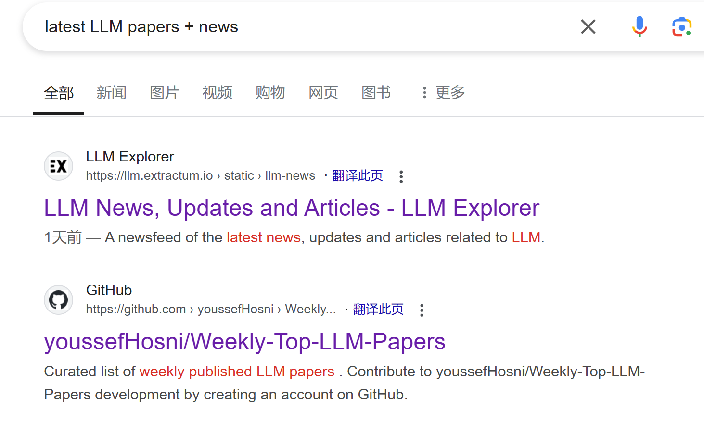

原本我打算做一期单纯的信息分享，但授人以鱼不如授人以渔，我会带大家走一遍从信息搜集、筛选再到整理的全过程，让你们充分了解如何在当今纷杂的世界享用纯净有价值的信息。最后还有一招压箱底的秘法来屏蔽垃圾信息。

## 信息搜集

:::caution[第一问]
首要的是想问问自己为什么要信息搜集。请务必抱有解决问题的目的来搜集。并不是说广泛涉猎不好，因为广泛涉猎本身也是一种目的。最糟糕的是热搜看一下，推荐视频看一下然后就迷失在网络世界了，那还不如直接看新闻或者找点娱乐的事干。
:::

既然有了目的，那么按照如下步骤进行：
- 细致化目的：国内外、时间、可靠度、专业度等
- 信息源初筛：书籍、官方网站、其他媒体、个人、AI 等。
- 信息初筛：你很容易判断一些信息是否满足需要，完整度、逻辑性等，再按照第一步的维度筛选。

### 例子：我想了解最前沿 AI 的技术。

#### 细致化目的

1. AI 的什么方向，比如说大模型。
2. 我想了解**学术界**大模型最近的技术
3. 不限国内外
4. 时效性强
5. 信息可以是像新闻那样不专业，但必须要可靠

#### 确定信息源

❌ 书籍：时效性太差

:::note[书籍的查找]
这里例子没介绍，但有必要提一下。

如果相关领域有人能提建议的最好先问一下，再去书籍评分的地方（微信阅读、豆瓣、Amazon等）上看一下。找书可以先到当地图书馆的官网上搜索看看有没有，如果没有看看电子书（可以到[Zlibrary](https://z-lib.gs/)上找），或者不急的话再网上购买二手、全新。

快速确定一本书是不是自己需要的：**看目录**。
:::

由于你确实不了解这个有什么官方网站、媒体提供此类信息，你只能排除掉书籍。那么接下来请出我们的“搜索工具”，目前主要有两类：
- 网络搜索引擎：比如百度、谷歌等
- AI 搜索：ChatGPT、Perplexity 等

前者：能用谷歌搜就用谷歌，百度不好用；后者：基本只有国内外的分别，另外说明一点 Kimi 的搜索并非 AI 搜索，相同 prompt 只会得到相同的结果。在这个简单的问题上用哪个都差不多，复杂目标用 AI 得到的结果能更细分化一些。

:::tip[搜索引擎的妙用]
参考资料：[一篇文章](https://zhuanlan.zhihu.com/p/659923111)

| 符号 | 用法 | 示例 |
| --- | --- | --- |
| ""（引号） | 查询完全匹配的内容 | 查找包含《百年孤独》的网页，语法："《百年孤独》" |
| OR | 查询多个关键字的结果 | 找包含 JS 或 TS 的网页，语法：JS OR TS |
| - | 删除某网站或包含某些关键词的结果 | 语法：苹果 -site:baidu.com |
| site: | 限定搜索网站或类型（com/cn/gov等） | 语法：site:gov 节水 |
| filetype: | 限定文件类型 | 语法：filetype:pdf 民法典 |
:::

那么这里我们使用谷歌搜索：latest LLM papers + news

我们显然知道这个是没有官方网站的，所以就可以在这些搜索结果上找。如果我们希望时效性，可以点击`工具`选择时间。

初步看一下这个结果还是不错的，也是很容易达成了目标。

特别注意，公众号、知识星球之类的平台在搜索引擎中很难搜得到，要到它们自己的平台、网络里面搜。

:::note[闭门的信息]
以上信息源全部是网络。这绝不是一个优质信息获取渠道的构成方式，它缺少了人，或者说实打实的人脉、圈子。

向来我对网络上打着信息差旗号的东西不屑一顾，因为人性，在信息差带来的绝对利益面前，人们不会将它们拱手相让。有句话说，当一个行业开始卖课的时候就意味着真正的红利期已经过去。因此要得到更新、更可靠的信息最重要的一点就是混入对的圈子、结识对的人。这又是一个庞大的话题，下次再说，这里只提一点——

**知识付费不过是知识的搬运工，你要确定你在为你的时间付费，而不是为你的无知付费**。换句话说，不要冲动消费而购买一堆 Baidu 能随意搜到的垃圾信息。有些需要人脉、圈子获得的信息（研报等）、免费内容过于稀缺整合难度大等不值得花很多时间的可以花钱解决。我们这一步信息搜集就是用来区别二者的，搜了、找了才知道。
:::

#### 信息初筛

绝大多数情况下初筛了信息源就足够获得较好的信息了，也就不需要再去初筛信息了。为了说明初筛，我们看到下面有一个搜索结果`Awesome-LLM: a curated list of Large Language Model`，看起来标题是不错的，但注意里面的更新时间，点进去它更新的内容，上周只增加了一条信息，它更新得太懒惰了，让人担心它的时效性。这轮初筛需要主观判断它**是否满足需要、达成目标**。

### 分享一些信息搜集的平台

- 国内：知乎、即刻（偏技术）、公众号（量子位、机器之心、新智元等）、小宇宙或苹果播客
- 国外：Quora、Stack Overflow、Github、X（政治，娱乐为主）

## 信息筛选和整理

搜集的目标是解决问题，筛选和下一步整理的目标是形成自己的知识体系。它更像是一个针对知识信息进行处理的工作流了。

:::tip[其他人的信息工作流]
参考资料：[RSS 信息流](https://www.barretlee.com/blog/2023/09/10/build-your-own-timeline/)、[Obsidian 工作流](https://csdiy.wiki/%E5%BF%85%E5%AD%A6%E5%B7%A5%E5%85%B7/workflow/)
:::

显然因人而异，这里谈谈我的想法。我之前有尝试用 Obsidian 构建网络、飞书知识库，也尝试过 Capacities 等软件，目前是返璞归真，直接文件夹 + 文件（不过 Obisidian 写 markdown 舒服，也是本地化就这样用了）。因为如果有问题就搜集信息解决它，真正需要吸纳的要么是专业知识，要么就是深刻的东西。前者上一步的操作足矣，后者在我这信息筛选标准如下：

1. 必须经过我的思考，确认其有参考、借鉴的价值
2. 侧重于“道”，较少涉及“术”

这个筛选方式不论时间、不论来源似乎扩展了太大的范围，但其实一个“道”的倾向就杀死新闻、绝大多数方法论等内容了。我常常选择《悉达多》《原则》这些书来激发思考，写一篇感悟来净化“术”、内化为道。

:::danger[切忌]
信息筛选切忌犯下“二极管”思维等常见思维认知错误。比如别人的新观点与自己旧观点冲突就认为一定有一方是错的，有可能各对一部分，或者说适用的领域就完全不同。
:::

## 压箱底的秘法

—— 信息节食

我在蒂姆费里斯的书中第一次了解到这个概念——就是在非必要时刻不再主动获取任何信息。如果有什么大新闻，你的同学、朋友一定会和你分享（又体现出人脉的重要性了）。司空见惯的事携带的信息不如突发事件，因此关注这些他人分享的突发、重大消息就足够了。

等到你想潜心研究某个东西的时候，你再去主动获取，按照第一步走。**信息节食就是把时间花在信息之外，尽量减少受到信息蕴含的价值观等的影响**。这种方式节约时间，性价比高。

## 附：每日信息搜集里面有什么

看完这些，如果还对我的`每日信息搜集`感兴趣，多少是没怎么认真看。这个收藏夹内的东西，我自己都不在看了。

1. [黑客新闻](https://news.ycombinator.com/)
2. [通往 AGI 之路](https://waytoagi.feishu.cn/wiki/QPe5w5g7UisbEkkow8XcDmOpn8e):这个内容质量真心越来越烂，不值得看了
3. [Daily Paper](https://huggingface.co/spaces/hysts/daily-papers):AI 前沿论文
4. [智鹭 AI 日报](https://www.aiheron.com/html/19-100.html)
5. [AI 日报](https://gorden-sun.notion.site/527689cd2b294e60912f040095e803c5?v=4f6cc12006c94f47aee4dc909511aeb5)
