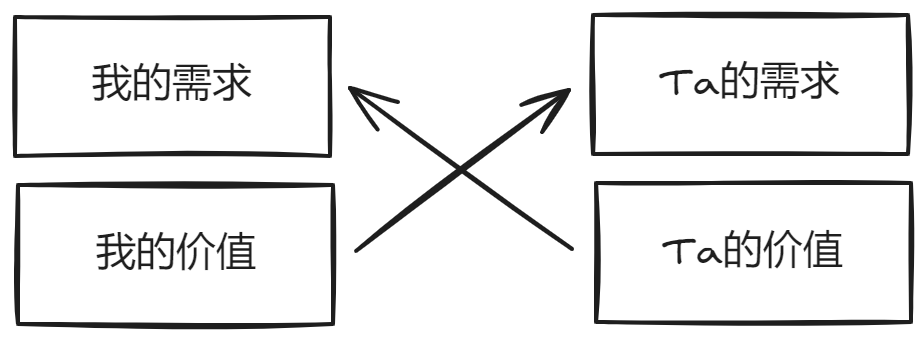

<iframe src="//player.bilibili.com/player.html?isOutside=true&aid=113578581432240&bvid=BV1BG6FYKEx8&cid=27129413657&p=1" scrolling="no" border="0" frameborder="no" framespacing="0" allowfullscreen="true"></iframe>

人脉是关于人的学问，人是多变的，视角也是多元的，本视频谈人脉搭建仅为鄙人一孔之见，不足之处敬请指正。

## 人脉之道：匹配

人脉关系建立的开始就像你在菜市场开了一个新摊位。第一步应该选对卖的东西，来的人是来买菜的，所以你不应该卖汽车轮胎。人脉之道在于匹配。

搭建人脉的原理就这一张图很简单，让别人的价值满足你的需求，让你的价值满足别人的需求。

### 第一问：你的需求是什么？

要回答这个问题，需要先问问自己，你想成为什么样的人？是想创业成为企业家，学术圈大佬还是高薪高管……

关注你当前的状态与你的目标之间的差距，尽量明确你要达到它的路径，**路径上需要哪些只能通过人脉获得的信息和资源**。

:::tip[精要主义]
人脉是需要你花费时间精力去维护的，网络越大，这个成本越大。

精要主义强调在有限的时间和资源下，专注于最重要的事情，以达到高效和有意义的目标。在人脉搭建上也一样，千万不要认为认识的人越多越好，所以这里我建议你只去关注那些**为达成目标必要的人脉**。
:::

接下来我们用一个例子贯穿整个人脉搭建的流程。你身无分文，希望成为一个伟大的企业家，路径是创业。创业需要的主要资源为资金、人才、技术。

1. 资金的主要来源：个人（亲朋好友）、投资人/投资机构
2. 人才的主要来源：朋友、同学、同事、其他创业者
3. 技术主要来源：导师（教授）、技术专家

### 第二问：这些人在哪？

“物以类聚，人以群分”，每个人都在各自的圈子中，最好的方法去寻找这些人的方法就是去融入他们的圈子。首要的事是去触及到这些圈子，再去思考如何让他们接纳你。

方法也很简单：**哪些人可能会知道他们在哪 -> 这些人在哪** ，不断追问自己，直到你知道某一类人在哪。

假设，你不知道投资人在哪，按照下面步骤追问：
1. 谁会知道投资人在哪？-> 创业者、其他有创业想法的人
2. 创业者在哪？-> 不知道
3. 谁会知道创业者在哪？-> 他们的学弟学妹，或许？
4. 这些学弟学妹在哪？-> 学校社团组织（创新创业相关）

对于不同的人来说，追问的层数也会不一样。可能第二问你就能答出来，创业者常出没于各类大会、黑客松和其他交流活动中。又或者你通过第三问就联想到会有一些成功的企业家到学校来分享，可以参加那些活动去认识他们。

如果你短期内没有那么强烈的人脉需求，但也希望在需要时能快速找到人。你可以尝试去和那些有一定人脉的人打好关系。这些人常叫资源掮客，做牵线搭桥都是收费的。但如果关系好，比如大学里的朋友，会很有帮助。

:::tip[提示]
投资人和创业者常常出没于大会、活动当中。你可以先尝试到`活动行`、`百格活动`等软件、小程序当中找一些活动去参加，直接去和人交流。
:::

:::note[如果不着急]
你可以尝试培养比你层次低一些的人，让他们在未来成为那些你希望用到的人脉。你不清楚他们未来会不会离你而去，因此对于想投入大量时间精力培养的小伙伴，根据价值观、道德观、人生观谨慎考虑。
:::

### 第三问：他们需要什么？

你现在已经在圈子的门口了，下一步是需要让他们接纳你。假设你是一个无差别敲门的上门推销员，毫无疑问，没有多少人会买单，同样地，你不应该优先关注你自己有什么价值，而应该先去看看对方需要什么。同样贯彻精要主义，优先满足**必要点和对方最大的需求**。

一般来说分为：情绪价值、（潜在）能力价值、资源。

1. 情绪价值是每个人都需要的（情商算是一部分）。谁都爱听好话，只不过有些人对于情绪价值要求更高些，希望其他人的礼节、行为举止等处处遂他心愿。

2. 能力价值往往指能转化为资产的能力，例如，你的技术、市场营销能力、销售能力等等。显然沟通、协作能力这些软能力也都默认包含在其中。

3. 资源千万不要只是认为自己有的钱、店面这些实的。你要考虑进你的资源整合能力，把你人脉网络上所有人的资源都算在内，都可以当做与人谈判的筹码。

:::tip[关于必要点]
我相信绝大多数人希望积累的人脉都是各行各界的大佬。他们值得你信赖，所以你想结识他们。这里有个很重要的逻辑，换位思考。其中包含两条定律：
1. 黄金定律：你希望别人怎么对你，你就怎么先对别人。
2. 白金定律：别人希望你怎么对他，你就怎么对他。

这两条定律就明确了所有的必要点。因此信任是其中之一：
- **做人靠谱**。不是反复横跳；不喜怒无常。对上谓“忠”，对同侪谓“义”，对下谓“仁”。
- **做事靠谱**，包括守时，言必信，行必果，此谓“信”。

上面提到的情绪价值和情商算是“礼”。
:::

继续刚刚的例子，我们来看看风险投资人最大的需求是什么。他们需要极大的投资回报率，那么对于资产、资源很多很稳定的反而没有那么青睐。潜在的能力价值会是风险投资人最关注的点。你需要在你的谈吐当中表现出来。因此表现得`像个学生`、`懦弱卑微`只会是你的扣分项。风险投资人会关注关心在校学生，但一定不是看起来很弱鸡的学生，因此除了能力之外还要有`骨气`。比如，你可以跟自己说，“你会让所有看不起你的人后悔！”

### 第四问：你能提供什么价值？

了解他们的需求之后，我们就要尽力去满足。按图索骥比起伯乐相马肯定简单多了吧。最没有意义的事是抱怨自己一无所有。应该仔细去挖掘自身拥有的能力价值、资源。没有能直接挂钩的也可以去寻找能间接挂钩的。实在没有也想办法去获得。

准备情绪价值、能力价值和资源执行层面差异点很多，整体还是遵循“精要主义”的原则，去抓重点。

## 人脉搭建之术：营销

同样是卖菜，为什么顾客最终没买你的菜，买了别家的呢？是营销出现了问题。营销固然有套路，但优秀的营销一定因人而异，接下来的内容为方法论，千人千法，仅为思路。

我给搭建人脉定义的营销不是这个（创造、沟通、传播、传递），而是从合适的态度和身份出发用心理学的技巧直接传播你的价值。

### 态度和身份

不端正的态度会从的言行举止中流露出来。态度决定了营销的力度，更决定了对方对你的看法。像抗日电视剧里的汉奸那样“啊！天皇！”，人家就当你是个工具人。尽管你希望你要找的人脉能接纳你，但我也不建议你的态度从一开始就是扭曲的，而是尽量平等地去交流，这样才更可能获取到平等的价值交换。

身份也是决定对方态度的重要因素。我大一的时候找线下活动去和人聊，上来就说是学生，对方直接离座找了别的座位。对学生有厌恶乃至恶意的社会人士可能没那么多，但学生身份的确不利于你去推进更深入的交流。你要提出你的能力价值，对方大概还要怀疑你的能力。

:::tip[这里给学生党的一个建议]
如果你想去这些线下活动做深入交流，打扮稍微成熟点（别穿没有领子的短袖），背挺直点，称自己为`xxx方向的创业者`。如果你在实习的话，也可以说自己是xxx职位，丢掉实习生这几个字。

从形式上看这是最简单的包装，但本质上要求你带入到合适的身份中，用正确的态度去开启一段对话。
:::

然后保持自信、真诚，千万不要不懂硬装。

### 心理学技巧

这个有很多，但是切忌过分追求套路。比如公式化的感谢词之类的一听就能听出来。我这里只是列举两点。

1. 保持微笑，这个要多练习，给人留下好的第一印象很重要。
2. 带瓶水给你要交谈的人

第二点是我转化自《影响力》一书例子的方法。书中，某个宗教的信徒为了获取捐赠会在地铁强行送行人一朵假花，再问他们是否愿意捐赠。他们用这种方式获取了大量捐赠。在线下活动之类的场合常常会有茶歇、休息的时间，你可以尝试递给你想去交谈的对象一瓶水，让他同意与你交流一会儿。

### 直接

确定你的目的不是为了唠嗑，而是寻找价值交换。因此你可以用一些话题引入，比如大会演讲者刚刚谈及的内容或者对方从事的领域，然后尽快确认交谈对象是否“匹配”。

直接二字很重要，你交谈的对象咖位越大你的时间就越少，拐弯抹角讲半天，对方一句“不好意思，我有点事，先走了，下次有机会再聊”，联系方式也没拿到就完了。所以要联系方式不一定等到最后，你看对方对你有点意思就可以要个vx。

## 人脉搭建之终：频率

菜场卖菜不是一次性的，你巴不得所有老客户都会再找你买，有稳定客流。人脉的巩固和延续很重要，归结起来只有两个字：频率。

别让对方忘记你就要多联系对方，不妨联想一下艾宾浩斯遗忘曲线。见面后的下个月一定要再联系一次。然后你可以尝试顶级销售联系重要的潜在客户的方法，在每个节假日发一句祝福。

保证足够的频率直到你和对方有一次真正的合作。如果这次合作双方都很满意才能真正算是和对方的这条人脉链搭建完成。

“实践是检验真理的唯一标准”，我只是提供一个搭建人脉的视角，诸位当知知行合一，愿各位都能找到适合自己的人脉搭建方式，建立起属于自己的人脉网络。共勉！
