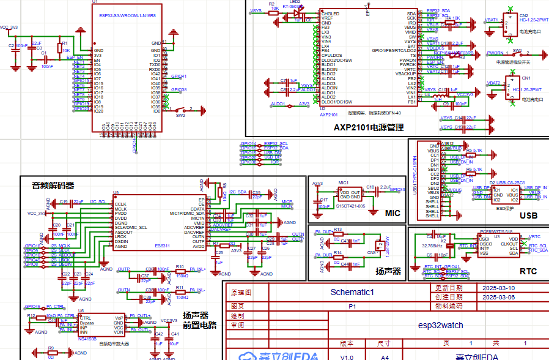

好久没有更新博客了，简单聊一下近况。上周和上上周主要还是控制理论这一块，说实话也是比较浅的内容。更新杂七杂八的基础内容也还是有的可更新的，比如微信小程序怎么写、ROS、Cursor和WindSurf开发应用等等，但是感觉没什么意思了。估摸时机也差不多，也是时候把**项目篇**做起来了。那些零碎的东西估计不定期更新，保不准看心情（bushi）。

所以现在在准备做一个非常经典电子DIY小项目——**智能手表**，已经有一些优秀的项目了，比如“海底撩”的手表、“Hamboo”等等。不过我还是不太满意，正好又看到“微雪”出过几块板子，打算集百家之长搞一个，再出教程。这个周期就比较长了。（想想海底撩和稚晖君的更新速度……）

毕竟是兼职做博主，时间也不多，我会尽量每周更新一下进度。

当前阶段 》**原理图**

■■■■■■■■■■■■■■■■■■■■■■■■■□□□□□□□□□□□□□□□□□□□□□□□□□ 50%

这个娱乐项目自然不考虑高速PCB那些东西，估计开wifi温度也会很高，功耗肯定不会低。