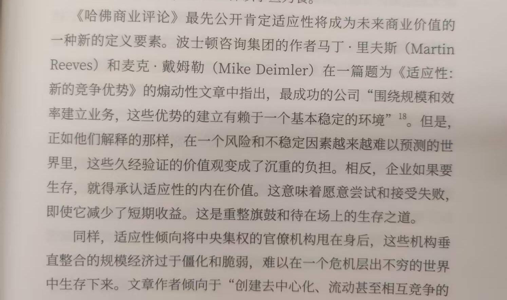
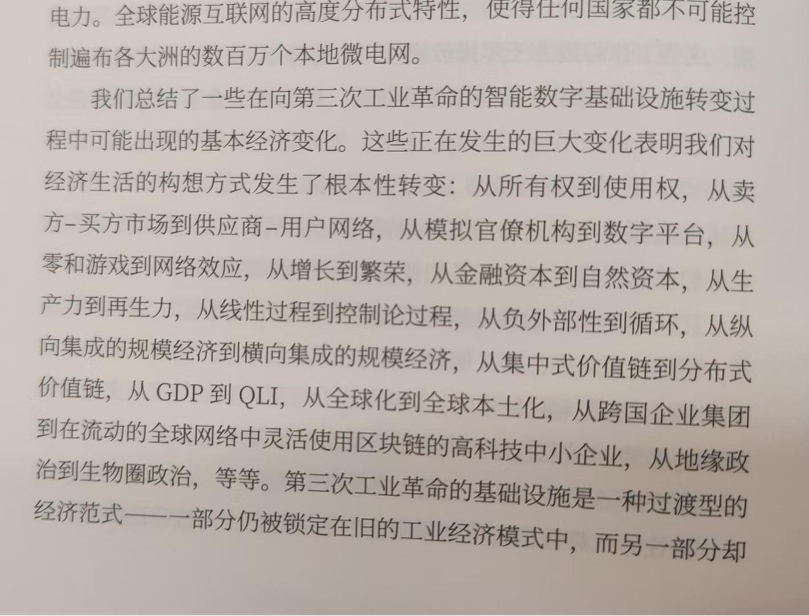
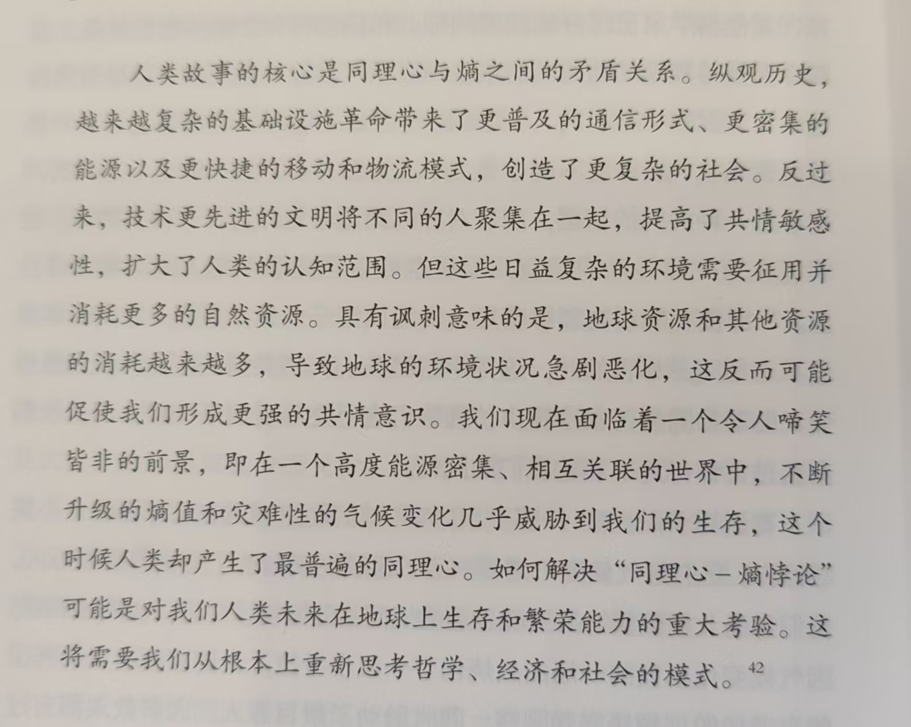

:::danger[主观评价]
评分：★★★★☆ 7.7/10.0

点评：视角和思维方式独特，但行文缺乏明显逻辑框架。
:::

## 效率 VS 熵

韧性：你可以理解为鲁棒性，应对特殊情况仍然可以正常工作。

追求效率可能降低韧性。例如美国新冠期间缺乏必要的口罩等产品（因为这些设备都被放到制造成本低的地方生产）。

熵：被消耗后基本无法再利用的能源依存

牛顿主义下（交易不受时间影响）的经济学会忽视溢出效应，即一笔交易未被承认的影响，这种影响在其他地方或者其他时间会导致更大的利润或成本（分别称为正外部性或负外部性）。

GDP只考虑了经济活动的顺势交换价值，很愚蠢。因为每次经济交换都有一条长长的熵尾，向可能的方向蔓延，影响其他现象。

**别用牛顿均衡模型**，例如新古典经济学家固守一个由作用力和反作用力、吸引力和排斥组成的经济系统（供给侧边际效应递减-消费编辑效用递减）。

而应该采用**热力学第一定律和第二定律**（能量守恒；孤立系统中，熵总是趋向于增加或保持不变）。**经济体系应该包含自然环境**。

应该用更高的视角去定义完整的系统，整个系统当中的因素会互相牵连，医学人类学家辛格提出这叫**协同蔓延**。**我们在衡量收益和成本时过分简化了有限因果关系的概念**。

化石燃料为我们带来巨大的效率提升，但也为我们带来了熵债——全球气候变暖。

## 地球财产化和劳动力贫困化

效率的提升从时间和空间两个角度看：
1. 时钟发明锁定时间
2. 透视法加速人类征服和圈住空间的进程
3. 印刷术凝固了时间
4. 工业革命交通物流进一步压缩了时间和空间
5. 1912年世界时间标准化

地球财产化：
1. 岩石圈私有化
2. 水圈私有化
3. 基因库市场化
4. 驾驭电磁波：全球定位系统——大脑中负责空间导航因为不用会萎缩
5. 互联网——互联网会让人损失认知能力，互联网搜索信息形成的记忆较弱

**大循环**：
1. 生产力提升，产能提升，同时公司用机器替代人力劳动，工人失业、工资降低
2. 生产的东西需要被购买，层出不穷的消费主义陷阱横行，欲望永远无法被填平，人们越来越穷
3. 银行为了利息，放贷给人们
4. 到某一刻泡沫破裂，人们还不起贷款，银行收不回钱

泰勒主义横行：
1. 20世纪丰田精益生产：只生产当前市场需要的东西，所有人“协作”确保完全对齐
2. 21世纪亚马逊
3. 游戏化：让奴役变得有趣，企业通过游戏培训的方式让员工感觉自己有主观能动性，但事实上不过是干机械的活

## 我们如何到达这里：重新思考地球上的进化

第六章介绍每个人都可以被视为一个生态系统。第七章介绍生物钟和电磁场对于生物的重要意义。这两章放这莫名其妙。

**复杂适应性社会/生态系统建模**：
1. 生态系统的行为可以由两个不同的属性来定义：韧性和稳定性
2. 韧性决定了系统内部各种关系的持久性，强调受冲击后的适应性（恢复、演化），鲁棒性强调受冲击后的不变（稳定）

:::tip[#2：CASES思维模型]
1. 从局部特征到系统属性
2. 从对象到关系
3. 从测量到捕获和评估复杂性：注意“涌现”
4. 从观察到干预
5. 放下对预测的执念而是选择**适应**
:::

## 韧性时代：工业时代的没落

基础设施三要素：相互交流的手段（通信手段）、维持生命的能量来源、一追踪形式的机动性或在环境中移动的能动性（运输物流方式）

它们改变了时空取向和集体生活安排方式

将眼下的第三次工业革命的基础设施视为一组职能的、非线性的自组织生态系统。不同于前两次自上而下，集中式的，这一次的工业革命由明显的分布式特征。大公司妄图数据集中会越来越困难。

曾经自由等同于自治，而在数字时代自由被认为时访问和包容性，自由就是能够参与地球上所有丰富多样的能动性。这是“同行治理”的政治基础。

书中介绍了分布式民主，中央要求地方推进民主，地方必须扩大民众参与度来实现决策。

伴随新的基础设施不断压缩时空，会促成更广泛的移情纽带。
1. 旧石器时代，采集-狩猎社会——“万物有灵论”作用于小型社区
2. 水利农业帝国——神学意识，宗教
3. 工业革命——意识形态，民族国家治理，思想灌输计划（公共教育->文化）

:::note[依恋理论]
**人们都有依附的需要**，这个可以依附的对象必须是可以信任的并且能够提供给我们支持和保护的重要“他者”，是“万物之灵”、是神、是国家意识形态。

人们通过这些框架（依附的对象）理解自身的存在。
:::

**基础设施将大量人群聚集在一起——超越了简单的血缘关系**。

作者认为现在正步入一个“韧性时代”——亲生命意识（共青其他生物，回归自然）。
1. 日本shinrin-yoku新文化，“树浴”，恢复身体健康的疗养性运动。
2. 自然学校和森林学校的发展

对关系型自我而言，韧性来自对“他者”的开放和拖鞋，而不是自给自足和自主。

> 因为当在生命的尽头回顾人生时，我们脑海中浮现的最生动的经历，至少是那些赋予我们生活意义的经历，正是我们产生共情冲动的时刻--它们是我们寻找个人意义的标志。
>
> **在韧性时代，我们需要进一步激发人们的同理心，并将共情扩展到下一个阶段——一种将人类带回生命大家庭的亲生命意识**。
