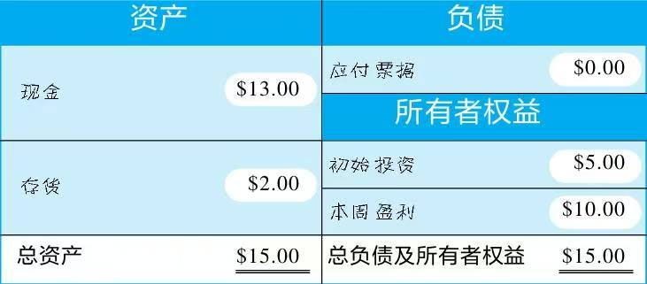
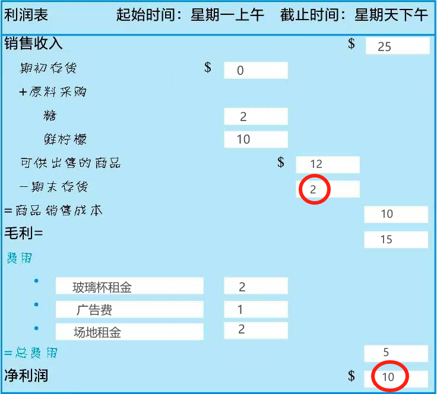
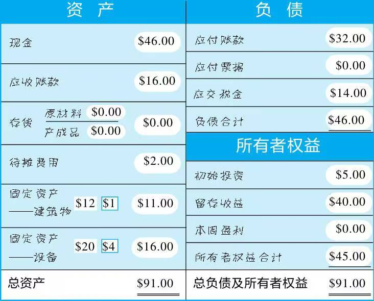

:::danger[主观评价]
评分：★★★★★ 9.3/10.0

点评：非常非常适合小白一步一步学，收获不错，对会计有点感觉了。
:::

## 5.30 资产负债表

**左边等于右边**

权益=所有者权益=股东权益=净值 

资产 = 存货 + 现金 = 负债（借了多少钱） + 所有者权益（初始投资 + 挣的钱）

费用：剔除产品生产成本之外企业经营所需的花费，它减少了盈利

它表明了你在生意中所拥有的东西，以及这些东西与那些拥有它的人或对此有要求权的人们之间的关系。

但是资产负债表不写明销售收入、商品成本、费用详情等等信息，像是一张快照，因此要创建一张记账卡，它更像是一部电影或录像。有三种叫法**运营报表、利润表和损益表**。

## 5.31 利润表 & 资产负债表补充

- 毛利 = 销售收入- 销售成本（生产过程中所有支出，包括产线工人和车间管理人员工资）
- 毛利 - 费用（与生产不直接相关的其他支出：广告费、公司管理人员工资） = 净利润

利润表像电影，记录的这段时间叫**会计周期**。

资产负债表中的存货与利润表上的期初、期末存货相关；净利润的数值与盈利的数值相同。

但是很明显还给父母的借款没有出现在两张表上。它对利润表有影响，因为利息是一项费用，影响了现金流，因此还要第三张表。

以前的盈利或是过去会计期间的利润称为**留存收益**。

你可以用盈利做两件事：留在生意里或者分给股东（一般发生在一个会计周期结束之后）。

:::note[把“期末资产负债表转期初”需要干两件事]
- 期初留存收益 = 上期期末留存收益 - 利润分配
- 期初存货 = 上期期末存货
:::

**我们因应付票据而获得现金，我们因应付账款获得商品或服务**。这两类债务都建立在**信用**上。

应付账款还期时间短，通常一年内，所以是流动负债，通常没有利息只有逾期的罚息。负债项目按照各类债务到期的期限长短来列示。

## 6.1/10 权责发生制 & 收付实现制

**如果雇佣的人增加了存货的价值，那就不能计入费用，它的劳动被凝结在产品里面**。比如花1美元雇人生产，那么现金-1美元，存货价值+1美元。你可以简单理解存货为制造成本。只是产品售出之后，这个人工会被计入费用。

为什么生意中允许赊销？这是为了提高销售额。

存货分为原材料，产成品和在产品。

还债的利息要作为一项费用列示在利润表中。

**因为还没用完的保险有价值，所以要放入资产中**，现金转化为待摊费用（也在左边）；当年结束，当年用完的保险要从待摊费用扣除，同时右边扣减利润。

:::note[会计核心概念]
- **权责发生制**：权利和责任的实际发生时间来确认收入和费用归属期，而非以现金收付时间为准。何时核算交易事项？利润产生的期间，赊账期间或是使用期间。更常用，也更加准确反映企业真实的财务状况和盈利能力。
- **收付实现制**：何时核算交易事项？有现金出现时。

法律规定：如果有存货就不能用收付实现制；服务业可以使用收付实现制。
:::

收付实现制买可以摊销的服务时，相比使用权责发生制首年利润减少，所得税减少，但由于之后几年不能摊销，利润增加还是得纳税——**延期纳税**。延期纳税意味着税减少，因为货币会慢慢贬值。

:::tip[创意会计]
服务类行业可以将收付实现制的财报给政府，以减少纳税；将权责发生制给银行或投资人，反映更准确的企业情况。
:::

美国政府会允许你从收付实现制改为权责发生制，但不允许反向。存在一些“灰色地带”，即有少量存货，这就要看它们对利润的贡献有多少了。

## 6.11 队列/堆栈 & 资产化/费用化

服务业种，成本与提供的服务直接相关，而费用与提供的服务不直接相关。

当存货种原材料和购买的原材料价格不一样时，有两种方法记账：一种是队列（先进先出），一种是堆栈（后进先出）。这两种方式都是为了明确被用掉的原材料的成本，即存货价值。

先进先出法便于会计核算。**如果原材料时不断涨价的，那么公司采用后进先出法的唯一目的在于节税**。有些行业原材料价格不断下降，那么就采用先进先出法。

这两种方法只是记账时的区别，实际上你当然可以先用最早采购的原材料，而用后进先出记账。美国允许你第一次从先进先出转为后进先出，但不太允许你下次逆向转了。政府不允许你财报先进先出，涉税报表后进先出，要满足**一贯性原则**。

此外还可以采用个别计价法对存货进行计价。

**权责发生制下，收到应收账款的事件不会被记录在利润表种，因此需要另一种表，以记录现金的流入和流出**。

:::tip[资本化/费用化小结]
- 如果购置了能**长期使用的、价值大的**（企业定，比如大于500刀）/能延长一项固定资产的寿命或增加价值、性能，算作资产
- 如果购置需要不断更换的/借款利息，算作费用
- 特别地：折旧属于非付现费用；还款利息也算费用

| 操作 | 资产负债表 | 利润表 | 现金流量表 |
| --- | --- | --- | --- |
| 资本化 | 现金减少，固定资产增加 | 不变 | 购置固定资产的现金投资 |
| 费用化 | 现金、盈利减少 | 总费用增加 | 费用的现金支付 |
| 折旧 | 固定资产、盈利减少 | 总费用增加 | 不变 |
:::

## 6.12 折旧

我们不能对土地折旧，因为土地寿命无限长、不会磨损。对于可以折旧的，根据价值和预估使用年限，常用直线折旧法。但这仅仅表示**账面净值**。现实世界也有可能价值会上升，以前的房地产、古董等等。

折旧费的优点在于不需要支付现金，就会使盈利和税收同时减少。

:::tip[赊账/借贷小结]
| 操作 | 资产负债表 | 利润表 | 现金流量表 |
| --- | --- | --- | --- |
| 赊账 | 原材料、应收账款增加 | 计入原料采购 | 不变 |
| 借贷 | 现金、应付票据增加 | 不变 | 现金流入增加 |
| 偿还赊账 | 现金、应付账款减少 | 不变 | 购置存货的现金流出 |
| 偿还借贷 | 现金、应付票据减少、盈利减少（利息） | 总费用增加（利息） | 偿还借款（本金）费用的现金支付（利息） |
:::

固定资产分为八大类（建筑、办公设备、专用设备、文物和陈列品、图书、运输设备、机械设备、其他固定资产），每一类有所不同因此折旧时需要有所区分。建筑物只能直线折旧，设备可以选择直线折旧/加速折旧法。在资产负债表中按照流动性快慢依次列示。

二倍加速折旧就是每年折旧数额 = 2*折旧基数（当前的固定资产价值）/折旧年限

加速折旧一开始折旧得多，意味着利润减少，所得税减少。因为通货膨胀，当前所得税减少比未来所得税减少要好。另一方面，也是政府鼓励企业买卖资产以刺激经济的方式。

:::note[重新审视三表]
- 资产负债表的右边代表左边的资产由谁提供的，负债代表我们对外的欠款，权益（包括留存收益）仅仅表面我们对于这些资产占有的份额。
- 利润表对应于资产负债表的盈利部分，是反映企业经营情况的录像。利润表不能呈现现金流所以才有现金流量表。**利润是公司经营的最终目标**。
- 现金流量表对应于资产负债表现金部分，是表明现金和其他各类资产、负债等之间转化的录像。**现金保证了公司的运作**。
:::

**一个企业的日常经营依靠的是现金，而非利润**。

拥有利润不代表拥有现金，利润可能留存于股东分红、应收账款、固定资产（先到现金，现金购置固定资产）等等。

发给所有者的薪酬是一项费用。

负债的应交税金 = 当期盈利 * 税率

:::tip[核销]
当你的存货损坏、腐烂等不能用了，就要核销。

| 操作 | 资产负债表 | 利润表 | 现金流量表 |
| --- | --- | --- | --- |
| 核销 | 原材料清零、盈利减少（应交税金减少） | 计入当期成本 | 不变 |
:::

:::caution[买卖一家存货类公司]
最难确认的就是存货的价值，需要找专家。
:::

## 6.13 总结

正如前面所说，利润存在很多地方，不够真实，赊账的赖账、存货损坏（成本增加）都会导致所谓“利润”下降。只不过**我们更希望利润全转化为现金**。

**销售收入、销售（服务）成本以及费用是影响利润的三大因素**。

我们要综合考虑，不能一味追求成本减少，反而影响新产品开发。但处理数据的时候销售额等可能出现波动，那么就要使用比例（成本/收入，费用/收入，净利率=净利润/收入）。与竞争对手对比，找工业数据白皮书、相关数据库。还要与自己比较，进行“趋势分析”。

 
