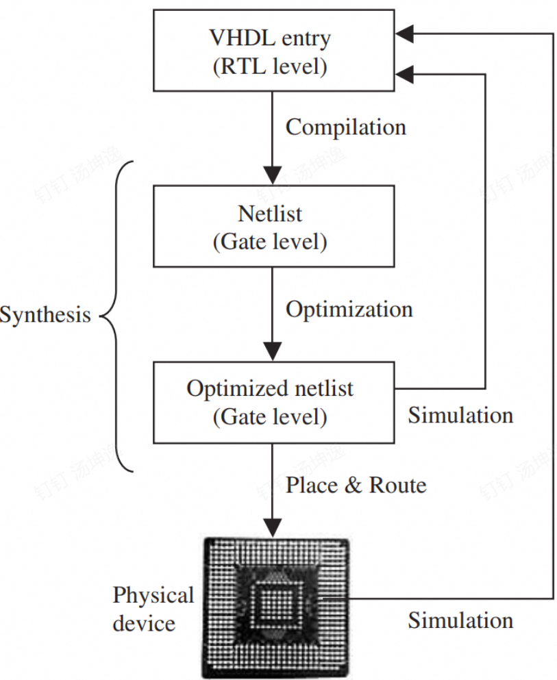
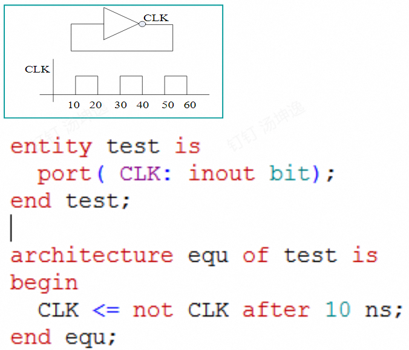
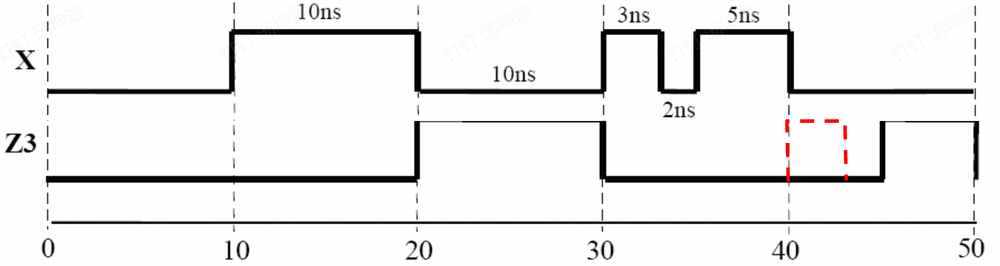
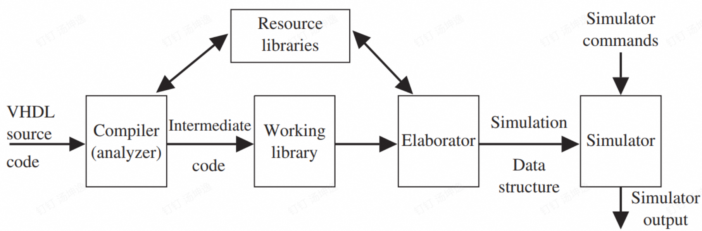
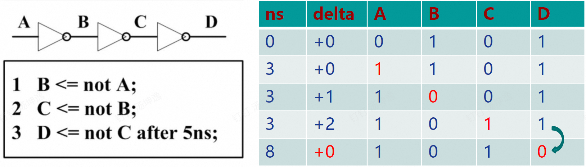
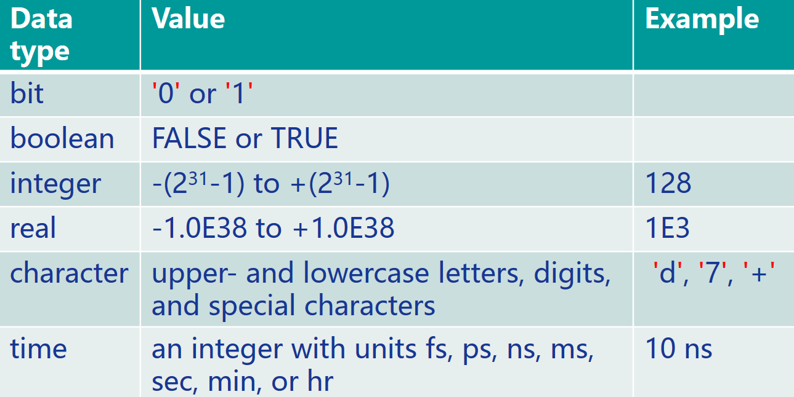
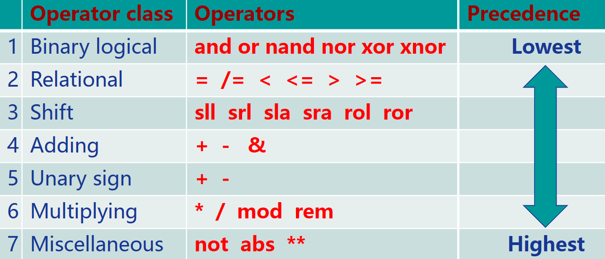
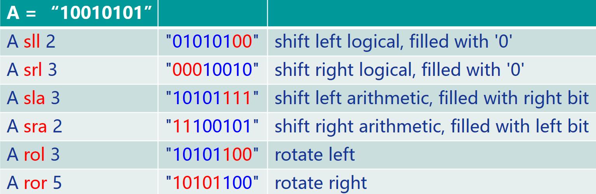

## 2.1 CAD（计算机辅助设计）



## 2.2 HDL（硬件描述语言）

硬件描述语言（HDL）描述电子电路或系统的行为（或结构），从而可以实现物理电路或系统。

VHDL是一种通用硬件描述语言，可用于描述和模拟多种数字系统的行为。系统的复杂性可以从几个门到复杂的集成电路的互连都可以。然而，虽然VHDL是完全可仿真的，但并非所有构造都可综合（转化为实际硬件）。

Verilog是另外一种HDL，流行度和VHDL五五开。下表对比：

| VHDL | Verilog |
| ---- | ------- |
| Government developed |  Commercially developed  |
| Ada based | C based |
| Strongly Type Cast | mildly Type Cast |
| Case(大小写) insensitive | Case sensitive |
| Difficult to learn | Easy to learn |
| More powerful | less powerful |

## 2.3 VHDL 描述组合逻辑电路

并发语句：随时准备执行。例如：

```
C <= A and B after 5 ns;
E <= C or D after 5ns;
```
`<=`表示赋值，右值变化后5ns左边的值才会变。这两天语句当中`A`或`B`，`C`或`D`一变化就会立即执行对应语句。

如果延时没有写，会安排一个极小的delay，来确保语句执行的时间顺序。

- VHDL 信号必须以字母开头，不能是保留字
- 语句以`;`结尾
- 两个`--`中间视为注释

:::note[bit_vector 类型]
```
C(3) <= A(3) and B(3);
C(2) <= A(2) and B(2);
C(1) <= A(1) and B(1);
C(0) <= A(0) and B(0)；
```
`bit_vector`类型相当于数组，可直接操作，使代码更加简单：
```
--A, B : in bit_vector(3 downto 0)
--C    : out bit_vector(3 downto 0)
C <= A and B;
```
我们可以更改顺序来实现倒序输出
```
signal up : out bit_vector (1 to 4);
signal down : in bit_vector (4 downto 1);
up <= down
```
:::

## 2.4 VHDL 模块

### Entity 和 Architecture
entity：描述模块的接口，包括输入、输出端口。
architecture：描述模块的实现，包括信号的声明、逻辑表达式、过程。



#### Entity
标准接口模块表示如下：
```
entity module_name is
    [port(interface-signal-declaration);]
end [entity] [entity-name];
```
#### Architecture
标准接口模块表示如下：
```
architecture architecture-name of entity-name is
    [declarations]
begin 
    architecture body
end[architecture] [architecture-name];
```

### 类型和模式

```
port(A, B: in integer := 2; C, D: out bit);
```
A和B为输入，都被赋值2，C和D为输出，缺省初始值，默认赋值为0。只在仿真中有效，综合时被忽略。

模式总共只有 in、out、inout、buffer 四种。其中 buffer 模式表示这个信号输出到外部，但允许在内部作为其他表达式的输入。

### 四位全加器的例子

```
entity FullAdder is
    port(X,Y,Cin:in bit;Cout,Sum:out bit);
end FullAdder;
architecture Equations of FullAdder is 
begin 
    Sum <= X xor Y xor Cin after 10 ns;
    Cout <= (X and Y) or (X and Cin) or (Y and Cin) after 10 ns;
end Equations;
entity Adder4 is 
    port (A, B: in bit_vector(3 downto 0); 
    Ci: in bit; -- Inputs
    S:out bit vector(3 downto 0);Co: out bit); --Outputs
end Adder4;
architecture Structure of Adder4 is
component FullAdder 
    port(X,Y, Cin: in bit;Cout, Sum: out bit);
end component;
signal C:bit vector(3 downto 1);
begin --instantiate four copies of the FullAdder
    FA0:FullAdder port map (A(0),B(0),Ci, C(1),S(0));
    FA1:FullAdder port map (A(1),B(1),C(1),C(2),S(1));
    FA2:FullAdder port map (A(2),B(2),C(2),C(3),S(2));
    FA3:FullAdder port map (A(3),B(3),C(3),Co,S(3));
end Structure;
```
`port map`实现端口的映射。

## 2.5 时序声明和 VHDL 进程

```
process (sensitivity-list)
begin 
    sequential-statements
end process;
```
Process 会先按顺序执行一次下面的代码，此后敏感列表中的信号一发生变化，再按顺序执行下方的代码。

实现`(A and B) or D`的例子：
```
entity nogates is
    port( A, B, C  :inbit;
        D: buffer bit;
        E: out bit);
endnogates;
architecture behave of nogates is
begin
    process(A, B, C, D)
    begin
        D <= A and B after 5 ns; --statement 1
        E <= C or  D after 5 ns; --statement 2
    end process; 
end behave;
```
只有**Processes,functions,procedures**是顺序语句，其他都是并发语句。

## 2.6 用 VHDL 进程建模(modeling)触发器

### 时钟D触发器

[时钟D触发器](../1#时钟-d-触发器)的实现：
```
process(CLK)
begin
    if  CLK’event and CLK = ‘1’
        then Q <= D;
    end if;
end process;
```

### 透明锁存器

```
process(G,D)
begin
    if G = ‘1’ 
        then Q <= D; 
    end if;
end process;
```
特别注意，D信号需要在敏感列表里，不然当`G=1`，D变化了，输出也不会变化。

### if 表达式(statement)

```
if condition then
    sequential statements
{elsif conditionthensequential statements}
[else sequential statements]
end if;
```
if 是顺序语句，只允许在能用顺序语句的模块当中使用，比如`processes`。

`else if`要有对应的`endif`，`elseif`不需要。

### J-K触发器


SN ：active-low asynchronous preset
RN : active-low asynchronous clear

## 2.7 在进程中使用 wait 语句

wait 语句有三种：
- wait on sensitivity-list：等待某个信号变化
- wait for time-expression：等待一段时间
- wait until Boolean-expression：等待直到某个条件满足

一个 process 至少有一个 sensitivity-list 或者 wait 语句。

## 2.8 两种类型的 VHDL 延时

Inertial delays（惯性延时）：当输入信号变化比输出信号的变化快时会过滤掉。例如：
```
A <= not A after 1ns;
C <= A and B after 5ns;
```

`afer`默认是惯性延时，完整表达式为：
```
signal_name <= reject pulse-width inertialexpression after delay-time；
```

C 不会发生任何变化，把 A 过滤了，拒绝脉冲宽度小于输出信号延时的输入( 1ns < 5ns)。

Transport delays（传输延时）：仅作延时。表达式为：
```
signal_name<= transportexpression afterdelay-time；
```

:::tip[例题]

Zm <= X after 4 ns; --inertial delay rejects short pulses 

Z3 <= transport Zm after 6 ns; --total delay is 10 ns
:::

## 2.9 VHDL 的编译、仿真和综合



Compiler:
- checks to see that references to libraries are correct
- checks source code to see that it conforms to the syntax and semantic rules

Elaborator:
- Ports are created for each instance of a component
- Memory storageis allocated for the required signals
- The interconnections among the port signals are specified
- A mechanism is established for executing VHDL statements in the proper sequence
- The resulting data structurere presents the digital system being simulated

关于 delta 计数器进一步说明：当加上有限长的 delay 时，delta 计数器会清零。



## 2.10 数据类型



Real 和 time 类型是无法被综合的。类型定义方法如下：
```
type state_type is (s0, s1, s2, s3);
signal state: state_type := s0;
```




