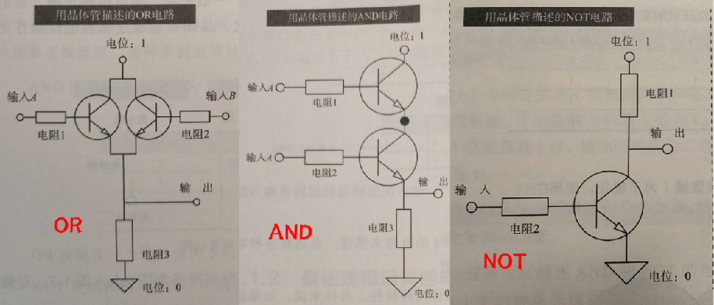
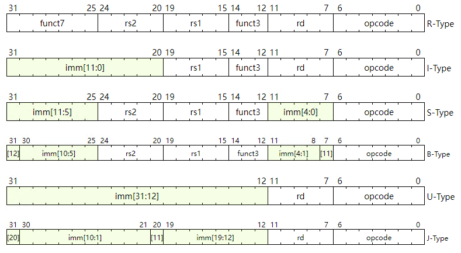

import { Aside } from '@astrojs/starlight/components';

:::note[项目介绍]
原来这是一个课程（从非门到俄罗斯方块），但因其贯通性和实践性，也可以称其为一个项目。

完整的课程内容在[《From Nand to Tetris》](https://www.nand2tetris.org/)。

2025.2.26本项目修改为针对《CPU制作入门》，鉴于前面部分内容相通， 遂保留。
:::

## 第一章CPU制作的基础知识

### 1.1 电路能够描述逻辑的理由

:::tip[电与逻辑的邂逅]
最早发展起来的是模拟电子技术，因为自然界当中声音、图像等信息本质上是连续的。例如电报，直接对声音处理转化为电信号，再还原比较容易和方便。另外电力技术也不够先进，具有离散特性的硬件还没制造出来。

但是人类社会为了交流，必须要标准化、量化一些东西。绝大多数计算都是有限小数或整数计算。模拟电子技术可以实现加减乘除积分微分，但连续信号无法存储，以及受噪声影响大两个问题导致其无法完成复杂运算。机械、液压响应太慢，光学发展不成熟。

<Aside type="note" title="香农：小事一桩">
香农意识到[布尔逻辑运算](./11b)与电气开关的开闭状态之间存在一一对应关系。在1938年的硕士论文《继电器和开关电路的符号分析》中，香农提出一种系统化的方法，用布尔表达式设计开关电路。
</Aside>

那时已经有电子管这样有“离散/开关”特性的器件了，于是实现计算的大任就交到了“离散”的“电”的手里。1947年晶体管发明，才慢慢有了数字电路的说法。
:::

正片开始🎬

晶体管：输入（基极）的电位为1（高于特定点位），集电极和发射极就回到同。一般集电极接正极，发射极接负极，电流从集电极流向发射极。可以说晶体管是通过基极电位操作开关电路的。



现在可以用电路实现 `AND、OR、NOT`了，而在[布尔逻辑运算](./1-1b)我们也知道任何布尔函数都能用它们的运算表达式表示。举个例子，加法（半加器：一位加一位，含进位）。

```
S = (A OR B) AND NOT (A AND B)
C = A AND B
```

可见用一系列电路描述组合逻辑，可对任意输入给出输出给定结果。描述这种组合逻辑的电路被称为[组合逻辑电路](../../electronics/fpga/1)。

### 1.2 为何能用基本逻辑电路实现 CPU

只有组合逻辑电路仍然没有存储功能，于是有了时序逻辑。
- 时序逻辑：根据当前的输入值和输出值决定最终输出值

用AND,OR和NOT可以描述各种真值表，但是前两者制造需要花费的晶体管更多，因此采用NAND,NOR和NOT。虽然只用NAND也可以，但是有NOR可以简化电路，同样也是节约材料和空间。很多目前CPU的基本元件是CMOS电路（由MOSFET元件组成的电路），在结构上更容易描述NAND和NOR。

一些时序逻辑电路查看[FPGA-1](../electronics/fpga/1#16-触发器和锁存器)。

组合逻辑电路和时序逻辑电路组合起来的电路被称为**有限状态机**（有限自动机），是 CPU 的基本形态。两个优点：
- 增加支持的运算种类
- 减小电路尺寸

:::note[二次加法]
1. 输入
2. 加法（组合逻辑）
3. 记忆加法结果（时序逻辑）
4. 加法（组合逻辑）
5. 输出
:::

用时钟信号激活。

### 1.3 CPU 的制造流程

1. 逻辑设计：逻辑电平的电路设计
2. 物理设计：片上电路配置（布局图形）设计
3. 光掩模生产
4. 在硅晶片上印制电路
5. 从硅晶片上分割芯片状电路

## 计算机架构

输入、输出、存储器、数据通路、控制通路

### 2.1 存储器

| 存储器类型 | 关键技术 | 易失性/非易失性 |
| --- | --- | --- |
| 寄存器 | DFF（时序逻辑电路）| 易失性 |
| 缓存 | SRAM（时序逻辑电路） | 易失性 |
| 主存 | DRAM（晶体管+电容） | 易失性 |
| 存储器 | HDD（磁性材料） | 非易失性 |
|  | SSD（NAND闪存） |  |

上电后，数据从主存->缓存->寄存器（离CPU从远到近）。

- **寄存器**：一个寄存器有多少位就有多少个D触发器，RISC-V固定为32个寄存器，每个32位，因此能记忆1024位数据；个人电脑目前多用64位；32位和64位实现方法几乎相同。
- **主存**：DRAM是典型，使用晶体管和电容器（根据电荷有无记录1位信息），它机构和使用时序逻辑的寄存器不同，本书视为相同。

寄存器每个地址32位，存储器每个地址8位（1个字节）。

### 2.2 基本处理流程

1. 取指令 (instruction fetch, IF)，从存储器中读取指令
2. 指令译码(instruction decode, ID)，从寄存器中读取所需数据
3. 运算
4. 访存(memory access, MEM)，从存储器中读取数据，将处理结果写入存储器
5. 回写(write back, WB)，将运算结果或存储器加载数据写入寄存器

- **IF**：保存存储器指令地址的叫程序计数器(program counter, PC)，保存于CPU内寄存器中。RISC-V指令32位，每取指一条，PC+4（4个字节=32位）。此外还有一个PC专用寄存器，来实现不连续地址的分支指令和跳转指令等。
- **ID**：本书介绍的是 RISC-V 指令集，定义了几种模式。



- rs: 表示存放作为运算源的数据的寄存器编号（5位，正好32个）
- rd: 对于数据写入的目的寄存器编号（5位）
- imm: 立即数（缺点是寄存器可以存32位数，但立即数只有12位或更少）
- opcode: 区分模式；funct: 表示指令运算

RISC-V 将译码处理简化了，**RISC 指令集**（reduced instruction set computer，精简指令集）指令都是定长，可以直接译码；而 **CISC 指令集**（reduced instruction set computer，复杂指令集）是非定长。有的指令相同字段既是读取源，也是写入目标等情况，ARM处理器无法使用单一的译码电路来处理所有指令类型的寄存器字段。处理器必须为不同的指令类型实现多套译码逻辑，这导致了逻辑电路规模的增大。

:::note[比如你要做个加法]
1. 首先执行**加载指令**(如`lw rd, offset(rs1)`)：
   - ID阶段：读取基址寄存器rs1的值
   - EX阶段：计算内存地址 = rs1值 + offset
   - MEM阶段：从计算出的地址读取数据
   - WB阶段：将读取的数据写回目标寄存器rd

2. 然后执行**加法指令**(如`add rd, rs1, rs2`)：
   - ID阶段：读取rs1和rs2寄存器的值(其中一个可能是上一条加载指令的结果)
   - EX阶段：执行加法运算
   - MEM阶段：对加法指令不执行任何存储器操作
   - WB阶段：将结果写回目标寄存器

原因在于 RISC-V 没有一条指令可以加载->运算，对数据存储器的访问仅限于的存储指令。
:::
