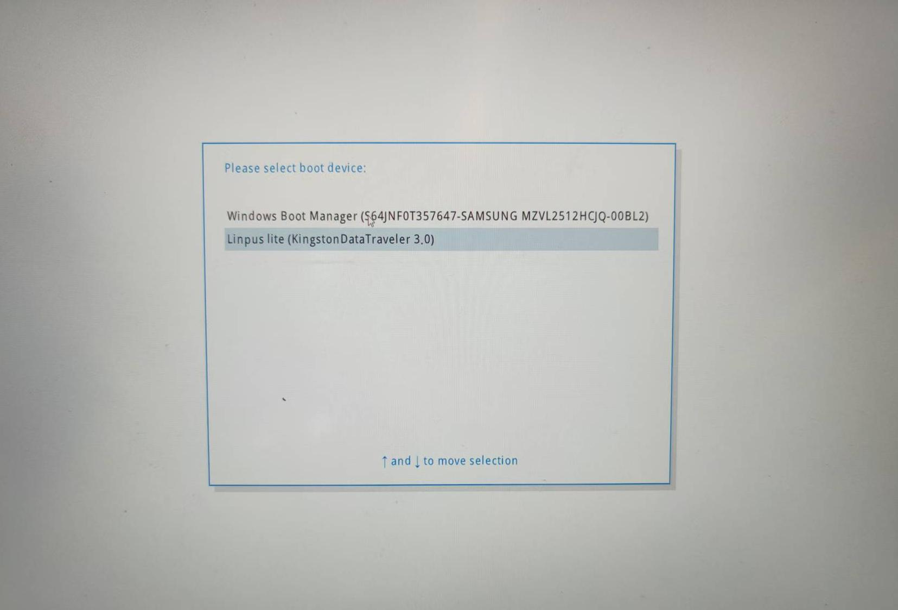
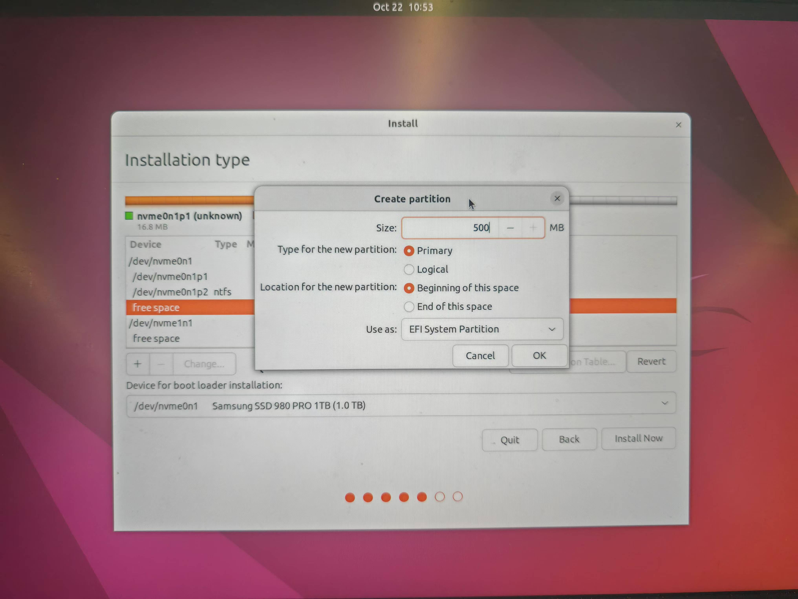
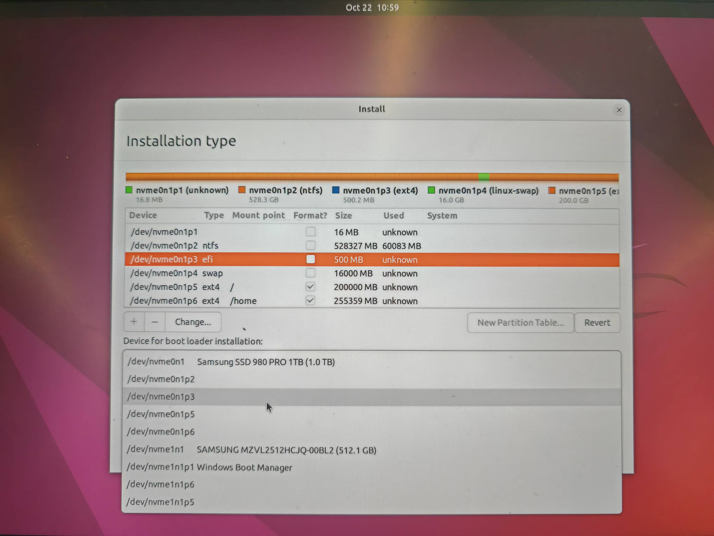
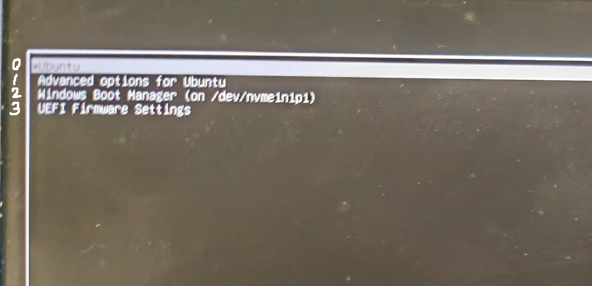
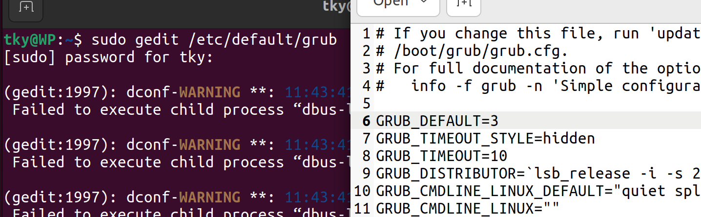
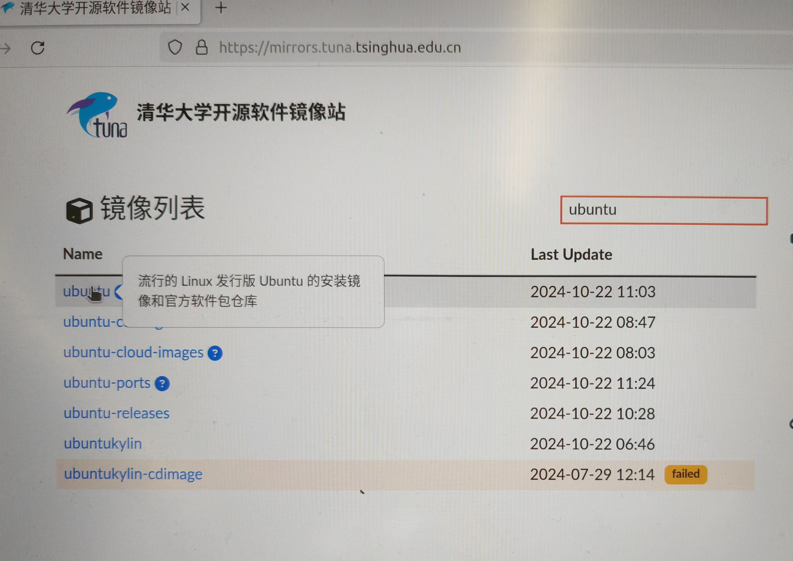
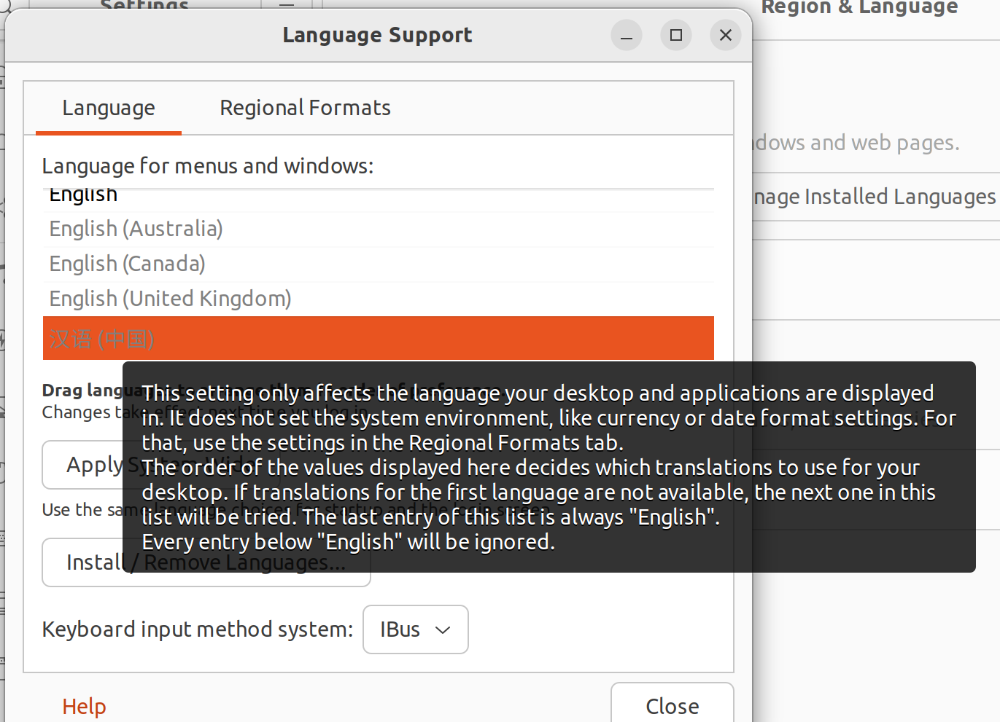
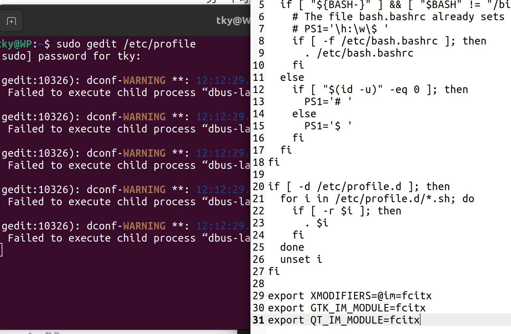
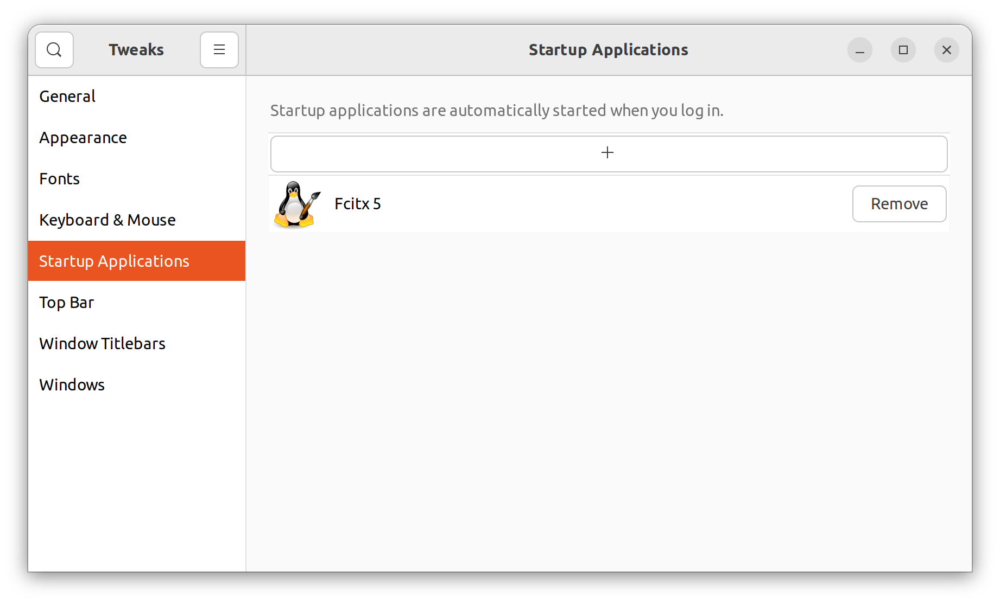
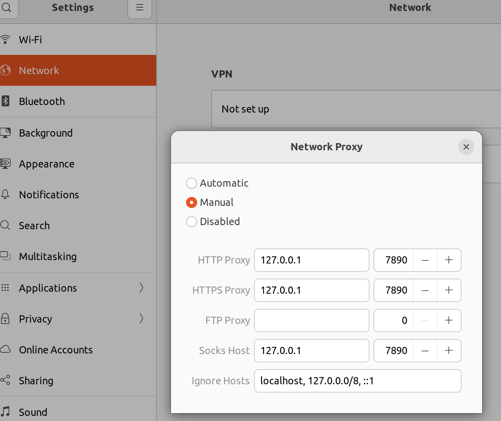

import { LinkCard, CardGrid } from '@astrojs/starlight/components';
import { Steps } from '@astrojs/starlight/components';

:::note[说明]

教学资源：[地址](https://ysyx.oscc.cc/docs/#%E6%95%99%E5%AD%A6%E8%B5%84%E6%BA%90)

| 预学习阶段 | 2 | https://ysyx.oscc.cc/docs/2306/preliminary/0.2.html |
| --- | --- | --- |

这篇为我在该阶段的笔记，可能包含一些错误和问题的解答。
:::

## 卸载 Ubuntu

因为我的版本是 Ubuntu 20.04 ，防止可能产生的问题，于是我在双系统下卸载 Ubuntu 。

### 步骤一：调整开机启动项位置


1. 开机进入 BIOS 设置：在电脑还未亮之前，狂按 F2 (不同电脑可能不同)，然后进入 BIOS 系统设置。
2. 找到启动项，找到 Windows 启动项，将其调整到第一启动项。（我这里按 F6 ）

:::note[不同品牌电脑 BIOS 进入]
- 联想笔记本：F1、F2或F12（部分电脑需要按住 Fn 键）
- 华硕笔记本：Esc
- 华为笔记本：F12
- 惠普笔记本：F9

我使用的是联想 Thinkbook 14，长按 Fn，狂按 F1 和 F2 进入的（总有一个是有用的）。
:::

### 步骤二：删除 Ubuntu 分区

:::tip[参考资料]
1. [使用DiskGenius删除Ubuntu分区](https://blog.csdn.net/qq_42257666/article/details/120721561)
2. [用磁盘管理直接删除](https://blog.csdn.net/m0_69251699/article/details/128874906)
:::

我选择方法 2 ，打开系统的“磁盘管理”，确定 Ubuntu 所在的分区，右键删除卷。主要的判别方法是：
1. 之前安装时分配的磁盘和空间大小
2. 没有写着 C、D、E、F 盘符的分区
3. 右键删除卷时，弹出的提示（如图）


:::note[EFI 分区]
如果你是重装 Ubuntu 系统可能会看到一个几百兆的分区，告诉你无法用这种方式删除卷，那么你可以按照下面步骤三的方法来删除它。你要选择对应的磁盘和分区。在`select partition`之后输入：
```cmd
delete partition override
```
然后你再看的时候就会发现，这个分区没了。
:::

### 步骤三：删除 Ubuntu EFI 文件

win + r，输入`cmd`进入命令窗口。

```cmd
diskpart
```

在弹出的窗口（如果有）中输入：

```cmd
list disk
```

找到 Windows 的 EFI 分区所在的磁盘（大概率是磁盘 0），输入：

```cmd
select disk 0
list partition
```
找到一个大小约 260M 的分区然后选择它，我这里是分区0，所以输入：

```cmd
select partition 0
```

分配盘符，不要和你已有的盘符重复，如C、D、E、F，我这里选择 P ：

```cmd
assign letter=P
```

系统（win11下面有个搜索框）里找到记事本，用管理员权限打开，上面“文件->打开”，找到 P 盘，找到 Ubuntu 文件夹，右键删除它。


最后，输入下面命令行，恢复回去。

```cmd
remove letter=P
```

## 安装 Ubuntu 22.04

:::caution[装Ubuntu之前]
只有一台电脑，但需要使用 Ubuntu ，有安装双系统和虚拟机两种方法。虚拟机就是能同时跑两个系统，吃电脑性能；双系统是在开机时决定进入哪个操作系统。根据自身需求决定，我这里介绍双系统的安装方法（CSDN 有大量虚拟机的教程，双系统较少）。

我这里使用的是 64 位 Windows 11 操作系统。在安装之前请自查电脑配置是否适合装双系统，如 32 位的 Windows 就不合适。
:::

### 下载镜像和镜像安装工具

下载镜像：[官网地址](https://releases.ubuntu.com/jammy/)

下载的镜像后缀为.iso，我下载的为`ubuntu-22.04.5-desktop-amd64.iso`。

:::tip
1. 开梯下载会更快一点
2. 占用空间比较大（4.4G），如果 C 盘满了，可以更改浏览器下载的路径
:::

我们可以趁下载镜像的功夫，再去下载一个制作启动盘的工具：[rufus](https://rufus.ie/zh/)，它是[开源](https://github.com/pbatard/rufus/releases/tag/v4.5)的。当然也有不同的教程采用不同的工具，例如 [win32diskimager](https://www.bilibili.com/video/BV1554y1n7zv/)、[Ventory](https://blog.csdn.net/qq_59001382/article/details/142951549)等。

### 磁盘分区

有**两种方案**：
方案一包含四个分区：
- efi：500M Ubuntu 引导区
- swap：交换区，休眠和数据溢出时存储的地方，依据物理内存分配（系统中查看），8G-10G，16G-16G，32G及以上-24G
- ext4：根目录，存放系统文件（理解为 C 盘），尝鲜级（不安装 CUDA 之类的）20G，一般 100G 以上。
- ext4：home目录，存放用户文件（理解为 D 盘），**重装系统时可以只覆盖其他分区，本分区内容能保存下来**，我这里也计划 100G 以上。

（重度需求，跑神经网络数据集等的 500 + 500G）

方案二仅有三个分区，将后两个分区合并，适合空间紧张的朋友。

打开“磁盘管理”，选择一个磁盘右键点`压缩卷`，设置所需要的大小，压缩得到未分配的空间。


:::note[可压缩空间的大小远小于磁盘的剩余空间]
打个比方就是瓶子里装石头，能利用的空间就只剩下最上面空出的空间，石头和石头之间的空隙并不能利用上。

解决方法有：1. 重新整理磁盘，把数据放一起去；2.把磁盘中数据导入到 U 盘，格式化磁盘，再把 U 盘中数据导回到磁盘。
:::

这时顺便看一下磁盘分区类型：右键刚刚压缩卷的那个磁盘（那一行最左侧的灰色区域），选择“属性”，点击“卷”，就能确定是 MBR 分区还是 GPT 分区。

:::note[关于分区类型]
我这里是装了一块新的硬盘，它的分区类型需要和电脑的匹配，所以都一样。当然也可以是直接在“系统信息”中查看“BIOS模式”。BIOS 引导模式和分区类型一一对应。

**MBR 采用 legacy 模式，GPT 采用 UEFI 模式**。MBR 属于比较老的电脑了，现在新电脑都普遍采用 GPT 分区类型。 
:::


### 制作启动盘

:::danger[特别注意]
1. 用来制作启动盘的 U 盘、移动硬盘等务必将内容提前备份，制作系统盘会将它清空。
2. 确保这段时间电脑不会没电，不然你的 U 盘可能就废了。
:::

准备一个内存够大（8G以上）的 U 盘，**注意备份**，因为制作系统盘会清除里面的内容。如果 U 盘上有物理的写保护滑块，请将它滑到 unlock 状态。

打开 Rufus，选择下载好的镜像文件，选择 U 盘作为启动盘。
- 在"分区方案和目标系统类型"选项中，选择刚刚我们查看的分区形式。我这里是 GPT 。
- 在"文件系统"和"簇大小"选项中，保持默认设置通常就可以。
- 在"新卷标"中，你可以自定义U盘的卷标名称，也可以保持默认。
- 勾选"快速格式化"和"创建一个启动盘使用ISO镜像"选项，这也是默认的。
- 检查坏块（Rufus 4.7）很慢，我没勾选；如果不慎勾选后取消，你的u盘将无法识别，重新插拔后格式化它
 
点击“开始”，它可能会弹出好几个警告，下面这个窗口如图选择第一个，之后的警告都是说会使你磁盘内容丢失、多分区磁盘其他分区也会丢失等等，**注意好备份**，一直“OK”“是”“确定”就行。


时间有点长，保持电脑有电。

### 安装系统

关机，开机时按 Fn + F2 进入 BIOS 选择 UEFI 引导模式（我这里原本就是 UEFI 模式，所以跳过此步）。

插上刚刚制作的系统启动盘，关机，开机时按 F12 （不同电脑可能不同，见下图，图来自B站机器人工匠阿杰）进入启动方式选择 U 盘启动。




等待一会儿，进入 Ubuntu 系统开始安装流程。
<Steps>
1. 欢迎界面选择 `English`，`Install Ubuntu`
   :::tip[选择英语]
    在一生一芯文档当中建议安装英文的系统环境，因此选择 English。如果不参与一生一芯，可以选择中文。
   :::
2. Keyboard Layout: 键盘布局左边和右边都选择 `English (US)`，`English (US)`，`Continue`
3. Wireless: 选择`I don't want to connect to a Wi-Fi network right now`，先跳过 Wi-Fi 设置,`Continue`
4. Updates and other software: 选择`Normal installation`，确认下面 Other options 什么都没选，`Continue`
   :::caution[关于软件更新]
    根据一生一芯PA0文档，不要开启软件更新，这会打乱原来的系统文件结构。因为第三步我们没有连网，因此这个默认选择的直接没法点了，正好。

    特别要注意后续安装完之后，还会弹出软件更新的窗口，**务必忽略！**
   :::
5. Installation type: 选择`Something else`，表示我们将自定义磁盘分配给 Ubuntu，就是前面磁盘分区的两种方案，`Continue`
   
6. Installation type: 找到你刚刚在 Windows 磁盘管理中压缩出来的卷（通过空间大小、写着 free space 来判断），点击它，再点下面 `+` 来创建分区，**每次创建分区都要确保选中的是那块 free space**，我这里采用方案一，需要创建四个分区：
   
   - EFI 分区：500 MB，类型选择 `EFI System Partition`，点击 `OK`，如下图所示（中间两个选项不用动，创建其他分区也默认如此，不再赘述）
    
   

    - SWAP 分区：根据我们前面计划的大小设置，我这里输入 16000 MB，类型选择 `Linux swap`，点击 `OK`
    - EXT4 分区：根据我们前面计划的大小设置，我这里输入 200000 MB，，类型选择 `Ext4 journaling file system`，Mount point（挂载点）选择 `/`，点击 `OK`
    - EXT4 分区： 将free space 剩余空间全用上输入进去，类型选择 `Ext4 journaling file system`，Mount point（挂载点）选择 `/home`，点击 `OK`

   Device for boot loader installation: 选择刚刚 EFI 分区，注意看下图，我的 efi 是 /dev/nvme0n1p3，下面也要选择相同的名称，点击 `Install Now`。

   

   弹出窗口，再确认一下四个分区（ESP、swap、ext4、ext4），点击 `Continue`
7. Where are you?: 点击中国，下面就会显示 `Shanghai`，`Continue`
8. Who are you?: 
   - Your name，建议短一点纯英文，我叫`tky`
   - Your computer's name，我用的`WP`
   - choose a password，因为 Ubuntu 不放什么隐私，简短一点方便登录，`tky`，同时下面选择`Log in automatically`自动登录
    
    `Continue`
9. 等待安装系统完成，约 5 分钟，弹出窗口`Installation Complete`，点击`Restart Now`重启系统。
10. 到下面的界面提示你要拔出 U 盘，并按下键盘上 `Enter` 键。
    
    

    你会看到这样的界面，这就是以后你选择进入哪个系统的开机界面了。

    

    可以看到默认是 Ubuntu ，如果 10s 内不用 ↑、↓ 选择会自动进入（后续我们会修改，让它默认进入 Windows）。记住 Windows 从上往下标序号是几，如图从 0 开始，我这里 Windows 是 2。记住就行，按下 `Enter` 进入 Ubuntu 系统。
11. 弹出一个 Ubuntu Pro 的窗口，一路 `Skip for now` ， `No, don't send system info` 就可以了。安装完成！
</Steps>

## Ubuntu 基本配置

### 默认启动项

现在重启开机默认的是 Ubuntu 系统，但如果我们主要工作在 Windows 系统，每次要按 ↓ 选择到 Windows 会非常麻烦，请按照下面步骤配置。

打开终端窗口（点击桌面左下角有九个点，第一行有一个软件叫`Terminal`，点击），输入：

```cmd
sudo gedit /etc/default/grub
```

:::note[sudo 介绍]
sudo 在 Linux 系统中表示使用管理员权限运行其后的命令，在操作系统文件时需要，在此处便是如此。一个命令窗口第一次使用时需要输入密码后回车。
:::



在弹出的文本编辑窗口更改第六行`GRUB_DEFAULT=0`，还记得上面安装系统第 10 步我们记住的数字是几吗？我的是2！把 0 改为 2。右上角有`Save`，保存一下，关闭窗口，再在命令窗口输入下面命令，搞定！

```cmd
sudo update-grub
```

### Wi-Fi 连接

桌面右上角点击，弹出的菜单选择`Wi-Fi Not Connected`，连接网络即可。

### 换源

Ubuntu 系统安装各类包、软件有它自己默认设置的路径，很显然是国外的网址，下载非常不方便。于是我们需要进行**换源**。

<Steps>
1. 选择镜像源，我这里选择[清华源镜像](https://mirrors.tuna.tsinghua.edu.cn)，搜索框输入 ubuntu 回车，如图所示，点击 Ubuntu 旁边的**问号**。

   

2. Ubuntu 软件仓库: 下面选择 Ubuntu 版本为 Ubuntu 22.04 LTS (jammy)，复制下面灰色区域的全部文本（源列表）。
3. 打开终端窗口，输入下面代码备份原有的源列表。
   ```cmd
   sudo cp /etc/apt/sources.list /etc/apt/sources.list.bak
   ```
   再输入下面代码打开源列表。
   ```cmd
   sudo gedit /etc/apt/sources.list
   ```
4. 全选删除原有源列表内容，把刚刚清华源复制的源列表粘贴进去，`Save`保存，关闭。
5. 千万不要忘了，使用`sudo apt-get update`去更新下载源。
</Steps>

### 时间同步

双系统存在一个问题就是时间不同步。

:::note[时间不同步的原因]
Ubuntu 系统采用 UTC 时间，连网后显示的时间是正确的，但实际上写入硬件 BIOS 的时间是当前时间 -8 小时。

Windows 系统直接从硬件 BIOS 读取时间，也就是当地时间（北京时间），所以会比 Ubuntu 系统慢 8 小时。
:::

解决方法如下
1. 安装时间同步工具
   ```cmd
   sudo apt install ntpdate
   ```
2. 使用工具同步到互联网时间
   ```cmd
   sudo ntpdate time.windows.com
   ```
3. 把时间机制从UTC改成localTime，并同步BIOS硬件时间
   ```cmd
   sudo hwclock --localtime --systohc 
   ```
### 中文输入法安装

中文输入法有ibus、fcitx、搜狗拼音输入法等，这里介绍 fcitx5 安装方法。

:::tip[参考资料]
为什么不建议安装搜狗输入法？

因为安装步骤（把汉语放到English前面并应用）中会更改系统环境语言，这在一生一芯文档中不建议，虽然修改起来比较方便也影响不大。你可以通过下面语句来判断系统环境的语言：
```cmd
echo $LANG
```

Ubuntu 安装 fcitx5 : https://zhuanlan.zhihu.com/p/508797663
:::

<Steps>
1. 打开设置，桌面右上角菜单下有齿轮，左侧找`Region & Language`，右侧点击`Manage Installed Languages`。这时可能提示你语言包没安装完成，等待它安装完。
2. 这时 Language support 里面有汉语了，读一下上面些什么，告诉你系统语言在上面 Region formats 里面修改，点一下去修改回英文。

   

3. 为使用 Fcitx 5，需要安装三部分基本内容：Fcitx 5 主程序、中文输入法引擎、图形界面相关。使用下面语句：
   ```cmd
   sudo apt install fcitx5 \
   fcitx5-chinese-addons \
   fcitx5-frontend-gtk4 fcitx5-frontend-gtk3 fcitx5-frontend-gtk2 \
   fcitx5-frontend-qt5
   ```
4. 安装中文词库，到[维基中文拼音词库Github的Releases](https://github.com/felixonmars/fcitx5-pinyin-zhwiki/releases)找一个后缀为`.dict`的下载。（如果你打不开 Github ，在[我的Gitee](https://gitee.com/indra_tang/awesome-ubuntuinstall)当中保存了 20250415 版本的 dict）由于可能存在更新，可以看该 Github 仓库的 README.md，看操作方法。
5. 点击桌面左侧栏，打开文件夹，打开下面 Others ，双击计算机，你就进入到根目录（存放系统文件的地方了），按照下面顺序依次进入`usr/share/fcitx5/pinyin`文件夹，右键选择打开 terminal，输入如下命令行在该文件内创建一个dictionaries文件夹。
   ```cmd
   sudo mkdir -p /usr/share/fcitx5/pinyin/dictionaries
   ```
   把刚刚下载的`.dict`拷贝进去，用下面命令（其中.dict的名称需自己修改）：
   ```cmd
   sudo mv ~/Downloads/zhwiki-20240909.dict /usr/share/fcitx5/pinyin/dictionaries
   ```
6. 打开终端，用下面代码打开系统文件:

   ```cmd
   sudo gedit /etc/profile
   ```
   在文件最下面加入如下三行代码：
   ```txt
   export XMODIFIERS=@im=fcitx
   export GTK_IM_MODULE=fcitx
   export QT_IM_MODULE=fcitx
   ```
   

7. 安装 Fcitx 5 后并没有自动添加到开机自启动中，每次开机后需要手动在应用程序中找到并启动，非常繁琐。因此安装工具 Tweaks 来配置它自启动，用`sudo apt install gnome-tweaks`安装。你可以在左下角九个点，里面找 Tweaks 打开它，自启动添加进 fcitx5。

   

8. 在你的应用（左下角九个点打开）有三只企鹅，打开 Fcitx 5 configuration，取消勾选`Only Show Current Language`，右侧选择`Pinyin`点击`<`添加进去。右上角有个键盘可以切换输入法。终于搞定了！
8. 在你的应用（左下角九个点打开）有三只企鹅，打开 Fcitx 5 configuration，取消勾选`Only Show Current Language`，右侧选择`Pinyin`点击`<`添加进去。右上角有个键盘可以切换输入法。终于搞定了！
</Steps>

:::tip[如何让 fcitx5 用起来和搜狗一样爽]
1. 给它安装一个皮肤，我参考了[这篇教程](https://github.com/thep0y/fcitx5-themes-candlelight)。这篇教程当中你可能需要安装git和安装vim，他会提示你如何下载`sudo apt install git`和`sudo apt install vim`（不用vim用gedit打开也可以）。
2. 这时你的输入切换需要同时按住`ctrl+shift`很不方便，请在 Fxitx 5 configuration 的 Global Option 里面修改 Trigger input Method 为 `Shift`。
3. 注意有个快捷按键是`Toggle embedded preedit`,你可以使用他写的`ctrl+alt+p`改为预编辑模式（因为在搜索框使用单行编辑模式会遮住）。
4. 同样在 configure 里面 `Addons` 里面找到 `Pinyin` 齿轮进去可以修改 `Previous candidate` 和 `Next candidate` 快捷键。
:::

## 常用软件安装

### 安装 Clash

:::tip[参考资料]
这篇我写的[Linux ( Ubuntu ) 系统装clash](https://zhuanlan.zhihu.com/p/2852384493)不错！
这篇我写的[Linux ( Ubuntu ) 系统装clash](https://zhuanlan.zhihu.com/p/2852384493)不错！
:::

下面是简略版，详细看上面链接。

1. 根据自己 Linux 系统的版本来确定安装的命令。
   ```cmd
   uname -a
   ```
   如果输出包含 x86_64 使用下面命令安装: 
   ```cmd
   wget https://github.com/clashdownload/Clash_for_Windows/releases/download/0.20.39/Clash.for.Windows-0.20.39-x64-linux.tar.gz
   ```
   如果输出包含 aarch64 使用下面命令安装: 
   ```cmd
   wget https://github.com/clashdownload/Clash_for_Windows/releases/download/0.20.39/Clash.for.Windows-0.20.39-arm64-linux.tar.gz
   ```
2. 找到它，解压，打开文件夹，双击 cfw 文件即可运行 clash ，使用方法和你在 Windows 一样。
3. 别忘了，在右上角网络配置选择手动，如图所示。

   
   

下面是简略版，详细看上面链接。

1. 根据自己 Linux 系统的版本来确定安装的命令。
   ```cmd
   uname -a
   ```
   如果输出包含 x86_64 使用下面命令安装: 
   ```cmd
   wget https://github.com/clashdownload/Clash_for_Windows/releases/download/0.20.39/Clash.for.Windows-0.20.39-x64-linux.tar.gz
   ```
   如果输出包含 aarch64 使用下面命令安装: 
   ```cmd
   wget https://github.com/clashdownload/Clash_for_Windows/releases/download/0.20.39/Clash.for.Windows-0.20.39-arm64-linux.tar.gz
   ```
2. 找到它，解压，打开文件夹，双击 cfw 文件即可运行 clash ，使用方法和你在 Windows 一样。
3. 别忘了，在右上角网络配置选择手动，如图所示。

   
   
### 安装 VSCode

1. 到[VScode](https://code.visualstudio.com/)官网下载`.deb`
2. 到下载文件的地方右键，选择打开方式为软件安装，在弹出的窗口快速按下`install`并输入密码。
3. 不妨顺便设置一下 VScode 的自动保存，点击左下角齿轮，搜索`auto save`，选择`after delay`，相当于实时保存。

### 安装微信

1. 打开[官网](https://linux.weixin.qq.com/en)。
2. 查看系统架构
   ```cmd
   dpkg --print-architecture
   ```
3. 根据不同架构`arm`和`x86-64`下载对应的微信 .deb 文件
4. 使用和安装 VSCode一样的方式，或者使用这样的命令：
   ```cmd
   sudo dpkg -i WeChatLinux_x86_64.deb
   ```

### 安装 Terminator 终端

```cmd
sudo apt install terminator
```

这是一个更好用的终端

- `ctrl+shift+o`上下分窗口
- `ctrl+shift+e`左右分窗口
- `ctrl+shift+w`关闭当前窗口
- `Alt`+上下左右来切换窗口

详细快捷键，右键选择`Preferences`里面查看。

### 安装 npm、node、pnpm

大部分教程`sudo apt install npm`会导致下载的版本是老的，请参考[这篇文章](https://github.com/nodesource/distributions)安装最新的npm和node。

```cmd
sudo apt-get install -y curl
curl -fsSL https://deb.nodesource.com/setup_23.x -o nodesource_setup.sh
sudo -E bash nodesource_setup.sh
sudo apt-get install -y nodejs
```

验证安装版本：
```cmd
node -v 
npm -v
```

pnpm 安装：
```cmd
sudo npm install -g pnpm
```

:::caution[使用pnpm安装sharp库失败]
更改 sharp 库的源：
```cmd
pnpm config set sharp_binary_host=https://npmmirror.com/mirrors/sharp
pnpm config set sharp_libvips_binary_host=https://npmmirror.com/mirrors/sharp-libvips
pnpm install
```
:::

### 安装 ROS2

到[官网](https://www.ros.org/blog/getting-started/) 我们选择 Humble 这个 LTS （长期维护）的版本。

按照这个[页面](https://docs.ros.org/en/humble/Installation/Ubuntu-Install-Debs.html)步骤进行安装：

你未来搞 ROS2 很可能需要用到 colcon (colcon是ros2的包构建工具，相当于ros1中的catkin工具一样)，建议先安装一下：
```cmd
sudo apt install python3-colcon-common-extensions
```

1. 打开终端，把以下代码粘贴进去运行：
```cmd
sudo apt update && sudo apt install locales
sudo locale-gen en_US en_US.UTF-8
sudo update-locale LC_ALL=en_US.UTF-8 LANG=en_US.UTF-8
export LANG=en_US.UTF-8
```
2. 设置 Universe 的源：
```cmd
sudo apt install software-properties-common
sudo add-apt-repository universe
```
有个`[Enter]`的提示，按回车继续。

3. 添加 ROS 2 GPG key：
```cmd
sudo apt update && sudo apt install curl -y
sudo curl -sSL https://raw.githubusercontent.com/ros/rosdistro/master/ros.key -o /usr/share/keyrings/ros-archive-keyring.gpg
```
4. 然后将存储库添加到您的源列表中。：
```cmd
echo "deb [arch=$(dpkg --print-architecture) signed-by=/usr/share/keyrings/ros-archive-keyring.gpg] http://packages.ros.org/ros2/ubuntu $(. /etc/os-release && echo $UBUNTU_CODENAME) main" | sudo tee /etc/apt/sources.list.d/ros2.list > /dev/null
```
5. 常规更新操作：
```cmd
sudo apt update
sudo apt upgrade
```
6. 安装 ROS2 桌面（必装），包含（ROS, RViz, demos, tutorials）：
```cmd
sudo apt install ros-humble-desktop
```
中间问yes or no，输入`Y`。

ROS-Base 安装：通信库、消息包、命令行工具。没有 GUI 工具。
```cmd
sudo apt install ros-humble-ros-base
```
开发工具：用于构建 ROS 包的编译器和其他工具
```cmd
sudo apt install ros-dev-tools
```
7. 环境设置：
大部分情况下是`.bash`可以直接用下面语句，但你的电脑上也可能是`.zsh`或`.sh`
```cmd
echo "source /opt/ros/humble/setup.bash" >> ~/.bashrc 
source ~/.bashrc
```
再输入`nano ~/.bashrc`或者用vim去打开它，看看最后一行是不是加上了`source /opt/ros/humble/setup.bash`。

用这种方式配置环境不用每次运行ros前都要source了，会更方便。

### 安装 Gazebo

```cmd
sudo apt install gazebo
sudo apt install ros-humble-gazebo-*
```

## 双系统下 Ubutnu 分区扩容

我已经猜到可能有朋友双系统安装 Ubuntu 系统给的空间小了，我恰好也写了一篇文章可以参考一下。

:::tip[参考资料]
[双系统 Ubuntu 分区扩容](https://blog.csdn.net/indrrra/article/details/136206465)
:::

## PA0

### Installing tools

```cmd
su -
```

:::danger[su: Authentication failure]
```cmd
sudo passwd root
```
输入自己 Ubuntu 用户密码，然后再设置 root 密码，为了方便我设置为和用户密码相同。

这时不需要做下面一步`adduser username sudo`了，已经同时把你的用户添加进`sudo`了。
:::
 
### Configuring vim

:::tip[Vim 基本使用]
现在的 Vim 没有那么垃圾只能依靠`hjkl`来上下左右，你可以直接用上下左右来移动光标，基本掌握以下操作就够了：

`i`进入编辑模式，`esc`退出编辑模式，`:wq`保存并退出，`:q!`不保存直接退出（`!`表示强制写入或退出）。

一生一芯提供的教程当中推荐使用[OpenVim](http://www.openvim.com/)
:::

#### 合并格式的diff

我们来看一个例子，修改前的文档如下所示：
```txt
The Way that can be told of is not the eternal Way;
The name that can be named is not the eternal name.
The Nameless is the origin of Heaven and Earth;
The Named is the mother of all things.
Therefore let there always be non-being,
  so we may see their subtlety,
And let there always be being,
  so we may see their outcome.
The two are the same,
But after they are produced,
  they have different names.
```

修改后的文档如下所示：
```txt
The Nameless is the origin of Heaven and Earth;
The named is the mother of all things.

Therefore let there always be non-being,
  so we may see their subtlety,
And let there always be being,
  so we may see their outcome.
The two are the same,
But after they are produced,
  they have different names.
They both may be called deep and profound.
Deeper and more profound,
The door of all subtleties!
```

修改前文本前七行和修改后文本前六行有较高相似度（这也是为什么 Unified diff 被创造出的原因）所以用`@@ -1,7 +1,6 @@`表示**修改修改前文本从1开始的连续7行为修改后文本从第1行开始的连续6行**。

下面每一行开头有`-`表示删除的，`+`表示添加的行，其他的不变。

于是完整的 Unified diff 写成如下形式：

```diff
--- lao	2002-02-21 23:30:39.942229878 -0800
+++ tzu	2002-02-21 23:30:50.442260588 -0800
@@ -1,7 +1,6 @@
-The Way that can be told of is not the eternal Way;
-The name that can be named is not the eternal name.
 The Nameless is the origin of Heaven and Earth;
-The Named is the mother of all things.
+The named is the mother of all things.
+
 Therefore let there always be non-being,
   so we may see their subtlety,
 And let there always be being,
@@ -9,3 +8,6 @@
 The two are the same,
 But after they are produced,
   they have different names.
+They both may be called deep and profound.
+Deeper and more profound,
+The door of all subtleties!
```
其中第一行表示修改前的文件，开头用`---`表示;第二行表示修改后的文件，开头用`+++`表示。

:::note[diff 的使用方法]
```cmd
$ diff [-bBi] from-file to-file
选项与参数：
from-file ：原始比对的文件名；
to-file   ：目标比对的文件名；

-b  ：忽略一行当中，仅有多个空白的差异，例如 "about me" 與 "about     me" 視為相同
-B  ：忽略空白行的差异。
-i  ：忽略大小写的不同。
```
:::

所以这里表示取消`"syntax on`前面的`"`。

修改完成之后别忘记写入`：wq!`。

### More Exploration

:::note[为什么 cd 没有 man]
cd 不是程序，它只是 shell 中的一个命令，所以没有 man 页面。
:::

#### 正则表达式

[正则表达式学习](https://linux.vbird.org/linux_basic/centos7/0330regularex.php)

结合以上教程，你很容易明白以下常用的正则表达式及含义：

| 符号 | 含义 |
| --- | --- |
| `.` | 匹配任意字符 |
| `*` | 匹配零个或多个字符，例如 `o*` 表示 0-n 个 o |
| `\{n1,n2\}` | 匹配 n1 到 n2 个字符 ，例如 `a\{3,5\}` 表示有连续的 3-5 个 a |
| `[abc]` | 匹配 a、b、c 任意一个字符 |
| `[^abc]` | 匹配除了 a、b、c 以外的任意字符 |
| `^` | 匹配字符串的开头 |
| `$` | 表示字符串末尾，`.h$` 表示以.h 结尾的文件 |
| `[n1-n2]` | 匹配 n1-n2 范围内的任意字符，必须 ASCII 当中连续，例如 `[A-Z]` 表示所有大写字母 |
| `\` | 转义字符，用于匹配一些特殊字符，例如 '\.' 表示匹配点号 |

尝试打印自己的 IP 地址：

```cmd   
ifconfig | grep -n '^.*inet ' | sed 's/^.*inet //g' | sed 's/ net.*$//g'
```

扩展的正则表达式符号：

| 符号 | 含义 |
| --- | --- |
| `\|` | 用或（ or ）的方式找出数个字符串 |
| `()` | 括号内的表达式会作为一个整体被匹配，如 egrep -n 'g(la\|oo)d' 找 glad 或 good|
| `+` | 匹配前面的字符 1 次或多次 |
| `?` | 匹配前面的字符 0 次或 1 次 |
| `()+` | 多个重复组的判别，如 egrep 'A(xyz)+C' 找开头为A结尾为C，中间有一个以上xyz的字符串 |

:::note[常用命令讲解]
单独再写一篇[常用命令](./comcom)
:::


<LinkCard title="项目首页" description="一生一芯跟学笔记" href="./ysyx" />
<CardGrid>
<LinkCard title="上一篇" description="预学习1：如何科学地提问" href="../ysyx" />
</CardGrid>