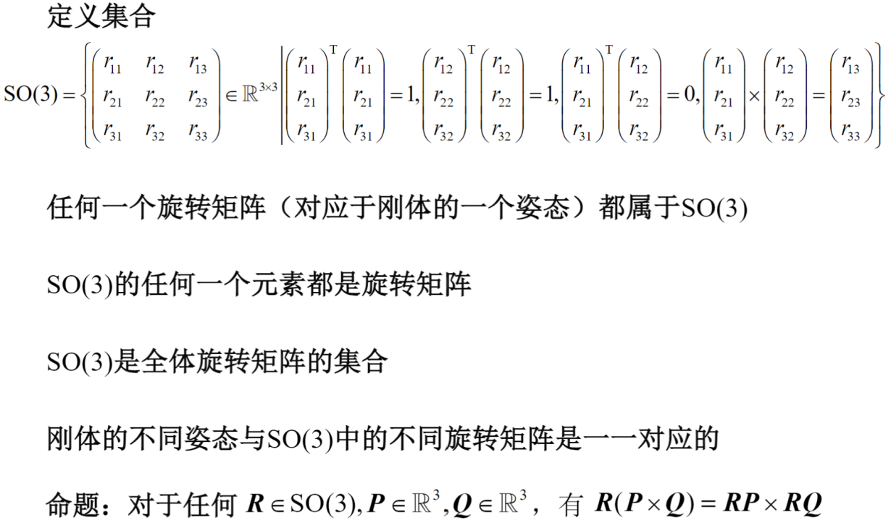
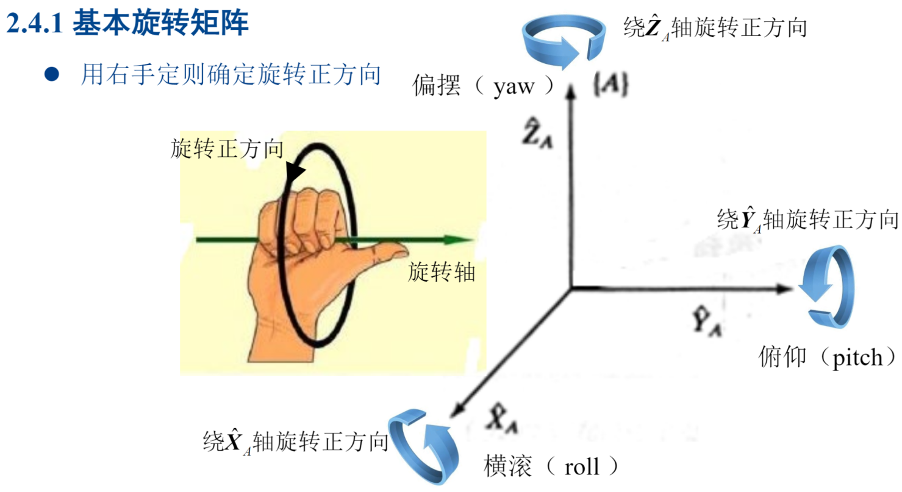
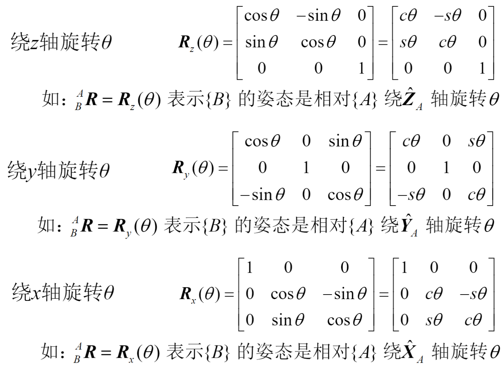
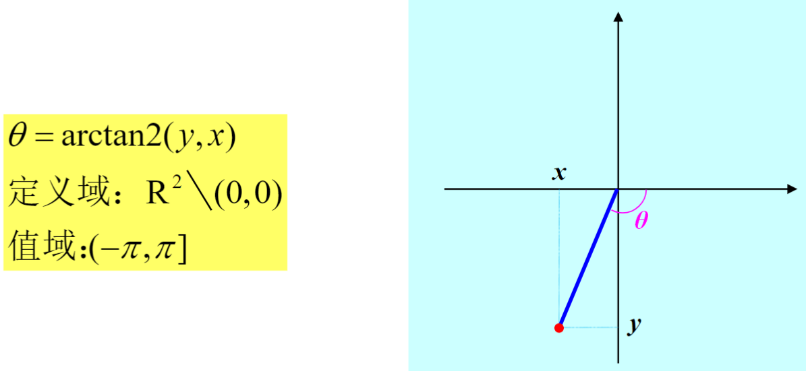
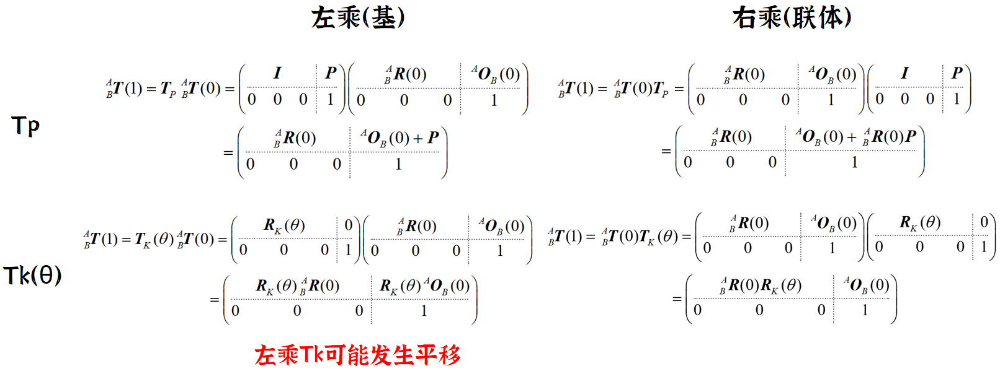

## 坐标系与向量

本篇章均采用[空间笛卡尔直角右手坐标系](https://baike.baidu.com/item/%E7%AC%9B%E5%8D%A1%E5%84%BF%E5%9D%90%E6%A0%87)，所有坐标系都采用同样长度的度量单位。

定义：向量是具有大小和方向的量

本文默认你已经掌握关于坐标系中向量的内积（点乘，标量）、外积（叉乘，右手螺旋法则，向量）和基本的线性代数知识。

## 点和刚体的描述

**点的位置描述**: 

$r_{O_AP}=(\hat{X}_A \ \hat{Y}_A \ \hat{Z}_A)^AP$

**在\{A\}中表示出\{B\}的位置**：

$r_{O_AO_B}=(\hat{X}_A \ \hat{Y}_A \ \hat{Z}_A)^AO_B,\ ^AO_B\in R^3$

**在\{A\}中表示出\{B\}的姿态**：

$\hat{X}_B = \left( \hat{X}_A \quad \hat{Y}_A \quad \hat{Z}_A \right) 
\begin{pmatrix} 
r_{11} \\ 
r_{21} \\ 
r_{31} 
\end{pmatrix}
$

$\hat{Y}_B = \left( \hat{X}_A \quad \hat{Y}_A \quad \hat{Z}_A \right)
\begin{pmatrix} 
r_{12} \\ 
r_{22} \\ 
r_{32} 
\end{pmatrix}
$

$\hat{Z}_B = \left( \hat{X}_A \quad \hat{Y}_A \quad \hat{Z}_A \right)
\begin{pmatrix} 
r_{13} \\ 
r_{23} \\ 
r_{33} 
\end{pmatrix}
$

**旋转矩阵**：
$^A_BR=\begin{pmatrix} 
r_{11} \ r_{12} \ r_{13}\\ 
r_{21} \ r_{22} \ r_{23}\\ 
r_{31} \ r_{32} \ r_{33}
\end{pmatrix}$

**在\{A\}中表示出\{B\}的位姿**：

## 两个坐标系的几何关系

$^B_AR=^A_BR^{-1}=^A_BR^T$

$^BO_A=-^B_AR^AO_B$

$^B_AT=^A_BT^{-1}$

$T^{-1} = \begin{pmatrix}
\boldsymbol{R}^{\mathrm{T}} & -\boldsymbol{R}^{\mathrm{T}}\boldsymbol{O} \\
0 \quad 0 \quad 0 & 1
\end{pmatrix}
$

**同一个点在两个参考系中的描述**：

$^AP=^AO_B+^A_BR^BP$

$\left( \begin{array}{c}
^A\boldsymbol{P} \\
1
\end{array} \right) = 
\left( \begin{array}{c:c}
^A_B\boldsymbol{R} & ^A\boldsymbol{O}_B \\
\hdashline
0 \quad 0 \quad 0 & 1
\end{array} \right)
\left( \begin{array}{c}
^B\boldsymbol{P} \\
1
\end{array} \right) =
^A_B\boldsymbol{T}
\left( \begin{array}{c}
^B\boldsymbol{P} \\
1
\end{array} \right)
$

**链式法则**：

$^A_CR=^A_BR ^B_CR \quad ^A_CT=^A_BT ^B_CT $

:::tip[]
左上角表示从哪个坐标系看，左下角或右下角表示某个点。公式中符号有分子分母相消的感觉。
:::

## 姿态的欧拉角表示和固定角表示

右手定则：朝向你时时逆时针

### 欧拉角表示

欧拉角操作是相对于联体坐标系的，每操作一步就右乘一项。

$\boldsymbol{R}_{z'y'x'}(\alpha,\beta,\gamma)=\boldsymbol{R}_z(\gamma)\boldsymbol{R}_y(\beta)\boldsymbol{R}_x(\alpha)$

任何SO(3)都可以用欧拉角表示。同理，还存在x-y-z欧拉角、x-z-y欧拉角、y-z-x欧拉角、y-x-z欧拉角和z-x-y欧拉角上述6种欧拉角合称为非对称型欧拉角。

$\boldsymbol{R}_{z'y'z'}(\alpha,\beta,\gamma) = \boldsymbol{R}_z(\alpha)\boldsymbol{R}_y(\beta)\boldsymbol{R}_z(\gamma)$

同理，还存在x-y-x欧拉角、x-z-x 欧拉角、y-x-  y欧拉角、y-z-y欧拉角和z-x-z欧拉角上述6种欧拉角合称为对称型欧拉角。

### 固定角表示

固定角操作是相对于固定坐标系的，每操作一步就左乘一项。

$\boldsymbol{R}_{zyx}(\alpha,\beta,\gamma)=\boldsymbol{R}_x(\gamma)\boldsymbol{R}_y(\beta)\boldsymbol{R}_z(\alpha)$

同理，还存在z-y-x固定角、y-z-x固定角、z-x-y固定角、x-z-y固定角和y-x-z固定角、z-y-z固定角、x-y-x固定角、x-z-x固定角、y-x-y固定角、y-z-y固定角和z-x-z固定角。

### 两种表示的缺陷

$R_z(\pm\pi+\alpha)R_y(\pm\pi-\beta)R_x(\pm\pi+\gamma) = R_z(\alpha)R_y(\beta)R_x(\gamma)$

一个姿态若能被一组俯仰角绝对值大于90°的z-y-x欧拉角或x-y-z固定角描述，那么也能被另一组俯仰角绝对值不大于90°的z-y-x欧拉角或x-y-z固定角描述。因此可以规定：

$(\alpha, \beta, \gamma) \in (-\pi, \pi] \times \left[-\frac{\pi}{2}, \frac{\pi}{2}\right] \times (-\pi, \pi]$

- 非对称型欧拉角和固定角可以规定β取值为[-π/2,π/2]，当β取值-π/2或π/2时，结果不唯一，而在(-π/2,π/2)范围内取值唯一。
- 对称型欧拉角和固定角可以规定β取值为[0,π]，当β取值0或π时，结果不唯一，而在(0,π)范围内取值唯一。

## 等效轴角表示

$\boldsymbol{R}_{OQ'} =
\boldsymbol{r}_{OQ} \cos \theta + (\boldsymbol{r}_{OQ} \cdot \boldsymbol{r}_{OK})\boldsymbol{r}_{OK}(1-\cos \theta) + (\boldsymbol{r}_{OK} \times \boldsymbol{r}_{OP})\sin \theta$

$^{A}_{B(0)}\mathbf{R} = \begin{pmatrix} 
k_x^2 v\theta + c\theta & k_x k_y v\theta - k_z s\theta & k_x k_z v\theta + k_y s\theta \\
k_x k_y v\theta + k_z s\theta & k_y^2 v\theta + c\theta & k_y k_z v\theta - k_x s\theta \\
k_x k_z v\theta - k_y s\theta & k_y k_z v\theta + k_x s\theta & k_z^2 v\theta + c\theta
\end{pmatrix} = \mathbf{R}_{\mathbf{k}}(\theta)
$

K代表转轴，单位向量，vθ=1-cosθ。这种描述称为等效轴较描述。规定θ取值为[0,π]。

$\theta = arccos(\frac{r_{11}+r_{22}+r_{33}-1}{2})$

当θ在(0,π)范围内取值唯一。

$\begin{pmatrix} 
k_x \\
k_y \\
k_z
\end{pmatrix} = \frac{1}{2\sin\theta}
\begin{pmatrix}
r_{32} - r_{23} \\
r_{13} - r_{31} \\
r_{21} - r_{12}
\end{pmatrix}
$

当θ为π时，K有两个解，如下。

$$\begin{pmatrix} k_x \\ k_y \\ k_z \end{pmatrix} = \pm\begin{pmatrix} \sqrt{\frac{r_{11}+1}{2}} \\ \frac{r_{12}}{\sqrt{2(r_{11}+1)}} \\ \frac{r_{13}}{\sqrt{2(r_{11}+1)}} \end{pmatrix}$$

当θ为0时，K可以任意取，无穷多个解。

### 等效轴角表示旋转、平移变换

\{B\}绕AK旋转θ是左乘的：

$^A_BR(0)=R_K(\theta)^A_BR(1)$

\{B\}绕BK旋转θ是右乘的：

$^B_AR(0)=^B_AR(1)R_K(\theta)$

:::tip[]
右乘联体左乘基，对于欧拉角和固定角、等效轴角表示都适用的口诀。
:::

## 四元数

缘由：\{B\}在\{A\}中连续多圈翻滚或翻滚范围较大，不宜对旋转角作限制

$(\eta \quad \varepsilon_1 \quad \varepsilon_2 \quad \varepsilon_3)^{\mathrm{T}} \in \mathbb{R}^4$

对应的四元数为 

$\eta + i\varepsilon_1 + j\varepsilon_2 + k\varepsilon_3$

它的共轭就是正号改成负号，其余都可以参考正常的复数运算法则。

单位四元数是模长为一的四元数，可以表示任何姿态 SO(3)。

$\mathbf{R}_{\varepsilon}(\eta) = \begin{pmatrix}
r_{11} & r_{12} & r_{13} \\
r_{21} & r_{22} & r_{23} \\
r_{31} & r_{32} & r_{33}
\end{pmatrix} = \begin{pmatrix}
2(\eta^2 + \varepsilon_1^2)-1 & 2(\varepsilon_1\varepsilon_2-\eta\varepsilon_3) & 2(\varepsilon_1\varepsilon_3+\eta\varepsilon_2) \\
2(\varepsilon_1\varepsilon_2+\eta\varepsilon_3) & 2(\eta^2+\varepsilon_2^2)-1 & 2(\varepsilon_2\varepsilon_3-\eta\varepsilon_1) \\
2(\varepsilon_1\varepsilon_3-\eta\varepsilon_2) & 2(\varepsilon_2\varepsilon_3+\eta\varepsilon_1) & 2(\eta^2+\varepsilon_3^2)-1
\end{pmatrix}
$

直接解出来是这样的

$\begin{pmatrix}
\eta \\
\varepsilon_1 \\
\varepsilon_2 \\
\varepsilon_3
\end{pmatrix} = \frac{1}{2} \begin{pmatrix}
\sqrt{r_{11} + r_{22} + r_{33} + 1} \\
\text{sgn}(r_{32} - r_{23})\sqrt{r_{11} - r_{22} - r_{33} + 1} \\
\text{sgn}(r_{13} - r_{31})\sqrt{r_{22} - r_{33} - r_{11} + 1} \\
\text{sgn}(r_{21} - r_{12})\sqrt{r_{33} - r_{11} - r_{22} + 1}
\end{pmatrix} \text{ 或 } \begin{pmatrix}
\eta \\
\varepsilon_1 \\
\varepsilon_2 \\
\varepsilon_3
\end{pmatrix} = -\frac{1}{2} \begin{pmatrix}
\sqrt{r_{11} + r_{22} + r_{33} + 1} \\
\text{sgn}(r_{32} - r_{23})\sqrt{r_{11} - r_{22} - r_{33} + 1} \\
\text{sgn}(r_{13} - r_{31})\sqrt{r_{22} - r_{33} - r_{11} + 1} \\
\text{sgn}(r_{21} - r_{12})\sqrt{r_{33} - r_{11} - r_{22} + 1}
\end{pmatrix}
$

三维向量转换为四元数的表示：

$\mathrm{i}x_2 + \mathrm{j}y_2 + \mathrm{k}z_2 = (\eta + \mathrm{i}\varepsilon_1 + \mathrm{j}\varepsilon_2 + \mathrm{k}\varepsilon_3)(\mathrm{i}x_1 + \mathrm{j}y_1 + \mathrm{k}z_1)(\eta + \mathrm{i}\varepsilon_1 + \mathrm{j}\varepsilon_2 + \mathrm{k}\varepsilon_3)^*$

**基于等效轴角表示的单位向量**(kx ky kz)T和旋转 θ ∈ R，定义**欧拉参数**

$(\eta \; \varepsilon_1 \; \varepsilon_2 \; \varepsilon_3)^T$

$$\eta = \cos\frac{\theta}{2}, \quad \varepsilon = \begin{pmatrix} \varepsilon_1 \\ \varepsilon_2 \\ \varepsilon_3 \end{pmatrix} = \begin{pmatrix} k_x\sin\frac{\theta}{2} \\ k_y\sin\frac{\theta}{2} \\ k_z\sin\frac{\theta}{2} \end{pmatrix}$$

**右乘联体左乘基同样对四元数有效**。