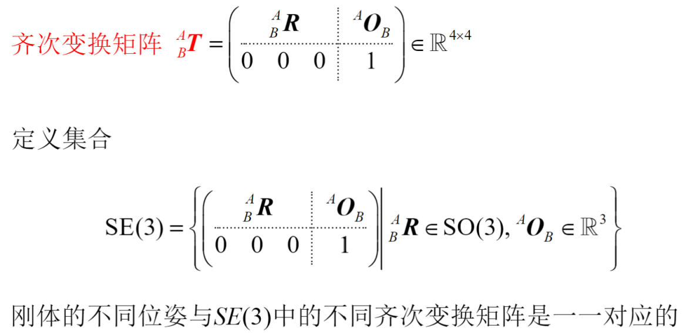
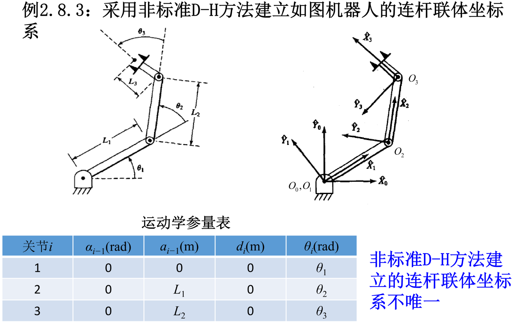

## 串联机构中的运动学参量

### 串联机构的组成

使两个刚体直接接触而又能产生一定相对运动的联接称为**运动副**，机器人的运动副也称关节，连杆即指由关节所联的刚体。

**串联机构**：多个连杆通过关节以串联形式连接成首尾不封闭的机械结构。

从串联机器人基座进行编号
- 固定基座为连杆0
- 第一个可动连杆为连杆1
- 以此类推，机器人最末端的连杆为连杆N
- 连杆0与连杆1通过关节1连接...连杆N-1与连杆N通过关节N连接

为了确定末端执行器在3维空间的位置和姿态，串联机器人至少需要6个关节。

###  运动学参量

连杆长度ai-1、连杆转角αi-1、连杆偏距di和关节角θi都称为关节 i 的运动学参量。

## 建立坐标系的非标准D-H(Denavit-Hartenberg)方法

• ai-1 和 αi-1 是固定不变的参数，不会随着关节i的运动而变化

• 若关节i是转动关节，则 di 是固定不变的参数，θi 是会随着关节i的运动而变化的关节变量，即：
  - 3个连杆参数 ai-1, αi-1, di
  - 1个关节变量 θi

• 若关节i是滑动关节，则 θi 是固定不变的参数，di 是会随着关节i的运动而变化的关节变量，即：
  - 3个连杆参数 ai-1, αi-1, θi
  - 1个关节变量 di

• 一个有 N 个关节的串联机构，有 4N 个运动学参量，其中 3N 个是连杆参数、N 个是关节变量，它们包含了串联机构的全部空间几何信息

## 正运动学

# 机器人运动学变换矩阵

\{i-1\}经四步变换成为\{i\}
1. 绕联体x轴旋转αi-1
2. 沿联体x轴平移ai-1
3. 绕联体z轴旋转θi
4. 沿联体z轴平移di

$$
^{i-1}_{i}T = \begin{pmatrix}
1 & 0 & 0 & a_{i-1} \\
0 & \cos\alpha_{i-1} & -\sin\alpha_{i-1} & 0 \\
0 & \sin\alpha_{i-1} & \cos\alpha_{i-1} & 0 \\
0 & 0 & 0 & 1
\end{pmatrix}
\begin{pmatrix}
\cos\theta_i & -\sin\theta_i & 0 & 0 \\
\sin\theta_i & \cos\theta_i & 0 & 0 \\
0 & 0 & 1 & d_i \\
0 & 0 & 0 & 1
\end{pmatrix}
$$

$$
= \begin{pmatrix}
\cos\theta_i & -\sin\theta_i & 0 & a_{i-1} \\
\sin\theta_i\cos\alpha_{i-1} & \cos\theta_i\cos\alpha_{i-1} & -\sin\alpha_{i-1} & -\sin\alpha_{i-1}d_i \\
\sin\theta_i\sin\alpha_{i-1} & \cos\theta_i\sin\alpha_{i-1} & \cos\alpha_{i-1} & \cos\alpha_{i-1}d_i \\
0 & 0 & 0 & 1
\end{pmatrix}
$$

正运动学问题：已知各关节变量的值，以基座坐标系为参考系，求末端工具联体坐标系的位姿

前向解法：

$$
^0_nT(\phi_1,\phi_1,\cdots,\phi_n) = ^0_1T(\phi_1)^1_2T(\phi_2)\cdots^{n-1}_nT(\phi_n)
$$

记关节i的关节变量为 Φi，则有：

- 若关节i是转动型关节，则 Φi = θi
- 若关节i是平动型关节，则 Φi = di

这种表示法使得我们可以用统一的符号表示不同类型关节的运动参数。

通过连续相乘各个相邻连杆之间的变换矩阵，可以得到从基座到末端执行器的完整变换关系，这是机器人运动学正解的基本方法。

- α：以前一个的x轴为大拇指，右手螺旋方向为正方向，前一个z轴转到后一个的角度
- a：z轴之间距离
- d：x轴之间距离（选取x轴时尽可能沿着连杆）
- θ：以后一个的z轴为大拇指，右手螺旋方向为正方向，前一个x轴转到后一个的角度

