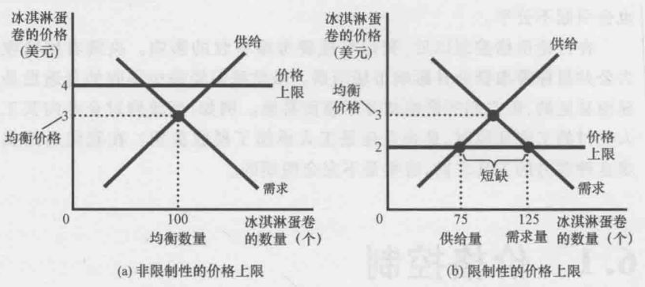
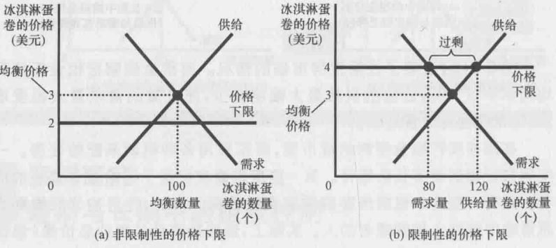
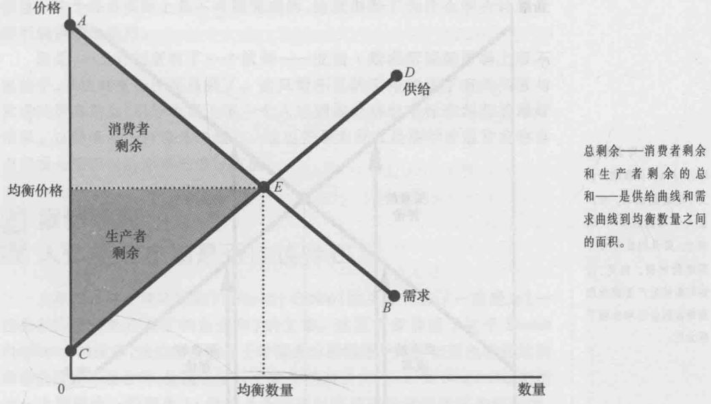
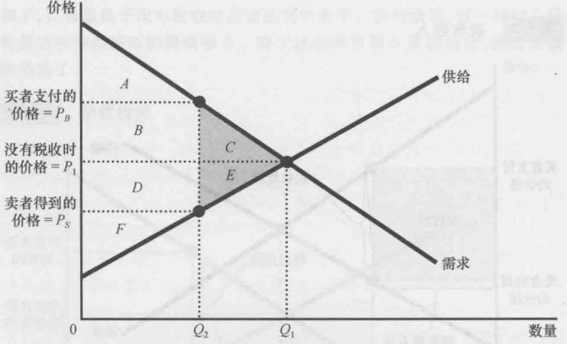
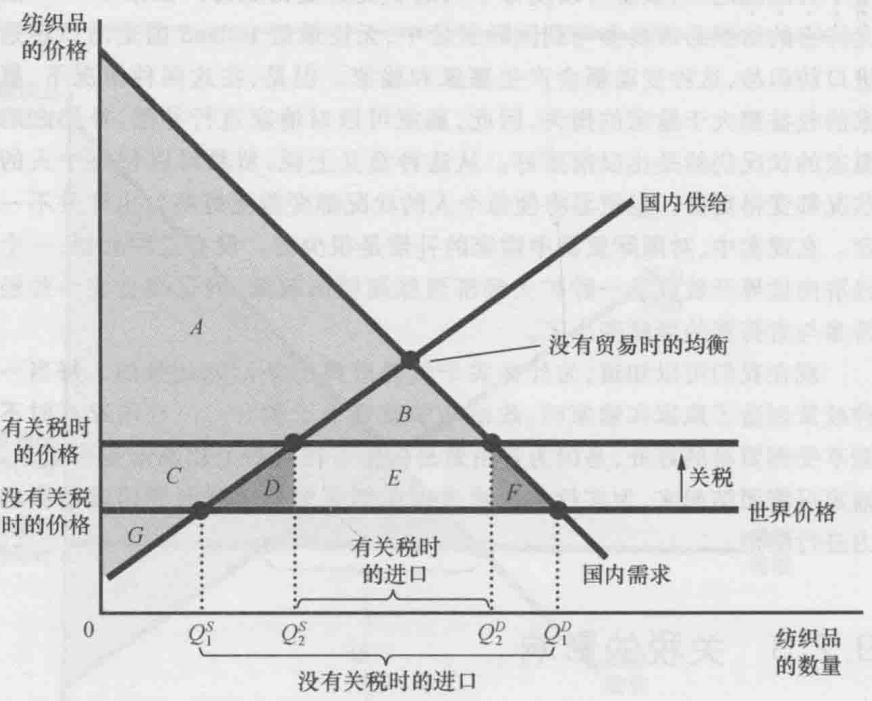
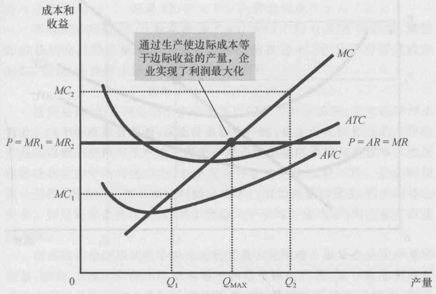
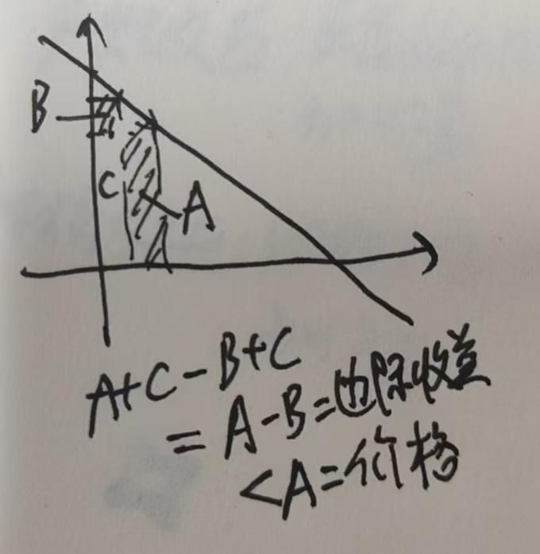
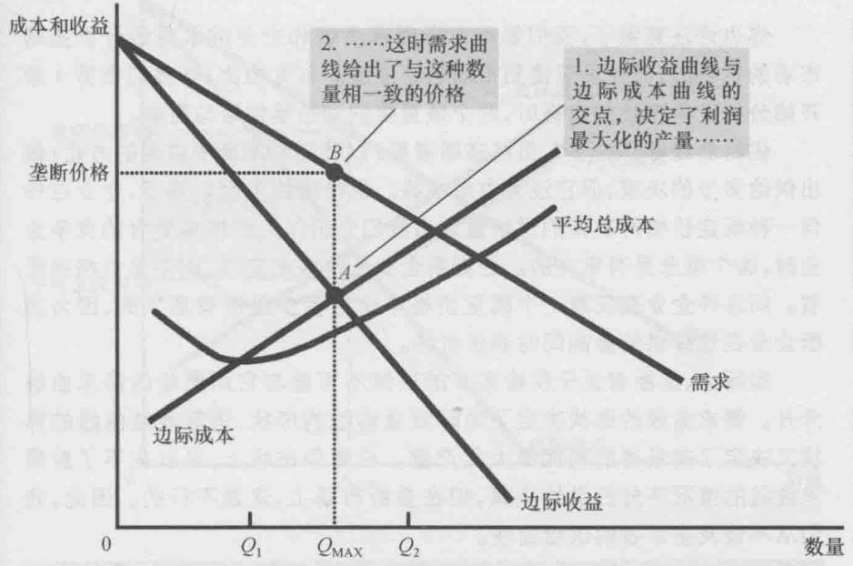
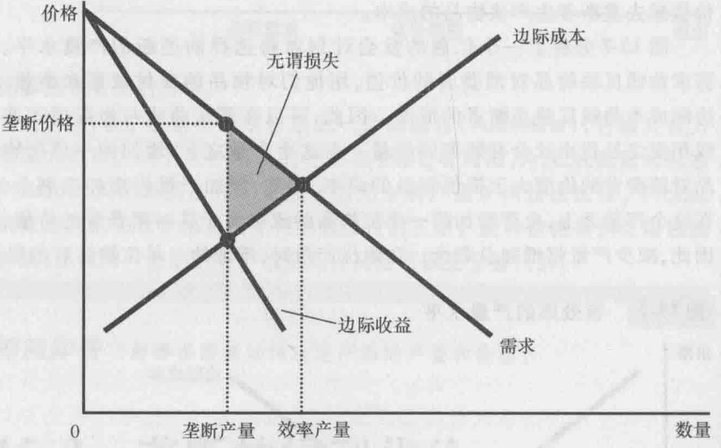

## 第一章经济学原理

### 十大经济学原理

1. 稀缺：人们面临取舍，黄油还是大炮、效率（把蛋糕做大）还是平等（把蛋糕分好）
2. 机会成本：某种东西的成本是为了得到它所放弃的东西（上大学的成本 = 你的时间 + 学校开销比校外多的部分）
3. 边际量：理性人考虑边际量
   - 边际收益：每多消费一单位商品所带来的利益。
   - 边际成本：每一单位新增生产的产品（或购买的）带来的总成本的增量

:::note[一杯水的边际收益多大]
取决于当时的环境。如果你正在参加马拉松赛跑，或者你在沙漠的太阳下奔走了三个小时，那么，此时的边际收益将会极大。
:::

4. 效用：人们会对激励作出反应（安全带减少安全开车的边际收益，会使人开车更不谨慎）
5. 自愿达成的交易对双方都有利：贸易可以使每个人的状况更好，分工、共享
6. 市场配置：市场通常是组织经济活动的一种好方法
7. 政府干预：政府有时可以改善市场结果
  - 市场经济需要实施产权的制度，一边每个人可以拥有和控制稀缺资源，不然农民预见自己谷物会被偷走就不会种了
  - 看不见的手不是无所不能的，政府干预可以改变人们自己选择的资源配置的原因：促进效率还是公平
8. 国家生产力：一国的生活水平取决于它生产物品和服务的能力
9. 通货膨胀（经济中物价总水平的上升）：当政府发行了过多货币时，物价上升
10. 拉弗曲线：社会面临通货膨胀和失业之间的短期权衡取舍，货币量增加刺激整体支出，需求增加推动企业增加雇佣，雇佣增多失业减少

### 经济中的成本概念和会计中的区别

会计成本仅包括显性成本，即实际支出的费用；经济成本包括显性成本和隐性成本（如机会成本）；机会成本是为选择某一选项所放弃的其他选项中最高价值。

## 第三章 比较优势

### 你每一项都比别人好，为啥要分工？

尽管一个人有可能在两种物品的生产上都具有绝对优势，但一个人却不可能在两种物品的生产上都具有比较优势。**因为一种物品的机会成本是另一种物品机会成本的倒数**，如果一个人生产一种物品的机会成本较高，那么，他生产另一种物品的机会成本必然较低（ta就有比较优势）。比较优势反映了相对的机会成本。除非两个人有相同的机会成本,否则一个人就会在一种物品上具有比较优势，而另一个人将在另一种物品上具有比较优势。
专业化和贸易的好处不是基于绝对优势，而是基于比较优势。当每个人专门生产自己有比较优势的物品时，经济的总产量就增加了，经济蛋糕的变大可用于改善每个人的状况。

### 为啥自由贸易这么好，为啥要打贸易战？

1. 保护特定产业发展，本国生产者收益（关税的话，还能增加政府收入，减低失业率，获得部分民众支持）
2. 使对手国受损，限制其具有比较优势的产业出口获取利润，可能会带来其对应产业的收缩、失业增加

:::tip[美国为啥要打贸易战]
1. 全球资本流动和普通民众的矛盾，金融资本推动各国发展有比较优势的产业，但是比较优势是会变动的，比如最早美国也有大量制造业，后来迁移到中国、东南亚国家了。这就会导致迁移之前的国家大量民众失业。
2. 为了缓解这个矛盾，那么就需要钱去给民众福利制度，促进平等。这个钱依赖全球金融，从全球价值链中汲取利润。（美国通过建立一套体系，不断用美元购买商品又大量印钞，输出通胀来获取利润。）那这就会导致其他国家有比较优势的制造业难以发展，成本过高，出口亏损。于是就有美国攫取利润与其他各国生产分工之间的矛盾。
3. 为了维持这套体系（游戏规则），美国需要科技优势，需要打击其他国家的先进产业。这就导致美国霸权信用和其他国家发展愿望之间的矛盾。
:::

## 第四章 供需的市场力量

### 如果你是市长，你怎么处理这个问题？物价上涨，你怎么做？

首先只有在需求的物品出现短缺的情况下，哄抬物价才会出现。如果没有短缺，**正常的市场过程会阻止物价突然上升**。
那么如果政策规定禁止哄抬物价的话，短缺物品该如何分配？一种方案是抽签，但结果往往是未抽中的人被迫以更高的价格购买抽中的人的物品，因此哄抬物价的人只是从商人变成了中签者。第二种方案是制定配给方案，每个人都分一点必需品。但这需要巨量计划和难以达到的信息水平，配给方案制订者需要知道既定地区可得到的每种物品的数量，和多少人需要，如果发生自然灾害，这些信息将很难得到。第三种方案是按照先来后到卖出物品，但结果是会导致人们囤积物品，商店货架都空了，所以速度并不能代表公正。

实际上在极端需求情形下，允许价格上涨限制了过度消费，结果是会有更多的顾客买得到物品，市场实现了更为公平的分配。所以商人并没有从灾难中获利，而是通过对物价的管理来获利，这种管理扩大了商品分配范围，产生了有益的社会效应。简言之，他们是**通过提供了重要的公共服务而正当地获得了回报** 。但哄抬物价会不会导致穷人买不到必需品？就大多数情况下而言，灾难期间的物价上升会让穷人开支雪上加霜，相对于价格管制，**通过转移支付（直接给受灾群众发放现金补贴）来减轻家庭赤字**是更好的方案。

## 第五章 供给、需求弹性

### 要从需求弹性角度分析，谷贱伤农？为啥农民不会在没有干旱的时候摧毁自己的农作物？

1. 当新技术能提高产量的时候，每一位农户都将谷物价格视为既定的，于是对于他们来说生产越多越好，供给曲线向右移动。
2. 而消费者不会因为生产变多就多消费，于是需求曲线不变。
3. 总收益是增加还是减少取决于需求弹性，很明显谷物的需求弹性比较低
4. 由于供给曲线右移，而低弹性的需求曲线不变，那么新均衡点的总收益P*Q会减少（销量略微增加，但价格显著降低）

:::tip[为什么石油输出国不能保持石油高价格？]
石油短期供给和需求比较稳定，因此弹性小，降低产量能明显增加收入；长期供给来看会有更多石油开采出来，需求也会有更多新能源等替代，二者弹性大，降低产量总收益是下降的
:::

:::tip[为什么在中国（人均土地少）必须农民转移，才能共同富裕？]
因为农业需求弹性小，总收入就这些，人太多。
:::

## 第六章 价格上限、下限

### 最高限价和最低保护价分别会对市场有什么影响？

- 非限制性价格上限，市场力量自然而然使经济向均衡方向移动，没有影响
- 限制性价格上限会导致物品短缺，而且，卖者必须在大量潜在买者中配给稀缺物品

- 非限制性价格下限没有影响
- 限制性价格上限引起生产过剩，那些由于买者个人偏好而受买者青睐的卖者能更容易卖出自己的产品

如果要实施最高限价和最低保护价要哪些配套措施，才能实施下去

- 限制性最高限价：
  - 质量标准：防止质量恶化
  - 供给补贴：激励生产者增加供给
  - 配给券制度：政府发放购买凭证
- 限制性最低保护价：
  - 出口补贴：帮助处理过剩
  - 需求刺激：通过补贴增加需求
  - 生产配额：限制过度生产
  - 质量提升：引导产业升级
  - 储备制度：建立战略储备

### 税收

无论向买者还是卖者征税，税收都会均摊（向卖者征税，供给曲线上移；向买者征税，需求曲线下移），立法者可以决定税收来自买者口袋还是卖者。但税收归宿取决于供给和需求的力量。

当供给比需求有弹性时，税收更多由消费者承担；但需求比供给更有弹性时，税收更多由供给方承担。收受负担更多落在缺乏弹性的市场一方上，因为他们不愿意、不太能离开这个市场。

## 第七章 剩余

### 看不见的手怎么引导配置

消费者剩余和生产者剩余时经济学家用来研究市场中买者和卖者福利的基本工具。

均衡点福利最大化。比如数量增多，边际卖者评价低于边际卖者成本，减少产量会增加总剩余；反之亦然。

如果资源配置使总剩余最大化，这种配置是有效率的。

### 为什么让市场资源配置决定性作用？

供求的力量可以有效的配置资源，即使每个卖者和买者只关心自己的利益也会在“看不见的手”指引下达到使买者与卖者共同利益最大化的均衡。

### 看不见的手到底有什么用？

1. 市场效率最大化
2. 市场福利最大化

:::note[前提]
前提条件使市场是完全竞争的，如果存在单个买者或卖者（市场势力）可以控制市场价格，就会使市场无效率；市场结果只影响市场的买者和卖者，如果还影响到其他人，比如污染等市场的副作用——外部性，它会使市场福利不仅仅取决于卖者的成本和买者的评价。
:::

## 第八章 税收

- 消费者剩余：ABC -> A
- 生产者剩余：DEF -> F
- 税收：0 -> BD
- 无谓损失：CE

### 为什么会出现无谓损失？

1. 经济学十大原理：人们会对激励作出反应
2. 市场通常可以有效地配置稀缺资源，供求均衡使市场上买者和卖者的总剩余最大化
3. 当税收提高了买者价格，对买者的激励是比没有税收时少消费；降低了卖者价格，对卖者的激励是比没有税收时少生产
4. 市场规模缩小到最有水平之下，引起看市场配置资源的无效率
税收引起的无谓损失是因为它使卖者和买者不能实现某些利益的好处。

## 第九章 关税

当一国允许贸易并成为一种物品的出口者时，国内该物品生产者的状况变好了，但国内消费者状况变坏了。总体上经济福利增加了。

当一国允许贸易并成为一种物品的进口者时，国内该物品生产者的状况变坏了，但国内消费者状况变好了。总体上经济福利增加了。

加上关税之后会有无谓损失DF。关税收入为E。

### 关税的利弊

- 加分项
  - 政府收入增加
  - 本国生产者收益
  - 保护特定产业
  - 部分民众支持（MAGA）
  - 对手国受损（谈判筹码）
- 减分项
  - 消费者成本增加
  - 下游厂商成本提高
  - 对手国反击
  - 限制商品多样性
  - 限制思想交流
  - 限制竞争

## 第十章 外部性

**外部性**：一个人的行为对旁观者福利的无补偿的影响。有利的是正外部性，有害的负外部性。

负外部性会导致社会成本增加，将原供给曲线上移（私人成本加上诸如污染这样的外部成本）。可以通过对生产征税和社会成本曲线重合——外部性内在化。
同样正外部性会使需求曲线上移（私人价值加上外部利益），可以针对正外部性补贴来内在化，纠正市场失灵。

### 外部性的公共政策

1. 命令控制政策：管制
2. 以市场为基础的政策
  1. 矫正税与补贴：比如汽油税（针对拥堵、车祸、污染三种负外部性）
  2. 可交易的污染许可证：限制排污量。污染许可证在企业之间的初始配置无关紧要，以低成本减少污染的企业会出售许可证，高成本减少污染的企业肯定希望能多排污，那就会买。
  3. 污染许可证比税好是因为有时我们不知道多少税收能最终使污染总符合到指标

### 外部性的私人解决办法

1. 道德规范和社会约束
2. 慈善行为
3. 利益各方签订合约/企业合并

### 科斯定理

私人经济主体可以解决他们之间的外部性问题。无论最初的权力如何分配，有关各方可以达成一种协议，在这种协议中，每个人的状况都可以变得更好而且结果是有效率的。

但是前提是可以顺利达成和实施协议。如果达成协议过程中所发生的成本（交易成本）大于达成协议带来的总收益就会是无效率的结果。例如涉及诸多利益方，谈判困难。

- 科斯第一定律：在交易成本为零的假设下，无论产权初始如何分配，当事人通过自由谈判总能实现资源配置的帕累托最优。
- 科斯第二定律：当交易成本为正时，产权初始界定直接影响资源配置效率。

:::note[科斯定理的启示]
1. 经济理论需要考虑现实约束
2. 解决社会问题要
  - 降低各方谈判协商成本
  - 建立有效的纠纷解决机制
  - 完善法律制度框架
3. 企业内部资源配置中：
  - 减少部门间协调成本
  - 明确责任和权利界限
  - 建立有效的内部市场机制
4. 当交易成本存在时，产权的初始分配就变得至关重要。这启示我们：
  - 清晰的产权界定是市场经济的基础
  - 法律制度和产权保护直接影响经济效率
:::

## 第十一章 公共物品

### 为什么市场不能有效地提供公共物品？所以公共部门提供。

公共物品既具有无排他性也具有非竞争性。

- 排他性：物品具有的可以阻止某人使用的特性
- 竞争性：一个人使用某种物品可以减少其他人对该物品的使用的特性。

当受益人数众多，而且排除掉任何一个受益者都不可能时，就会出现搭便车者问题。那么相当于这项活动会带来正外部性，如果搭便车特别方便那么社会价值会远远高于私人价值，如果没有补贴，私人不会选择去做。市场会变得没有效率。

### 为什么公共资源总会被私有占用/过度使用？

因为社会激励和个人激励不同。尽管集体存在能够让结果更好的方案，但是没有一方有减少自己使用/维护公共资源的激励。它属于多人囚徒困境。
公地悲剧产生的原因是外部性，放羊会导致降低土地质量（负外部性）。对于私人而言，自己放多少羊是不考虑负外部性的。

解决方案一样：管制、征税、放羊数量许可证、集体自治

:::tip[为什么奶牛没有灭种？]
因为奶牛是私人物品，私人会尽可能保护；大象是公共资源。解决大象捕杀问题：一种是大象私人化，一种是设为违法。
:::

### 产权的重要性

由于公共资源、公共物品带来的外部性问题，导致市场没有有效地配置资源，其本质问题是没有建立好产权，即某些有价值地东西并没有在法律上有权控制它地所有者。例如清洁的空气，没有一个人有权给它定价，并从它的使用中得到利润。

当产权缺失引起市场失灵时，政府可以潜在地解决问题，例如在出售污染许可证的情况下，政府帮助界定产权。有时是对某些行为管制，有时是提供市场不能提供的物品。总的来说，是为了提高整体经济福利。

## 第十二章 税收制度

支付能力：一个人可以承受的负担

纵向平等：支付能力更强的纳税人应该缴纳更多的税（税收归宿）

横向平等：支付能力相似的纳税人应该缴纳等量税收（相似的评估很难）

对公司征所得税，税收归宿是个人（所有者、顾客、工人）支付所有税收：公司老板减少生产，对工人需求减少，汽车价格上升（消费者承担），工人工资下降。

税收制度本质是效率和平等的取舍：过高的税扭曲工作和储蓄的经济激励，降低经济的效率。

## 第十三章 生产成本

会计学只考虑显性成本（需要企业支付货币的投入成本），但经济学还考虑隐性成本（不需要企业支出货币的投入成本，比如所有者时间的机会成本）

所以经济利润=会计利润-隐性成本

边际产量递减：一种投入的边际产量随着投入量增加而减少的特征

- 总成本可以分为固定成本FC（不随产量变动而变动的成本）和可变成本VC（随着产量变动而变动的成本）
- 平均总成本ATC =总成本TC / 产量Q 一般是 U 形的
- 边际成本MC =总成本变动量/产量变动量 与ATC最低点处相交；随产量的增加而上升
- 平均可变成本AVC，平均固定成本AFC

首先，只要边际成本（理解为新一门课绩点）比平均总成本低，平均总成本就会下降，于是二者一定会相交。由于边际成本还会增加（前提：边际产量递减的企业，也就是典型企业），那么平均总成本也会慢慢增加（可以理解新的课绩点比原来平均绩点高了）。所以MC和ATC在最低点处相交。

- 规模经济：长期平均总成本随产量增加而减少的特性（较高的产量允许工人实现专业化、现代流水线）
- 规模不经济：长期平均总成本随产量增加而增加的特性（大公司的固有协调问题，管理团队变庞大）
- 规模收益不变：长期平均总成本在产量变动时不变的特性

### 从生产函数推导成本函数

给定生产函数：Q = LK

这是一个柯布-道格拉斯型生产函数的特殊形式

#### 短期假设

- 资本固定：K = k̄（常数）
- 劳动可变：L可以调整

TC_SR = FC + wL

其中：FC = rk̄（固定成本），w为工资率

TC_SR = rk̄ + w(Q/k̄) = rk̄ + (w/k̄)Q

#### 长期成本函数推导

在长期，所有要素都可变，需要找到成本最小化的要素组合。

TC = wL + r(Q/L) = wL + rQ/L 求导

L² = rQ/w，于是还可以得到wL = rK

## 第十四章 竞争市场

完全竞争市场：市场上有很多卖家和买家，卖者提供的物品大体上是相同的，企业可以自由地进入或退出市场

平均收益 = 总收益 / 产量

边际收益 = 物品的价格

在完全竞争市场，市场价格P=平均收益AR=边际收益MR

- 如果边际收益大于边际成本，企业应该增加其产量。
- 如果边际成本大于边际收益，企业应该减少其产量。
- 在利润最大化的产量水平时，边际收益和边际成本正好相等。

在该情况下，边际成本曲线决定了企业在任何一种价格时愿意供给的物品数量，因此边际成本曲线也是竞争企业的供给曲线。

### 停业与退出

如果生产得到的总收益TR<可变动成本VC（P<AVC）时，企业应该停止营业。所以竞争企业的短期供给曲线是边际成本曲线位于平均可变动成本曲线之上的那一部分。

沉没成本（已经发生无法收回的成本）不参与决策。

如果TR<TC（P<ATC），企业就应该退出这个市场。所以竞争企业的短期供给曲线是边际成本曲线位于平均总成本曲线之上的那一部分。

### 短期与长期

利润=(P-ATC)*Q

短期供给曲线可以理解为市场上企业数量固定，不变的供给曲线，横轴的值翻个倍

长期来看如果允许自由进入和退出，最终P=ATC最低点，零润为0，长期供给曲线变成完全弹性（横着的）。看起来荒谬，但是实际上总成本包含了机会成本，包括金钱和时间。最终虽然利润为0，但收益弥补了机会成本（相当于用机会成本去换利益）。

但长期供给曲线也可能会向右上方倾斜：
1. 一些生产资源数量可能有限，比如土地。提高供给，进入者增加，土地价格上涨，成本增加。
2. 新进入者成本较高，为了扩大市场，鼓励新进入者，于是需要提高价格

## 第十五章 垄断

垄断产生的基本原因是进入壁垒。壁垒的主要原因：
1. 垄断资源
2. 政府管制：政府授予的排他性生产的权利
3. 生产流程
4. 技术优势
5. 自然垄断：低于两个或更多企业的成本向整个市场供给一种物品和服务而产生的垄断。当相关产量存在规模经济的时候，自然垄断就产生了。

:::tip[垄断企业如何生成和定价]
竞争企业的需求曲线是水平的，完全弹性。竞争企业是价格接受者。

垄断企业的需求曲线就是市场需求曲线。

垄断企业的边际收益一定小于其物品的价格。比如我想多卖一点，赚更多（产量效应），那么价格必须下降，于是相比不多卖总收益可能会下降（价格效应）
:::

图中的是需求曲线=价格曲线=平均收益曲线

利润化最大产量时，垄断企业：P>MR=MC

垄断者收取高于边际成本的价格，由此可以推断垄断的无效率

### 价格歧视

完全价格歧视（一级价格歧视）描述垄断者完全了解每个顾客的支付意愿，收取不同价格。它会夺走所有消费者剩余和无谓损失。

二级价格歧视是对每一单位产品都按照消费者的边际意愿来制定价格。

三级价格歧视是针对具有不同需求价格弹性的消费群体收取不同的价格。