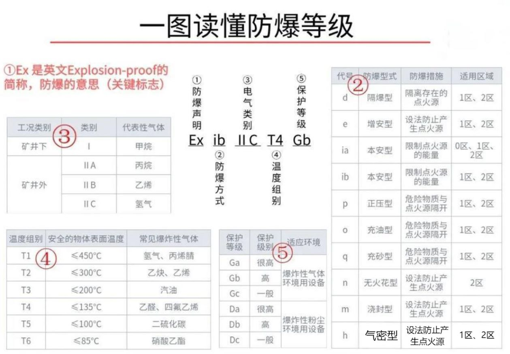
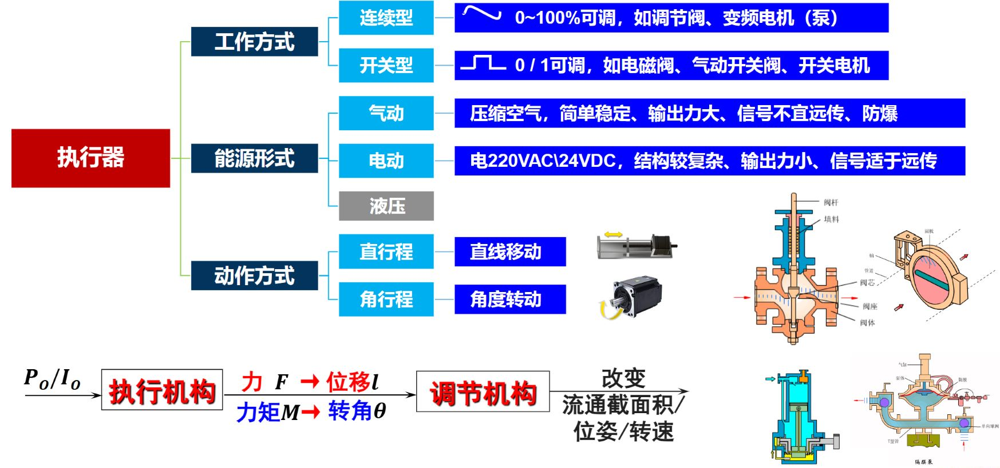
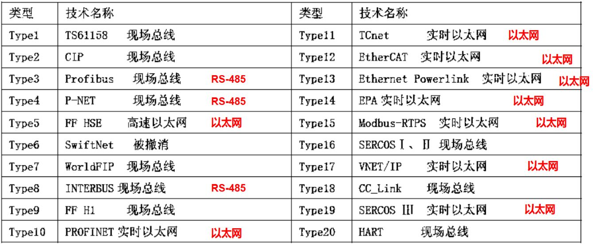

好久不见，今天讲讲三个月前有位伙伴点的菜——PLC。直接讲PLC恐怕不能很好了解，作为简明入门自然是要一并讲清楚PLC的整个大背景——计算机控制系统，你可以理解为**工业控制系统**。如果想直接上手西门子PLC软件，跳转到这。

## 它是什么？

没有什么比类比更容易去讲清楚这个玩意儿。

设想，我们手动遥控器去控制一架无人机去侦察、探索。而计算机控制系统把你这个人换成了一台**计算机**，无人机换成**执行器**，可能是一个水箱的开关阀门，也可能是一个电机，总之都是和工业生产相关的东西。而无人机上的相机换成各种**检测仪表**，去测量液位、温度、流量等等，也是工业相关的东西。无人机遥控可能是用2.4GHz专有协议无线通信的，在工控系统中我们会换成专门的**通信手段**。

我们在玩无人机的时候，会通过传回的画面来控制，防止无人机撞到树上。这就像闭环控制。在工控系统中，我们也是类似这样的控制方式，将这四个部分串联、组合起来，构成一套运作逻辑。比如要控制水箱水位，检测水箱水位过高，计算机发出信号，排水阀打开去降低水位。

## 那它和常规的控制有什么区别呢？

这么一类比貌似只是换成了工业场景。没错！我们玩的小车、无人机可能玩一段时间就坏了或者只能在很常规的环境中玩。但工业控制系统特别强调一件事——**可靠**。（当然还特别关注**可维护性**、**实时性**和**网络通信**）

### 仪表

在检测仪表中，我们会为他们制定防爆和防护的等级编号来确保可靠。防爆就是防止仪表的电火花引爆其工作环境中的气体和粉尘。防护就是防止外部的水、灰尘等异物进入，损坏仪表。

### 执行器

执行器方面的安全可靠上，选型就不赘述了，值得注意的是要从保证人员和设备安全角度来确定**正反作用**。比如，当执行器不受控（无信号）时，阀门处于关闭位置危害性小，则选正作用式（接收到信号就打开）。

### 网络通信

在通信方面，工业控制系统通过一些网络拓扑结构来实现多台主机、设备的通信。最常见的是**总线结构**、星型、环型、树型。他们彼此之间通信核心就分为三层：物理层面怎么接线、传输协议怎么保证数据送达（实时性、设备地址等等）、应用协议规定数据格式。

现在比较普遍使用现场总线和工业以太网两类通信。现场总线的物理层面比较常见的是RS485接口，差动、双线平衡传输，共模干扰抑制能力强，而传输和应用则有Profibus、P-NET等等。工业以太网物理层一般用标准以太网物理层（IEEE 802.3），传输和应用常见的有PROFINET、EtherCAT等等。

:::note[通信双方的交互方式]
- 单工通信：单一方向传输，没有反向交互（如传统的键盘、鼠标通信）
- 半双工通信：双方可以交互数据，但不在同时，应用广泛（只需2根通信线）
- 全双工通信：双方可以同时交互数据，效率高，至少3根（共地）或4根通信线
:::

但现在广泛采用的**现场总线**的工业控制系统（FCS）并不是说只用现场总线，而在于强调其**全数字、全分散**（全数字→现场设备高度自治；全分散→系统结构高度分散）的特点。

### 控制器

控制器有用放大器搭的单元组合式控制器、有数字式控制器，当然也有PLC 启动！PLC全称叫可编程逻辑控制器。（IEC定义：PLC是一种专门用于工业环境的数字运算操作系统，可通过编制程序实现逻辑运算、算术运算、定时、计数等操作，通过AI、DI和AO、DO接口，控制机械设备或生产过程）

## 实操