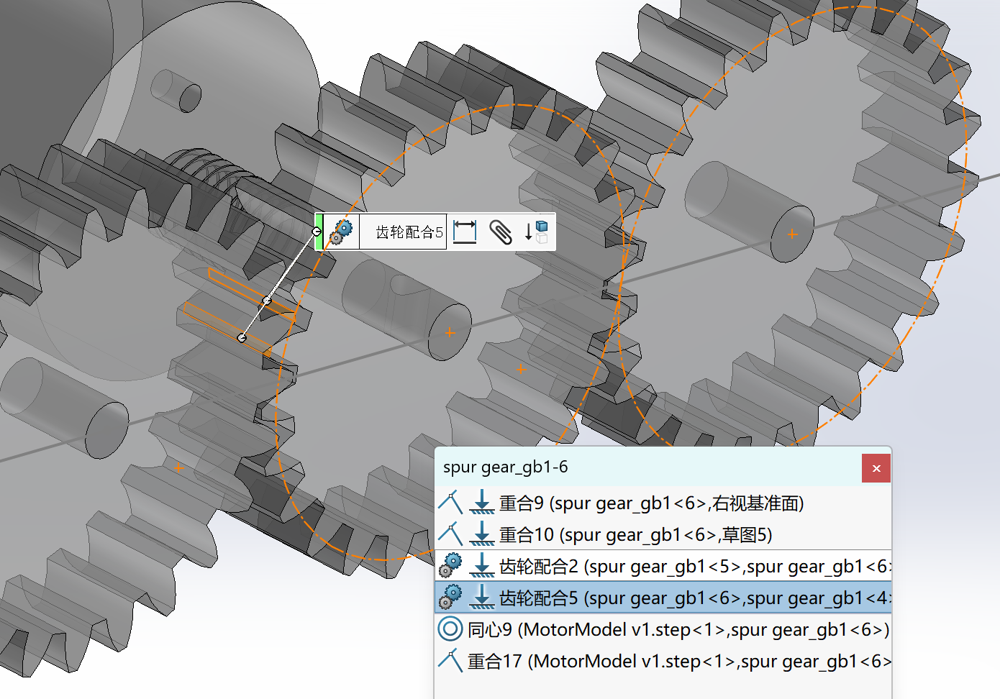
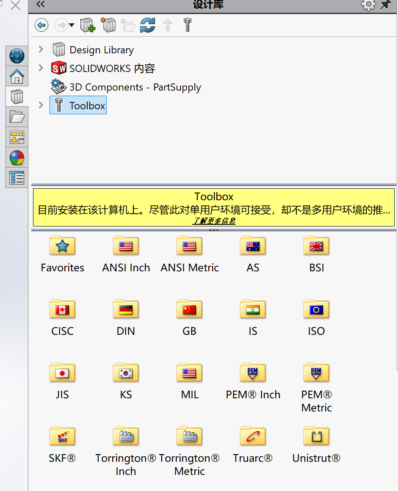

## SolidWorks

:::tip[安装参考材料]
[这篇](https://mp.weixin.qq.com/s/xGi_HKrT3kWgpQ8oAULgTA)是安装 2023 版SolidWorks 的教程，但该软件每年更新无明显差别。
:::

一句话讲清楚机械建模就是**捏泥人**和**搭积木**。

做一个物体的模型时采用捏泥人的方法，你可以先弄一大块泥，像雕塑那样，一点一点把泥去掉，从中“取出”那个泥人。你也可以先弄个身子，再一点点往上加手臂、腿、脚等。

### 草图和实体

草图是二维的，实体是从一幅或多幅草图中获得的三维模型。

实体的尺寸数据一部分来自草图，一部分来自获取该实体的方式（也不一定有）。例如你选择用拉伸来获取圆柱，圆柱形的底的尺寸由它的草图决定，而高度则由拉伸的距离决定。

接下来进行一些简单的操作，从0开始画一辆小车！（详细见视频）

### 装配体

配合是组装零件成装配体的核心功能，分为`标准`、`机械`、`高级`、`分析`四类，标准是最简便、大学阶段最常用的。

:::note[可能会用到的机械配合]
我们可以用机械配合来实现例如齿轮随动的效果。

齿轮可以直接在 Toolbox 里面找 GB 拿（见下）。齿轮配合主要有三点：
1. 分度圆相切，你可以通过设定两个齿轮转轴距离来实现相同的目的
2. 有两个齿的面相切，或者你旋转到差不多也可以
3. 齿轮配合，机械配合里选择`齿轮`，再点两个齿轮的顶面即可（如图，方法不止这一种）

:::
### 其他

- **视图设置**：让使用界面用起来更舒服
- **材质光影**：选择合适的材质，让你的模型看起来更漂亮
- **爆炸视图**：做动画，呈现装配的逻辑（B站教程有很多）

:::tip[标准零件在哪里]

如果你没有上述侧边栏，你可以点击`视图->工具栏->任务窗格`来开启这个侧边栏。

Toolbox，点击`现在插入`你就可以看到不同国家标准的零件库了。 GB 就是我们中国国标的零件，你不需要徒手画各种齿轮之类的，只需要按需求去找即可。
:::

## 3D打印

这里主要介绍以 PLA 为耗材的 3D 打印。

### 先导配置

1. 选择对应的 3D 打印机
2. 选择相应的打印板（不同的板打印时耗材丝温度等有所区别，因此要选对）
3. 耗材丝选择

### 打印设置

主要的三个配置的地方是：

1. **单层的厚度**：拓竹默认 0.2 mm，这个根据你需要打印物体大小、精度来判断
2. **填充的密度**：填充密度简单说就是每一层耗材丝所占据的比例。这个决定了打印所消耗的耗材丝的量以及打印出来物体的强度，需要权衡。一般在20 - 80% 之间
3. **支撑**：支撑是为了提高悬空部分的抗拉强度，悬空的界定基于物体大小、凸出部分多少等因素。一般对直径大的洞、侧面直接延伸出较长的部分需要进行支撑设置

打印设置完之后通常会进行切片预览，逐层查看是否存在悬空、缺陷等，确认无误后开始打印。

### 打印

**上传**：据我所知有局域网上传切片文件和使用 SD 卡两种方式。后者需要使用读卡器将切片文件放入 SD 卡，然后将 SD 卡插入 3D 打印机的 SD 卡槽。

**打印**：有些打印机没法在额外设置。如果是拓竹 X1 等稍微高级一些的有选择耗材丝、延时摄影等设置。打印时间一般都会在显示屏上面显示出来。

**取出**：拿出打印板，尽量用铲子把物体取下（指甲扣就别让塑料嵌进去），摘下“支撑”的部分就得到了！

:::caution[注意事项]
1. 3D 打印后打印板要清理干净，上面用于定位的耗材料要去除掉
2. 多次使用打印板后需要确认粘性，及时涂抹专用的胶水，防止后续打印件与打印板粘连而难以取下
:::