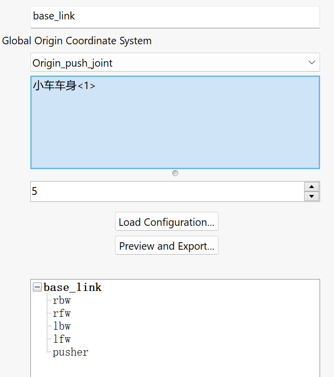
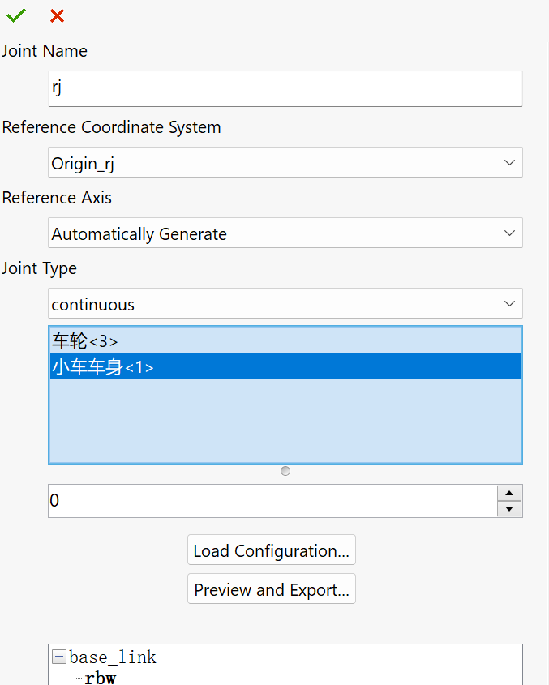
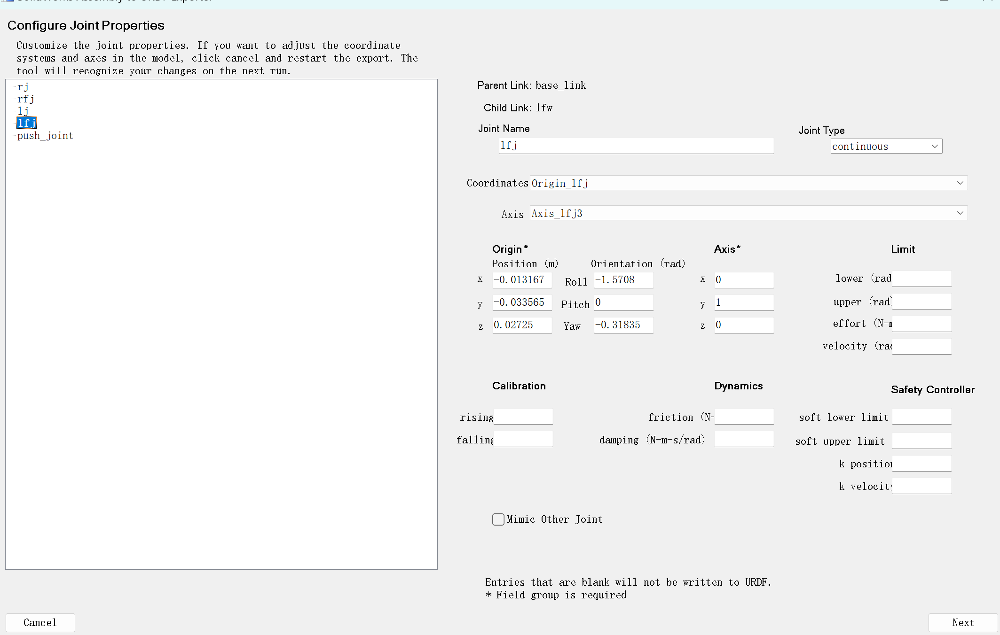
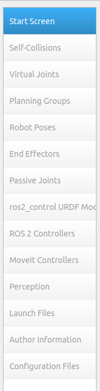

import { Steps } from '@astrojs/starlight/components';

:::tip[提要]
[ROS1 版本](https://github.com/maindraster/ros1_moveit_gazebo)的仓库（使用的是一个不同小车模型）: 

本教程使用 ROS2 主要内容为：
- 如何使用插件将小车模型转化为 URDF 文件
- Moveit2 操控小车的机械臂
- 如何在 Gazebo 中开小车

**所有本教程略过的内容均会提供各类参考链接。**
:::
:::caution[注意]
本教程使用的各软件版本如下：
- SolidWorks 2023
- Ubuntu 22.04 LTS
- ROS2 Humble
- Moveit2

如果你在其他版本下食用本教程出现问题，恐难以回答。此外对于未能像 ROS1 仓库那样将 Moveit2 应用到 Gazebo 中深感抱歉。
:::
## 模型转为 URDF

### 什么是 URDF？

URDF（Unified Robot Description Format）是一种用于描述机器人模型的 XML 格式。它是一种开放的标准，由 Wikipedia 维护。

URDF 文件包含机器人模型的详细信息，包括：机器人名称、机器人链接、关节、传感器等等。

### 准备工作

先确定小车有哪些需要活动的部件，给它们增加上转轴、坐标系。如果不用添加，后续插件也可以自动生成，但可能和你设想的有偏差，例如仿真时可能会翻倒、转轴不正确等等。具体操作见视频。

### 如何将模型转为 URDF？

<Steps>
1. 给你的 SolidWorks 安装能将模型导出为 URDF 文件的插件。
   [Wiki地址](https://wiki.ros.org/action/fullsearch/sw_urdf_exporter?action=fullsearch&context=180&value=linkto:%22sw_urdf_exporter%22) 里面包含了教程。
2. 打开小车模型，上方`工具`菜单，向下滚动`Tools`，点击`Export as URDF`。
3. 第一栏：取个名字，一般 base_link；第三栏：选择 link 实体；第四栏：确定相连接的实体数目，每增加一个，下方会给基座增添一个子 link。
   
   :::note[Link 和 Joint]
   我们一般把机器人描述为由`link`和`joint`组成的物体，`link`是机器人各部分的物理实体，`joint`是连接`link`的桥梁。可以类比为人的手臂和关节。
   :::
4. 可以双击下面的子 link，配置子 link 的属性。第一栏：joint 名称；第二栏：参考坐标系；第三栏：参考轴；第四栏：joint 类型，`continuous`是连续旋转，`fixed`是固定，`revolute`是限位旋转；第五栏：选择 link 实体；第六栏：子 link 数量（同上）。下方按钮一：导入已有的配置；下方按钮二：预览与导出配置。
   
5. 完成所有 link 的配置。
6. 点击`Preview and Export...`，预览导出配置。
7. 进一步配置 joint 属性，主要是给`revolute`类型配置旋转上下限，数值单位为 rad，例如 +3.14 约为 +180°，它是相对你当前显示位置来算的，注意 `upper`必须比`lower`大，`velocity`必须表示不能是整数（后续仿真会出错，可以用例如 2.01 这样的小数）。
   
   :::danger[注意]
   这个插件不是很稳定，这页以及点`next`的下一页要特别注意是不是空白的，或者缺少数据的（关注 Joint type）。如果是，就退出重新 Export，或者直接退出 SW 重进。
   ::: 
8. 下一页配置也是看看有没有缺数据，就可以导出了，建议选择`URDF and meshes`
</Steps>

## Moveit2 准备与安装

Moveit2 [^1]是 ROS 2 的机器人操作平台，融合了运动规划、操作、3D 感知、运动学、控制和导航方面的最新进展。

### 准备工作

请先安装好 Ubuntu 系统、ROS2、Gazebo ->[详细的文字版教程](../../project/ysyx/1-2)

### 安装 Rosdep 以安装系统依赖项

这一步最好需要魔法，Github 不是很稳定，这篇[教程](https://blog.csdn.net/weixin_55944949/article/details/140373710)提供了国内 gitee 的安装方式。

```cmd
sudo apt install python3-rosdep
sudo rosdep init
rosdep update
sudo apt update
sudo apt dist-upgrade
```
另外，不同于 ROS1 我们习惯使用的 catkin_make 编译。Colcon 会成为我们 ROS2 使用新的编译工具。记得安装：
```cmd
sudo apt-get install python3-colcon-common-extensions
```

### 安装 Moveit2

这里官方教程是直接把 Moveit2 仓库都搬过去了（实际上不需要，而且很费时间），我们直接二进制安装，方便又快捷！

```cmd
sudo apt install ros-humble-moveit
```

### 安装 moveit-setup-assistant

```cmd
sudo apt install ros-humble-moveit-setup-assistant
sudo apt install ros-humble-moveit-*
```
下面一条是顺便安装的。
:::tip[提示]
可能有不少同学安装的包不全，有缺少。那么在后续的操作过程中，执行语句后会提示报错，告诉你缺少什么。去检索一下就能知道相应包的安装语句，一般是`sudo apt install 包名`。**读懂这类报错非常有必要**。
:::

## 使用 Moveit2 控制小车机械臂

### 创建 ROS2 工作空间

```cmd
mkdir -p carbot_ws/src
cd carbot_ws/src
```
:::caution[注意]
有个我难以理解的事是，按照下面方式建的包理论上是很常规的，不会有问题的，但是在我这里使用 moveit2 后，launch文件始终会对路径报错（国内没有任何解决方案）。你可以尝试按照 Reddit 上更改路径的方式来运行。

我为了保证所有人都成功，直接将官方 [panda_description](https://github.com/moveit/moveit_resources/tree/humble/panda_description) 包(pakage)粘贴进来（替换其中的 meshes 和 URDF 文件，如果你想要尝试官方的 panda 机械臂模型，也可以不替换）。
:::
```
ros2 pkg create carbot_description --build-type ament_python
```
把你的 URDF 文件夹和 meshes 文件夹粘贴进去。

### 配置 URDF 文件

先把名字改成英文。

STL 的文件路径需要修改，网上使用`file:///$(find carbot_description)`可以，我这里不太行，直接用绝对路径`file:///home/tky/car_ws/src/panda_description`

### 开始 Moveit2 assistant setup

:::danger[新手常忘]
每一次对你的包进行修改，请务必用以下语句来更新，不然还是原来的报错。
```cmd
colcon build
source install/setup.bash
```
:::
```cmd
ros2 launch moveit_setup_assistant setup_assistant.launch.py
```

具体流程可以看我的教程视频或参考[官方教程](https://moveit.picknik.ai/main/doc/examples/setup_assistant/setup_assistant_tutorial.html) 。在这里我们主要配置从上往下第 1、2、3、4、5、8、9、10、13、14 项。其中第13项这个邮箱可以乱填，但不能没有，后续会报错。



:::caution[Poses滑动条显示问题]
Ubuntu 系统设置里`Displays`->`Scale`，看一下是不是缩放为 200%，请调回 100%。
:::

第 14 项导出时要和 panda_description 同一级目录，两个包并列，假设你给这个放 Moveit2 文件的包文件夹取名`config`。

### 运行 Moveit2

```cmd
ros2 launch config demo.launch.py
```
:::tip[Ubuntu 使用技巧]
使用`tab`键可以补全文件名称，如果这个文件的前几个字母是独一无二的，上面的命令中打出`de`后按下`tab`就能补全。
:::

接下来就可以根据我们的想法，用可视化界面去操作小车的手臂了。`plan`是规划无碰撞让各个关节达到指定位置的路径，`execute`是执行，可视化过程。

## 从 URDF 到 Xacro

Xacro 是 XML,也可以用来表示机器人，与 URDF 很像，但比它有更好的扩展性。

我必须说下面不是一种正规的获得 xacro 文件的方式，但没有关系。

<Steps>
1. 首先将文件后缀重命名为`.xacro`
2. 修改开头的（从注释之后开始）
   ```diff
   - <robot name="car">
   + <robot name="car" xmlns:xacro="http://www.ros.org/wiki/xacro">
   +  <xacro:include filename="$(find moveit_resources_panda_description)/urdf/robot.gazebo.xacro" /> 
   ```
   这里的`moveit_resources_panda_description`是我们可以从`package.xml`中看到的。
3. 新建一个文件夹叫`robot.gazebo.xacro`
4. 复制以下代码到`robot.gazebo.xacro`，并根据你自己的 joint 和 link 名称进行修改。
   ```xml
   <?xml version="1.0"?>
   <robot>

   <gazebo reference="base_link">
      <material>Gazebo/FlatBlack</material>
   </gazebo>

   <gazebo reference="lfw">
      <mu1>1000000</mu1>
      <mu2>1000000</mu2>
      <kp>500000.0</kp>
      <kd>10.0</kd>
      <minDepth>0.001</minDepth>
      <maxVel>1.0</maxVel>
      <fdir1>1 0 0</fdir1>
      <material>Gazebo/DarkGrey</material>
   </gazebo>

   <gazebo reference="rfw">
      <mu1>1000000</mu1>
      <mu2>1000000</mu2>
      <kp>500000.0</kp>
      <kd>10.0</kd>
      <minDepth>0.001</minDepth>
      <maxVel>1.0</maxVel>
      <fdir1>1 0 0</fdir1>
      <material>Gazebo/DarkGrey</material>
   </gazebo>

   <gazebo reference="lbw">
      <mu1>0.5</mu1>
      <mu2>0.5</mu2>
      <kp>500000.0</kp>
      <kd>100.0</kd>
      <minDepth>0.001</minDepth>
      <maxVel>1.0</maxVel>
      <material>Gazebo/DarkGrey</material>
   </gazebo>

   <gazebo reference="rbw">
      <mu1>0.5</mu1>
      <mu2>0.5</mu2>
      <kp>500000.0</kp>
      <kd>100.0</kd>
      <minDepth>0.001</minDepth>
      <maxVel>1.0</maxVel>
      <material>Gazebo/DarkGrey</material>
   </gazebo>

   <gazebo>
      <plugin name="mybot_controller" filename="libgazebo_ros_diff_drive.so">
         <odometry_frame>odom</odometry_frame>
         <publish_odom>true</publish_odom>
         <publish_odom_tf>true</publish_odom_tf>
         <publish_wheel_tf>true</publish_wheel_tf>
         <robot_base_frame>base_link</robot_base_frame>
         <num_wheel_pairs>2</num_wheel_pairs>
         <left_joint>lj</left_joint>
         <right_joint>rj</right_joint>
         <left_joint>lfj</left_joint>
         <right_joint>rfj</right_joint>
         <wheel_separation>0.5</wheel_separation>
         <wheel_separation>0.5</wheel_separation>
         <wheel_diameter>0.12</wheel_diameter>
         <wheel_diameter>0.12</wheel_diameter>
         <max_wheel_torque>100000</max_wheel_torque>
      </plugin>
   </gazebo>
   </robot>
   ```
</Steps>

在 ROS1 的版本中提供了另外`skid_steer`包的操控方法。这里 ROS1 和 ROS2 虽然使用插件名称相同，但 XML 编写存在一定差异。

## 在 Gazebo 仿真环境中开小车

Gazebo 是 ROS2 自带的仿真环境，我们可以用它来模拟小车的运动。

### 安装 Gazebo 和 teleop_twist_keyboard

```cmd
sudo apt install gazebo
sudo apt install ros-humble-gazebo-*
```
```cmd
sudo apt install ros-humble-teleop-twist-keyboard
```
### 撰写启动 Gazebo 的.launch.py 文件

原定计划是将同时运行 Gazebo 和 Moveit2 中配置的小车关节控制的节点，这样可以在仿真中开小车的同时还能控制机器臂。但是我不清楚是我的环境还是什么地方出现了问题，导致采用鱼香ROS大佬的代码，Gazebo开不起来，官方的代码也有问题。我将节点发布的那行注释掉了，拿来开小车肯定没有问题。

在`panda_description`文件夹下创建文件夹`launch`，新建文件名称为`gazebo_model.launch.py`，具体代码的解释见视频，直接复制粘贴下面代码肯定是用不了的，有好几处需要自行修改。

```python
import os
from ament_index_python.packages import get_package_share_directory
from launch import LaunchDescription
from launch.actions import ExecuteProcess, IncludeLaunchDescription
from launch.actions import TimerAction
from launch.launch_description_sources import PythonLaunchDescriptionSource
from launch_ros.substitutions import FindPackageShare

from launch_ros.actions import Node
import xacro

def generate_launch_description():
    # this name has to match the robot name in the Xacro file
    robotXacroName='car'
    # this is the name of our package, at the same time this is the name of the
    # folder that will be used to define the paths
    namePackage = 'moveit_resources_panda_description'
    # this is a relative path to the xacro file defining the model
    modelFileRelativePath = 'urdf/car.xacro'
    # this is a relative path to the Gazebo world file
    worldFileRelativePath = 'world/arena4.world'
    # this is the absolute path to the model
    pathModelFile = os.path.join(get_package_share_directory(namePackage),modelFileRelativePath)
    # this is the absolute path to the world model
    pathWorldFile = os.path.join(get_package_share_directory(namePackage),worldFileRelativePath)
    # get the robot description from the xacro model file
    robotDescription = xacro.process_file(pathModelFile).toxml()
    # this is the launch file from the gazebo_ros package
    gazebo_rosPackageLaunch=PythonLaunchDescriptionSource(os.path.join(get_package_share_directory('gazebo_ros'),'launch', 'gazebo.launch.py'))
    # this is the launch description
    gazeboLaunch=IncludeLaunchDescription(gazebo_rosPackageLaunch,launch_arguments={'world': pathWorldFile}.items())
    # here, we create a gazebo_ros Node
    spawnModelNode = Node(package='gazebo_ros', executable='spawn_entity.py',
    arguments=['-topic', 'robot_description', '-entity', robotXacroName],output='screen')

    # Robot State Publisher Node
    nodeRobotStatePublisher = Node(
        package='robot_state_publisher',
        executable='robot_state_publisher',
        output='screen',
        parameters=[{'robot_description': robotDescription,
        'use_sim_time': True}]
    )
    # Load controllers using ros2 control spawn, but delay their activation
    load_joint_state_broadcaster = TimerAction(
        period=5.0,  # Delay in seconds
        actions=[
            ExecuteProcess(
                cmd=['ros2', 'control', 'load_controller', '--set-state', 'active', 'joint_state_broadcaster'],
                output='screen'
            )
        ]
    )

    load_arm_controller = TimerAction(
        period=7.0,  # Delay in seconds, ensure this happens after joint_state_broadcaster
        actions=[
            ExecuteProcess(
                cmd=['ros2', 'control', 'load_controller', '--set-state', 'active', 'paaa_controller'],
                output='screen'
            )
        ]
    )

    # Launch MoveIt 2 (robot_state_publisher + move_group + RViz)
    move_group_launch = IncludeLaunchDescription(
        PythonLaunchDescriptionSource([
            FindPackageShare('config'), '/launch/move_group.launch.py']),  # Replace with actual MoveIt package name
    )

    # Launch RViz with MoveIt 2 configuration
    rviz_config_file = FindPackageShare('config')\
        .find('config') + '/config/moveit.rviz'  # Replace with actual path

    rviz = Node(
        package='rviz2',
        executable='rviz2',
        name='rviz2',
        output='screen',
        arguments=['-d', rviz_config_file]
    )

    # here we create an empty launch description object
    launchDescriptionObject = LaunchDescription()
    # we add gazeboLaunch
    launchDescriptionObject.add_action(gazeboLaunch)
    
    # we add the two nodes
    launchDescriptionObject.add_action(spawnModelNode)
    launchDescriptionObject.add_action(nodeRobotStatePublisher)
    launchDescriptionObject.add_action(load_joint_state_broadcaster)
    # launchDescriptionObject.add_action(load_arm_controller)
    launchDescriptionObject.add_action(rviz)
    launchDescriptionObject.add_action(move_group_launch)
    return launchDescriptionObject
```

然后你需要在 Cmakelist 当中的 include 添加 launch 文件夹，形式如下：

```cmake
install(DIRECTORY meshes urdf launch DESTINATION share/${PROJECT_NAME})
```

如果你希望尝试我失败的 Rviz 控制 Gazebo 环境下的小车，你需要对`car.xacro`和`package.xml`修改，具体见文章最后的代码仓库。

:::note[补充]
上面代码的 Gazebo 启动相比国外、官方提供的代码还增加了 world 文件的导入，也就是仿真中的环境，事实上，我自己使用时没启动成功。

你可以尝试换一种 Gazebo 启动方式，参考[文章](https://blog.csdn.net/joyopirate/article/details/129424607)，我这里用它这个代码完全不能启动 Gazebo。
:::

### 让我们开始开小车吧！

```cmd
ros2 launch moveit_resources_panda_description gazebo_model.launch.py
```

然后打开一个新的终端，输入：

```cmd
ros2 run teleop_twist_keyboard teleop_twist_keyboard
```

按下键盘上的方向键，小车就会开始运动。

:::tip[代码仓库]
[地址](https://github.com/maindraster/ros2_moveit_gazebo)
尽管视频中多次生命，但还是还想再声明一下：
1. 本仓库实现了小车在 Gazebo 环境下的运动、Moveit2 运动规划执行（Rviz），仅仅只需要按本文的`gazebo_model.launch.py`代码配置并运行即可
2. 未能实现通过 Rviz 的窗口规划控制后，让 Gazebo 环境中的小车机械臂执行

而本文开头 ROS1 的仓库没有 2 的问题。
:::
---
[^1]: 由于 ROS1 最后一个版本到2025年停止维护，因此原定基于 ROS1 的教程决定更改为基于 ROS2 ，同样使用的 Moveit 须改为 Moveit2 。
