import { Steps } from '@astrojs/starlight/components';

啊，你就像者控制算法，我的心偏偏被你稳住了！

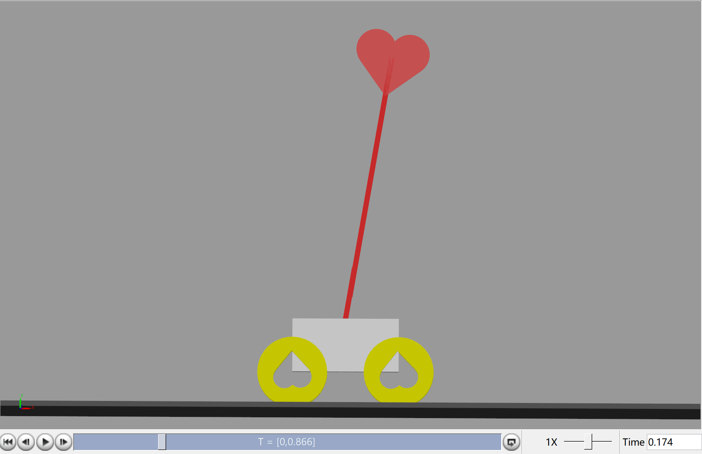

今天我们就要用 MATLAB 一步一步去做出这个爱心倒立摆。

## 倒立摆的 PID 控制模型

上个视频当中我们介绍了控制系统。我们回顾一下，一个完整的闭环控制系统，简单地拆分下，只需要一个被控对象和一个控制模块。

<Steps>
1. **谁是被控对象**？很显然呐，这个爱心倒立摆就是我们的被控对象。
2. **被控量是什么**？那不安的心摇摇欲坠的**角度**。
3. **控制量是什么**？我们给下面那辆小车的力。
</Steps>

第一步告诉我们要对这个倒立摆进行建模，有两种方法，第一种是用物理学、数学公式来“模拟”，在 MATLAB 当中我们可以编写 S-Function 来实现。另一种就是直接制作出这个模型，像开头发癫片段里面那样。（我们先讲这第二种，第一种放 P2 介绍）

### MATLAB Multibody

想要搭建出这样一个模型，我们需要用到 MATLAB 当中 Simscape Multibody，建议结合[官网](https://ww2.mathworks.cn/help/sm/getting-started-with-simmechanics.html)文档学习。此部分的内容要感谢博主 J_H_Li 。


<Steps>
1. 打开 Simulink 新建一个 slx 模型文件。
2. 创建三件套：
    - `Solver Configuration`：模型求解器
    - `World Frame`：世界坐标系
    - `Mechanism Configuration`：配置整个装置的物理属性，点开设置 [0 9.8 0]
3. 创建一个`6 DOF`模块，允许你搭建的模型在这个“世界”当中能有三个平移、三个旋转的自由度，本质上是一个关节
    - 给 X 和 Y 方向上设置状态的位置（直接与该模块相连的物体在这个世界坐标系中的坐标）你可以定义一个变量`x_0`也可以直接输入数字`0.12`。如果是采用变量，你可以新建一个脚本来赋值。
    - x方向上给力，所以 Action -> Force provided by input
    - 如果希望监控它的一些值，可以点开 Sensing 勾选你想了解的值。 
4. 接下来新建一个`Brick Solid`作为“地板”
    - Geometry Dimensions 设置 [2 0.01 2]
    - Export 勾选 Entire Geometry 选项用于和轮子接触，防止穿模
</Steps>

:::note[link 和 joint]
在之前机器人建模教程中介绍过，任何物体几乎都可以用两类部件描述，一个叫`link`，可以理解为实体，一个叫`joint`，理解为关节。人形机器人的身体是一个`link`，手臂是一个`link`，两个`link`之间有一个`joint`（关节）才能让手臂运动。
:::

`Ctrl + D`可以查看模型。

<Steps>
5. 再新建一个`Brick Solid`
    - Geometry Dimensions 设置 [0.2 0.1 0.1]（你们可以自行设置）
    - Inertial 设置 Mass 1 kg
    - Frames -> New Frame -> 选这一项↓再选一个长的面，点 use
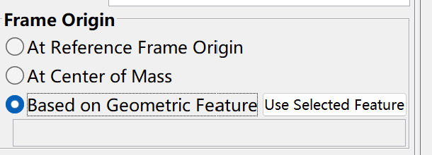
这个frame表示与下一个相连的link连接的位置。
6. 新建一个`Revolute Joint`
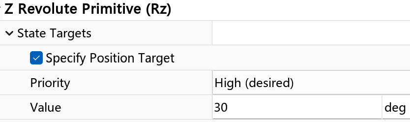
7. 再新建一个`Brick Solid`
    - Geometry Dimensions 设置 [0.01 0.5 0.01]
    - Inertial 设置 Mass 0.5 kg
    - Frames -> New Frame -> 同上，但是两个小的面需要各设置一个frame，分别用于与小车主体和爱心相连
    - Graphics 里面可以设置颜色
8. 接下来就是车轮子的建模了，按照如下图所示，分别新建`Rigid Transform`、`Revolute Joint`、`File Solid`和`Spatial Contact Force`
    - `Rigid Transform`：设置的是四个轮子坐标的位置（[0.1 -0.05 0.09]，[0.1 -0.05 -0.04]，[-0.1 -0.05 0.09]、[-0.1 -0.05 -0.04]）
    - `Revolute Joint`：设置的是四个轮子的关节
    - `File Solid`：设置的是轮子的形状，这里我们导入 STL 文件（你可以通过 SolidWorks 建模导出成 STL 文件），设置 Geometry 中 Export 勾选 Convex Hull 选项，轮子就有实体了
    - `Spatial Contact Force`：设置的是轮子与地面的接触力
9. 第八步的`Spatial Contact Force`与第四步`Brick Solid`连接，防穿模
10. 新建`File Solid`，用上自己制作的爱心，可以根据前面的自行设置。
11. 根据自己需要新建输入和输出的模块
    - 输入：`Input` + `Simulink-PS Converter`
    - 输出：`Output` + `PS-Simulink Converter`
</Steps>

最终连线可以得到如图的模型：

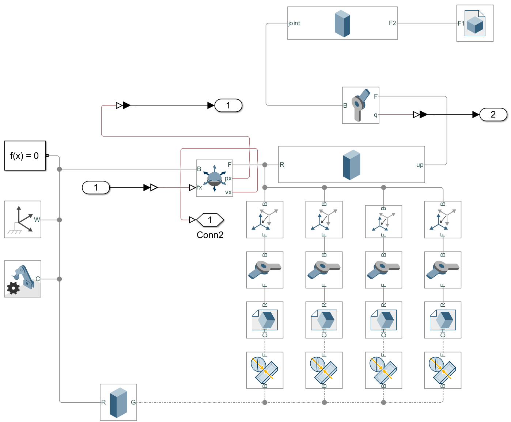

### 用 level-2 S-Function 建模

下面是一个倒立摆的 level-2 S-Function 建模，让我们快速看一下代码结构。

```MATLAB
function inverted_pendulum(block)
    % Level-2 MATLAB file S-Function for inverted pendulum dynamics
    setup(block);
end

function setup(block)
    % Register number of ports
    block.NumInputPorts  = 1;  % Input: Force (F)
    block.NumOutputPorts = 2;  % Outputs: theta (angle) and x (cart position)

    % Setup port dimensions
    block.SetPreCompInpPortInfoToDynamic;
    block.SetPreCompOutPortInfoToDynamic;

    block.InputPort(1).Dimensions        = 1; % 输入，即控制量 F
    block.OutputPort(1).Dimensions       = 1; % 输出，即被控量 theta
    block.OutputPort(2).Dimensions       = 1; % 输出，小车运动的距离 x

    % 状态变量的数量（求解过程产生的量）
    block.NumContStates = 4; % [x, x_dot, theta, theta_dot]

    % Set block sample time
    block.SampleTimes = [0 0]; % Continuous system

    % Block characteristics
    block.SimStateCompliance = 'DefaultSimState';
    
    % 定义函数
    block.RegBlockMethod('InitializeConditions', @InitConditions);
    block.RegBlockMethod('Outputs',              @Output);
    block.RegBlockMethod('Derivatives',          @Derivatives);
    block.RegBlockMethod('SetInputPortSamplingMode', @SetInputPortSamplingMode);
end

% 设置初始状态变量的值
function InitConditions(block)
    % Initialize the state variables: [x; x_dot; theta; theta_dot]
    block.ContStates.Data = [0; 0; pi/6; 0]; 
end

% 设置输出的量
function Output(block)
    % Output the current state: theta and x
    state = block.ContStates.Data;
    block.OutputPort(1).Data = state(3); % theta
    block.OutputPort(2).Data = state(1); % x
end

% 微分方程
function Derivatives(block)
    % Parameters (adjust as needed)
    M = 1.0;   % Mass of the cart
    m = 0.5;   % Mass of the pendulum
    l = 0.5;   % Length of the pendulum
    g = 9.81;  % Gravity constant

    % 定义状态变量
    x      = block.ContStates.Data(1);
    x_dot  = block.ContStates.Data(2);
    theta  = block.ContStates.Data(3);
    theta_dot = block.ContStates.Data(4);

    % Input force
    F = block.InputPort(1).Data;

    % 物理、数学公式
    sin_theta = sin(theta);
    cos_theta = cos(theta);
    
    theta_ddot = (F*cos_theta-(M+m)*g*sin_theta+m*l*theta_dot^2*sin_theta*cos_theta)/(m*l*cos_theta^2-(M+m)*l);
    x_ddot = (g*sin_theta - l*theta_ddot)/cos_theta;

    % Derivatives of state variables
    block.Derivatives.Data = [x_dot; x_ddot; theta_dot; theta_ddot];
end

function SetInputPortSamplingMode(block, idx, fd)
    block.InputPort(idx).SamplingMode = fd;
    block.OutputPort(1).SamplingMode = fd;
    block.OutputPort(2).SamplingMode = fd;
end
```

代码当中的公式可以采用拉普拉斯公式计算出来，暂不探讨。

### 完成 PID 控制模型

接下来我们将要完成控制和反馈的部分了，上个视频当中我们已经列出 PID 的公式如下。

$$\alpha = K_p(\theta_{set} - \theta_{real}) + K_d\frac{d\theta_{set}-d\theta_{real}}{dt} + K_i\int_{0}^{t} (\theta_{set} - \theta_{real})dt$$

但是这次我们将采用增量型离散PID控制算法如下：

$F(k) = F(k-1) + K \left[ K_p \Delta \theta(k) + \frac{T}{T_i} \theta(k) + \frac{T_d}{T} (\Delta \theta(k) - \Delta \theta(k-1)) \right]
$

可以看到，只有一个角度的输出不够，我们还需要上一个时刻的角度输出来获得角度差`d_theta`和上上个时刻的角度来获得`dd_theta`。

因此，我们可以用`Unit Delay`模块来保存上一个时刻的值（本质是 Z 变换）。用两个该模块外加`Sum`模块，我们可以得出公式中所有需要的值。

这次我们将创建一个`Matlab Function`模块来实现 PID 控制，而不是用 Simulink 中的模块搭建。它就是一个实现 PID 控制的函数，如下所示：

```MATLAB
function f_k = pid_control(theta, d_theta, p_d_theta, p_f, k)
    % PID Controller for inverted pendulum
    % Inputs:
    %   theta       - Current angle (rad)
    %   d_theta     - Current angular velocity (rad/s)
    %   p_d_theta   - Desired angle (target, rad)
    %   p_f         - Desired angular velocity (target, rad/s)
    %   k           - PID gain coefficients [K_p, K_i, K_d]
    % Output:
    %   f_k         - Control force (N)
    
    % PID coefficients
    T = 0.0001;
    T_i = 0.001;
    T_d = 10;
    K_p = 200;  % Proportional gain
    
    % Compute PID control output
    f_k = p_f + k*(K_p * d_theta + T/T_i * theta + T_d/T * (d_theta-p_d_theta));
    if f_k > 25
        f_k = 25;
    elseif f_k < -25
        f_k = -25;
    end
end
```

## 专家控制

如果你注意看刚刚的 PID 代码，其实在最后对输出的力进行了限制，不能超过 25N ，这也算是专家控制的一部分了。

接下来我们可以根据（题设）给出的要求去添加模块、连接完成整个专家控制系统。同样你可以采用模块来进行判断，也可以用 MATLAB function 来实现专家控制的**分类讨论**。

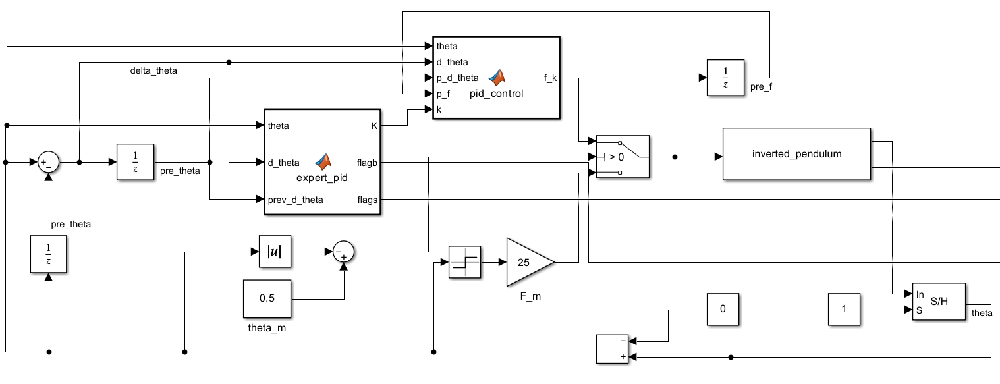

## 模糊控制

在命令行窗口输入

```cmd
fuzzy
```

弹出一个窗口，这个就是对模糊模块的配置。

上期视频中我们介绍了模糊控制包含模糊化、模糊推理和去模糊化三个步骤。

<Steps>
1. 模糊化：点击黄色的Input，下面`Range`设置输入的范围，上方`Edit`可以编辑需要划分的区间数量，点击每个隶属度函数可以设置它们的`Type`、`Params`调整它们的形状和范围。很多时候我们模糊控制的输入不只有一个，因此我们可以回到主页面点击`Edit`来新添一个输入，当然也可以在这里新添输出。
2. 模糊推理：点击`Edit`->`Rule`就可以选择在什么输入条件下执行什么输出，再点击`Add Rule`添加一条规则。对于输入为误差和误差变化率一般使用如下规则：
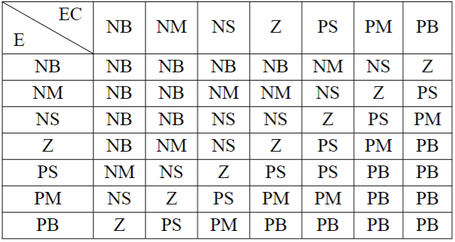
对于模糊PID控制，我们常进行修改采用如下规则：
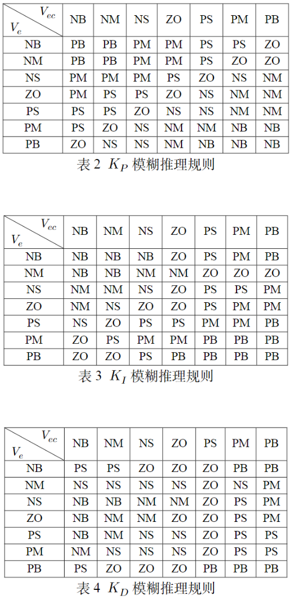
你可以在`View`->`Surfaces`中查看对应模糊规则对应关系的曲面。
3. 去模糊化：点击黄色的Output，下面`Range`设置输出的范围，上方`Edit`可以编辑需要划分的区间数量，点击每个隶属度函数可以设置它们的`Type`、`Params`调整它们的形状和范围。
4. 保存之后，在 Simulink 当中输入`Fuzzy Logic Controller`，将刚刚保存的文件放入即可。
</Steps>

例子（具体代码后续上传到 Github）：
- 直接模糊控制
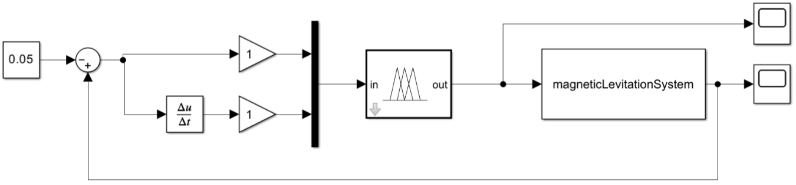
- 模糊 PID 控制
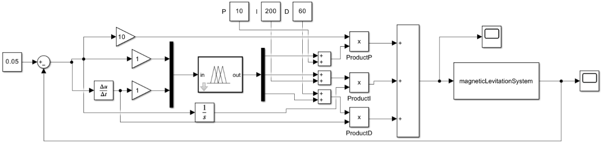

## 神经网络控制

### 神经网络辨识

神经网络辨识的本质是学习和模拟某个系统的特性，并不是控制。选择的输入和具体模型（物理学公式）有关。这里我们已经有一个机械臂的 S-Function 模型，接下来我们将采用串并联神经网络辨识。

$y_p(k+1) = f[y_p(k), y_p(k-1), ..., y_p(k-n+1); u(k), u(k-1), ..., u(k-m+1)]$

在我们的例子当中最高阶为二阶导，因此可以搭建出如下模型：

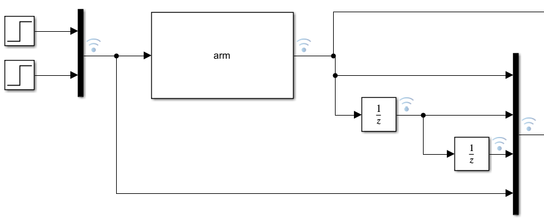

框选这个区域，点击`记录信号`，运行模型，再点击`数据分析器`。我们依据标签选择 mux 8个的输出，另存为 xlsx 文件。然后自行处理一下，分成两个表，一张表存输入量，一张表存输出（保证时间点一样）。

然后我们再命令窗口输入（也可以在APP当中找到`神经网路拟合`）：

```cmd
nftool
```

导入两张表，都不用什么操作，下一步 -> 完成即可。

:::caution[注意]
两张表必须取名不同，可以给第二张表取名叫 data1 。

:::

训练可以自行设置验证、测试数据多少，层大小，训练方式等等。最后导出模型，接入刚刚未完成的模型，可以接`Scope`对比。如图。

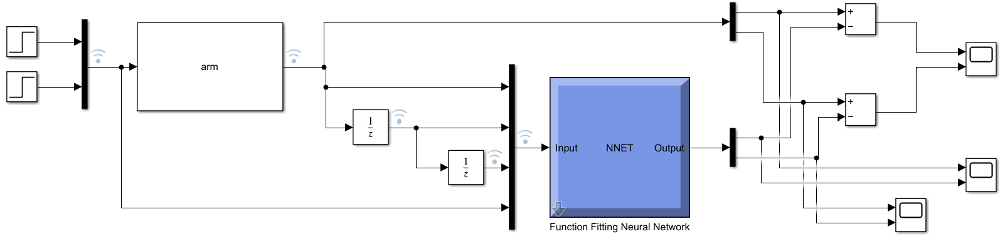

### 自适应神经网络

RBF 自适应神经网络需要把神经网络的代码写入到模块当中，为此你需要事先了解一些神经网络的知识，此处不展开，仅提供一些参考。

:::note[参考]
刘金琨的[《智能控制——理论基础、算法设计与应用（第2版）》(2023)](http://www.tup.tsinghua.edu.cn/booksCenter/book_09676501.html#)该书有配套的代码。

刘金琨还有两本比较旧的书也可以参考：
- 《机械系统RBF神经网络控制》2013
- 《RBF神经网络自适应控制MATLAB仿真》2014
（网络资源暂时没找到讲这个讲的好的）
:::

:::tip[最优控制的 MATLAB 实现]
最优控制的 MATLAB 实现 B 站上就有不少讲的不错的 Up 主，直接搜 MPC 就有不少，本人就不献丑做视频了。
:::