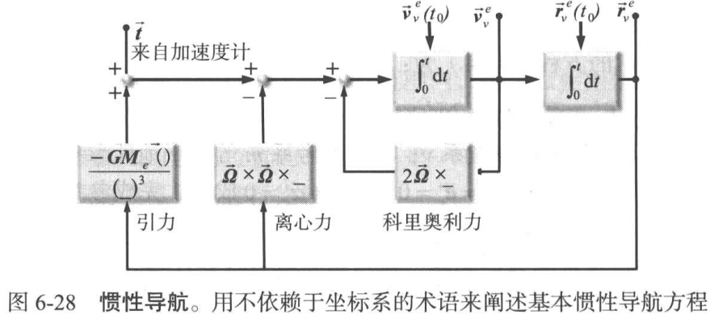
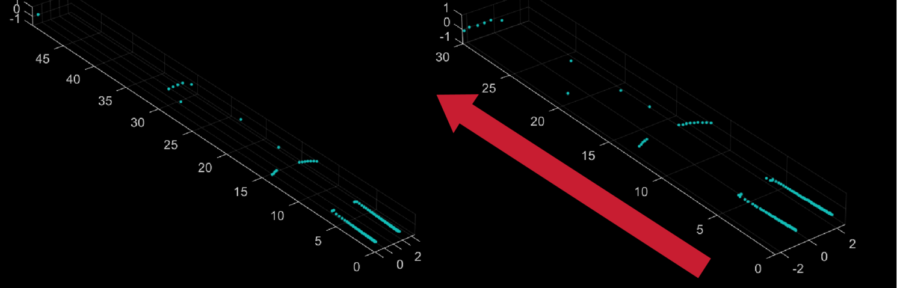
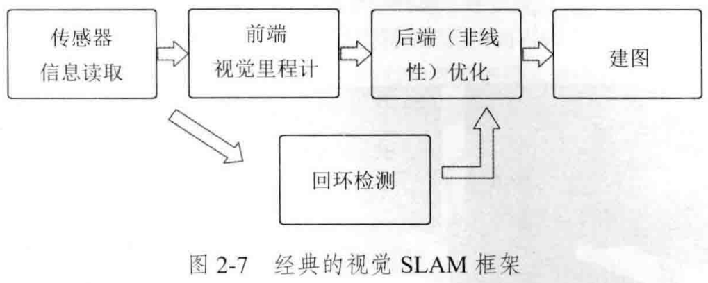
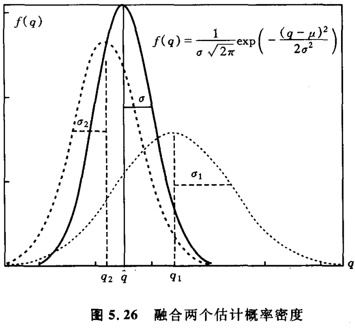
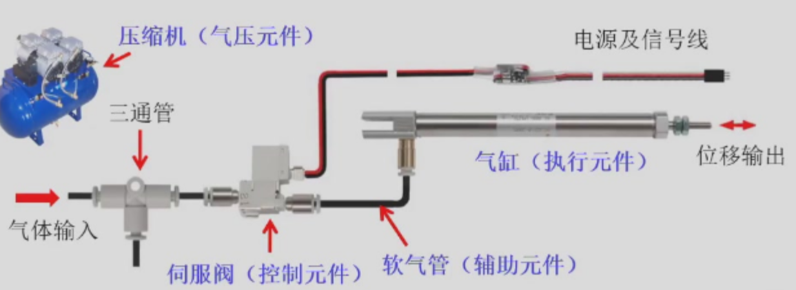
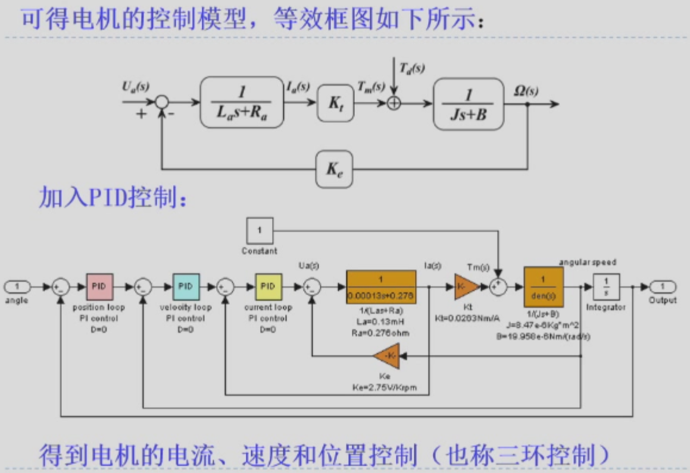

import { Steps } from '@astrojs/starlight/components';

从春晚上的舞蹈机器人到几天前人形机器人跑马拉松，你可曾想过机器人到底是什么呢？有两只脚两只手吗，那扫地机器人呢？如果想造一台帮你干活的机器人又该从那些方面着手呢？

## 机器人是什么？

“机器人”这词就是科幻作家造的，科学家发明家一看，哦哟有意思，就纷纷开始造自己的想的机器人。于是对于它的定义，自然是各执一词了。不过抽象出来，有三个东西可以概括：

**感知、决策、执行**

感知就是它的视觉、触觉、听觉等等，接收环境给它的输入，并从中知道一些东西；决策就是能用它的小脑瓜处理这些输入信息，做出判断、选择；执行就是它能按照指令做出动作，完成任务。

这么一看，自主送外卖的无人机、无人驾驶汽车都算机器人，广义一点，今年走红的AI Agent也可以算，而你那只会发6的朋友，咳咳。

有了机器人的概念，那么怎么造呢？

## 感知 = 感 + 知

感知、感知，先感才能知。

人有耳目眼鼻皮肤可以感，机器人怎么感？没错,传感器！我们一般把机器人的传感器分为内部传感器和外部传感器。

内部传感器有点我们感知自己平衡的小脑，用于测量机器人自身状态。比如：

| 传感器 | 检测功能 |
|-------|---------|
| 电位器、旋转变压器、码盘 | 角度、位移 |
| 测速发电机、码盘 | 速度、角速度 |
| 加速度传感器 | 加速度 |
| 倾斜仪 | 倾斜角度 |
| 陀螺仪 | 方位角 |
| 力/力矩传感器 | 力/力矩 |

外部传感器就是机器人对环境进行感知了，比如：

| 传感器 | 感知内容 | 传感器 | 感知内容 |
|-------|---------|-------|---------|
| 视觉 | 环境图像 | 嗅觉 | 气味 |
| 触觉、滑动觉 | 物体存在检测、尺寸、形状、材质、硬度、光滑 | 听觉 | 声音 |
| 接近觉 | 障碍检测、距离 | 味觉 | 味道 |
| 热觉 | 温度 | 力觉 | 力和力矩 |

正所谓：

视觉传感选得差，一头识途瞎老马。力觉传感胡乱塞，大象跳着踩踩背。

因此要造一个机器人选传感器百倍关键。

选传感器的套路也很简单，先把你的需求，哦不，叫约束条件，写出来，比如：测量范围、测量精度，传感器大小、重量，传感器使用条件还有你钱包厚度之类的。

然后再对应着看你能买哪些传感器，一般：
1. 性能指标看精度、稳定性、响应速度、信号类别（模拟或数字）、输出量、被测对象特性的影响、过输入保护等等。最好能弄清楚原理，它的静态特性（输出和输入的关系）如何，动态特性又如何；
2. 使用条件看环境温度、湿度、振动等，测量时间、还有信号传输距离、与外设的连接方式、供电方式和电源容量。

有了硬件帮我们感，还要软件帮我们知。用相机看到了图像，只有处理过后才能知道，“哦，我在客厅，前面有个沙发”，“哦，对面是斧头帮，冲我来了”。以最常见的感知任务——定位为例。

### 例子

假设你要造一台扫地机器人。
<Steps>
1. 先依据场景确定需求，考虑到家庭地面上椅子、猫会动，不可能有现成的场景图供你进行路径规划，于是你大概要用一边建立环境地图一边定位的算法，这个算法就叫SLAM。当然让机器人运动的时候，不要碰到人和东西，肯定也要避障算法。
2. 要想实现这两个功能，可以选择相机、激光雷达配个里程计（Odometry）、惯性测量单元（IMU）。
3. 接下来首先思考的就是如何处理传感器的数据，一般我们称为SLAM的**前端**，不同传感器显然不同。
</Steps>
:::tip[IMU处理方式]
由于IMU包含xyz三轴加速度，很容易想到能通过积分来算出自己的位置，但在实际使用时还要剥除离心力、科氏力等的影响，再去积分才能得到想要的位置。[^1]

:::
:::tip[相机处理方式]
而用相机来定位，则需要让计算机能够根据相邻的图像来估计自己位置和姿态的变化，其中涉及到图像特征点检测、特征匹配、三角测量、位姿估计等算法。我们称其为**前端视觉里程计**（Visual Odometry）。
:::
:::tip[激光雷达处理方式]
激光雷达通过激光反射获取其所在平面障碍的分布情况，获取的数据通常是一堆发生反射的障碍物点，也就是点云。同样需要通过对相邻时刻的点云分布来确定自己位姿的变化，比如能够判断出来两端圆弧是相同的障碍物，机器人大概在往这个方向走。对应的算法叫**ICP点云匹配**。

:::
<Steps>
4. 由于存在噪声，比如传感器受温度、磁场影响，接下来要将传感器的数据进行去噪、滤波的处理，来获取整个系统的状态（机器人的位姿和地图），以及这个状态的不确定性有多大（最大后验概率估计，MAP）。这步对前端结果的优化叫**后端**。在纯视觉SLAM当中，我们让机器人判断是否回到原位，纠正随时间产生的累计偏差十分有效，即**回环检测**。这就是基础的视觉SLAM框架。[^2]

而多传感器的SLAM的后端，常要综合各个传感器的噪声分布情况进行滤波和融合。其中一种典型算法叫**扩展卡尔曼滤波算法**（Extended Kalman Filter, EKF）。比如它先依据IMU的数据进行下一时刻的位姿预测，再采用视觉和雷达的测量数据按照一定“权重”进行更新纠正。这个权重，依据不确定度确定，像激光雷达，它位置的信息挺准，但速度就不准。当然融合过程中还会考虑各种传感器数据噪声的分布情况。[^3] [^4]

</Steps>

上述提到的定位方法只是一种，通常我们有三种定位方法：
- 基于外部设备感知（比如外部相机拍摄来确定机器人位置、全球卫星定位）
- 基于里程计的航位估计
- 基于本体设备感知的定位 -> 运动与感知融合的定位

## 决策

感知是解答“我在哪？”，决策就是解答“我要干什么？”

决策也一样需要硬件和软件。
- 软件是根据任务确定的算法、程序
- 硬件是机器人的大脑，根据算法程序，确定性能合适的芯片、板子。从差到好，有Stm32F106这样的小型单片机，到树莓派这样的单板机，再到比肩电脑性能的板卡。不过很多时候，我们会先让一些差一点“大脑”去处理，再把结果传给“大脑”去做决策。比如一些自机械臂、灵巧手会自带控制模块。

### 运动规划

延续定位的例子，扫地机器人还需要能找到一次性扫完全屋的办法，并躲开路上的猫、椅、墙等。这属于很常见的决策任务——运动规划。

这件事有三个方面要考虑：
1. 安全性：无碰
2. 光滑性：节能、平稳
3. 运动学可行性：可执行、可控

和感知一样，我们也可以把这个任务分为前端和后端[^5]。

<Steps>
1. 前端是轨迹搜索，我们可以把它粗糙地分成三类：
    - 基于搜索的方法
        - 图搜索
        - Dijkstra算法和A*算法
        - Jump Point Search算法
    - 基于采样的方法
        - Probabilistic Road Map(PRM)
        - Rapidly-exploring Random Tree(RRT)
        - Optimal Sampling-based Planning(OSBP)
        - Advanced Sampling-based Planning(ASBP)
    - 满足动力学要求的路径规划
        - State-state Boundary Value Optimal Control Problem
        - State Lattice Search算法
        - Kinodynamic RRT*
        - Hybrid A*算法
2. 后端是对前端得到轨迹的优化，也可以粗糙分为两类：
    - Minimum Snap轨迹优化
        - Differential Flatness
        - Minimum Snap Optimization
        - Closed-form Solution to Minimum Snap
        - Time Allocation
        - Implementation in Practice
    - 硬约束与软约束轨迹优化
        - Soft Constrained Trajectory Optimization
        - Hard Constrained Trajectory Optimization
3. 避障算法则比较灵活。不过在运用时我们通常采用全局规划+局部避障的策略，比如Dynamic Window Approach(DWA)算法、Velocity Obstacle(VO)算法等。可以将避障算法理解为前端的一部分。
</Steps>

一句话总结运动规划是在决策，**机器人应该用什么样的运动（x(t),v(t),a(t)）来完成的任务**，如扫地。

### 运动控制

有了轨迹那就要执行，执行那肯定就是运动控制了。欸？我还偏就不把运动控制纳入执行，这点我埋个伏笔，最后再说。无论在运动控制还是规划当中都有一个很重要的概念叫变换矩阵T，它包含一个表示姿态或旋转的旋转矩阵和一个表示位置或平移的位置向量。用来描述机器人或是一个关节的位姿。关节就是那些能旋转、平移的地方，扫地机器人的轮子能旋转，也算一个[关节](../../train/w9_simu/#如何将模型转为-urdf)(joint)。

${}^A_B\mathbf{T} = \begin{pmatrix}
{}^A\mathbf{R} & {}^A\mathbf{O}_B \\
\begin{matrix} 0 & 0 & 0 \end{matrix} & 1
\end{pmatrix} \in \mathbb{R}^{4 \times 4}
$

${}^1_3\mathbf{T}={}^1_2\mathbf{T}{}^2_3\mathbf{T}$
依据机器人运动情况或是关节与关节之间物理上的关系，用T的点乘（右乘时相对联体坐标系旋转平移，左乘相对基座标系）来获取新时刻机器人的位姿或者下一个关节的位姿。当我们不断点乘T就可以获得末端的位移和旋转矩阵。这就是**正运动学**。但实际解决任务时，我们往往以机械臂末端受力和位置为已知目标，去控制其各个关节的力和角度，这就是**逆运动学**。我们可以用雅可比矩阵的方式来解决。

旋转矩阵R的参数通常是欧拉角（和布莱恩角），即绕x轴、绕y轴、绕z轴旋转的三个角度。而位姿向量是xyz三个方向的位置。从感觉来看，它们对时间求导很可能和角速度和速度有关。事实也的确如此。

$$\dot{\mathbf{R}}(t) = \boldsymbol{\omega}(t)^{\wedge} \mathbf{R}(t)$$

$\dot{\mathbf{P}}=\boldsymbol{v}$

所以可以说我们还得到了机械臂末端的速度和角速度，而这恰恰也是我们最关注的、需要被控制的东西。我们把速度和角速度合成一个6*n的矩阵，好巧不巧，它就是几何雅可比矩阵，而且力的传递公式也与它有关系。

$\tau = J^T{\mathbf{F}}$

n\*1 = (n\*6) \* (6\*1) 

$F=(F_x, F_y, F_z, n_x, n_y, n_z)^T$

上面的式子表示，当末端有`F`的力和力矩时，为了平衡n个关节各自的力。不过很显然它只是考虑了机械臂的结构，而没有考虑到其他的物理因素，比如摩擦、重力等等。用**拉格朗日方法**（或牛顿-欧拉迭代法[^6]）来推导，即从能量角度把这些遗漏的因素考虑进来，我们可以得到完整的运动学方程。

拉格朗日公式：

$\frac{d}{dt}\left(\frac{\partial k}{\partial \dot{\phi}}\right) - \frac{\partial k}{\partial \phi} + \frac{\partial u}{\partial \phi}= \tau - B\dot{\phi} + J ^T F$

$M(q)\ddot{\phi} + C(\phi, \dot{\phi})\dot{\phi} + L\dot{\phi} + G(\phi)=\tau  + J ^T F$

- `Φ`是一个表示每个关节的状态的向量，例如3个关节的RPR机械臂，那么就是一个（角度，位移，角度）的向量（旋转型关节是角度，平动型关节是位移）。
- `L=B1+B2`，B1代表电机电阻损耗，B2为关节运动的粘性摩擦系数
- `G`，各关节承受重力
- `τ`是各个关节期望电流下的力

其实这个动力学方程和牛二很像，左边就像是`ma`右边是`F`。左边这些`M`、`C`、`G`都是机械臂固有的物理、结构特性，是已知的。每个关节的状态`Φ`是我们在上一步运动规划中得到的结果，`F`是末端的力，当然可以根据任务设计末端期望的力。如果你看过上一期控制理论的视频，你很快就能反应过来，这个动力学方程就是被控系统，我们有许许多多的控制方法来设计各个关节的力，即`τ`。

于是，运动控制要做的本质上还是**决策**，即**机器人各个关节应该用什么样的力来跟踪我们期望的运动轨迹和末端受力**。

## 执行

一般我们谈论执行器不包含其对应的控制部分。不过在实际构建机器人时，我们还是会把控制结合起来选择合适的执行器硬件。以下是比较常用的三类执行器：

- 直流电机：小车行走
- 舵机：机械臂操纵
- 气缸：直线伸缩运动

它们都有各自的控制和驱动方式。

:::tip[气动系统]
一个简易的气动系统：气压元件、控制元件、执行元件和辅助元件。

:::
## 控制的回环，机器人的细胞

机器人不断与环境交互，理解自己在哪，要做什么，然后去操控机械硬件执行。这样闭环的方式，避免了各种干扰积累的误差，也就是控制理论在机器人身上的体现。而我们谈论的**具身智能**也正是强调机器人与环境交互形成一套深度融合感知-决策-执行的模式。

扫地机器人中我们先根据任务，采用运动规划的“决策”方式获得了轨迹、速度等机器人宏观的运动的目标信息。而这些信息又变成轮子控制的输入。轮子的电机上安装上编码器测速，配合IMU等传感器用来“感知”实际速度，再用PID之类的控制算法来“决策”得到期望的电机力或转速。得到的这便是典型的双闭环控制，无人机中常常使用。进一步，电机转速又成为了电力拖动自动控制系统的控制目标。得到的很像是经典的位置、速度、电流三环控制。

对于复杂的人形机器人而言，有许许多多的任务，比如让身体控制平衡、双腿实现跳跃等等，同样有很多的关节以及多样的执行器。而有时为了完成同一项任务，还需要不同的部分和关节相互配合。正是这些感知、决策和执行的回环，相互嵌套、组合，构成了整个机器人。

## 尾声

感知、决策和执行是我认为机器人比较重要的三个特点。实际上，其中涉及到的但本视频未特意介绍的机械结构设计、能源供给等等也是机器人中不可或缺的一部分，多机协同、跨机学习等等也是时下研究开发的热点。尽管目前大规模商业落地的机器人只有扫地机器人和无人机，但从我们的需求出发，我们应当认识到这样综合性强、复杂度高的技术突破需要长期投入和持续创新，不妨给予这一领域足够的耐心和支持。

[^1]: 《移动机器人学》，Alonzo Kelly
[^2]: 《视觉SLAM十四讲从理论到实践》第二版，高翔、张涛
[^3]: [图解卡尔曼滤波](https://mp.weixin.qq.com/s?__biz=MzU0NjgzMDIxMQ==&mid=2247630398&idx=1&sn=4c308c075421118abb91da576ebf9d23)
[^4]: 《自主移动机器人导论》，Roland Seigwart
[^5]: 浙江大学《机器人导论》课程Slides，高飞 
[^6]: 《机器人建模与控制》吴俊/《机器人学导论》John J.Craig