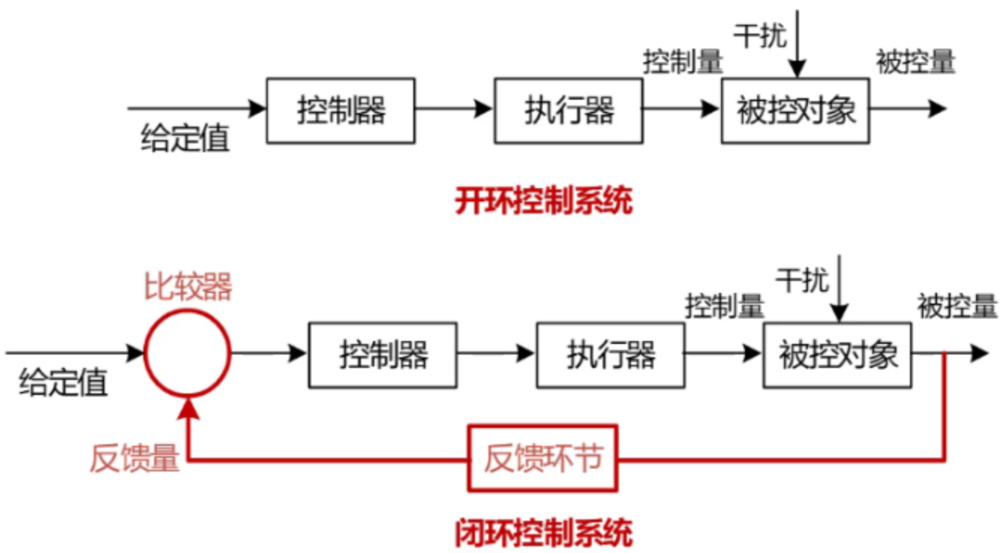
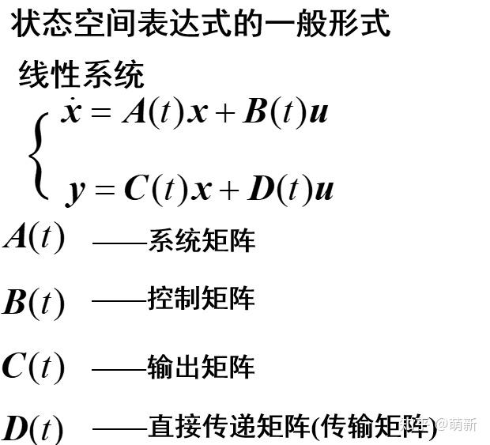
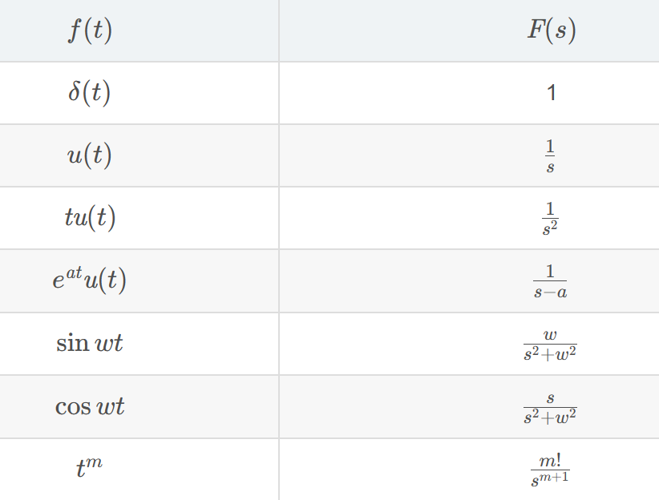
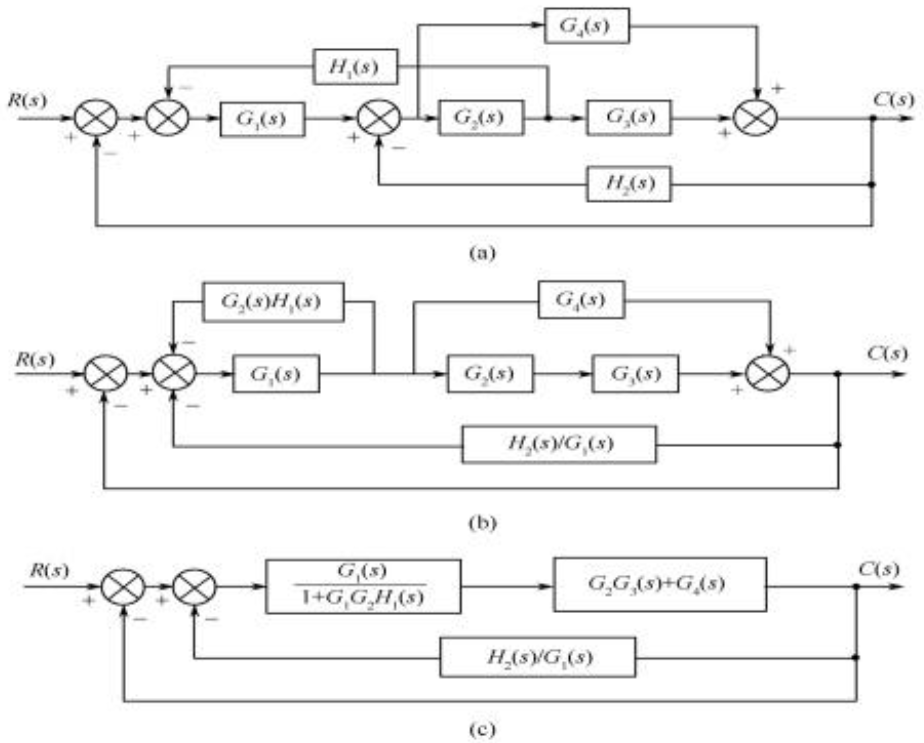
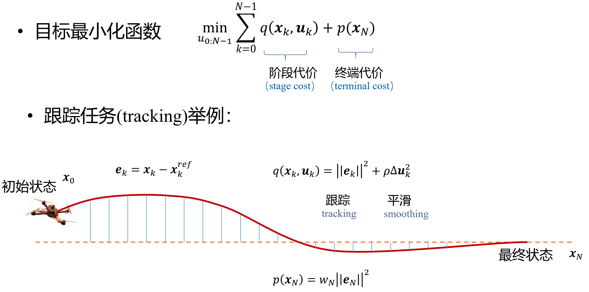
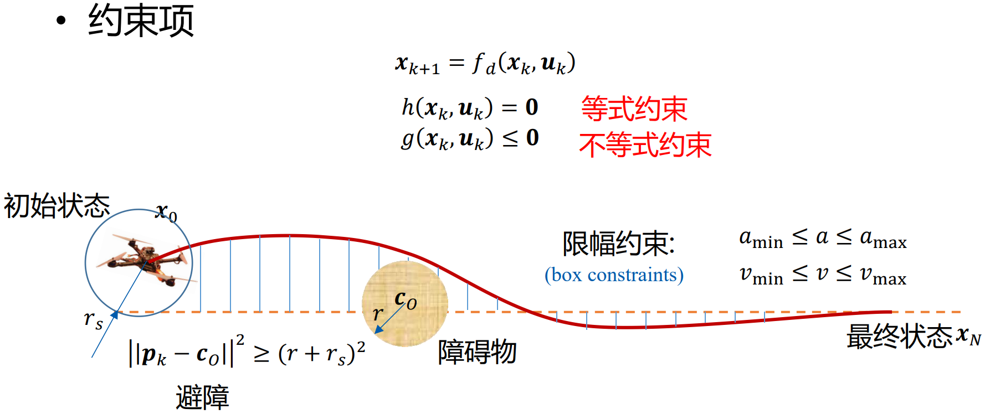
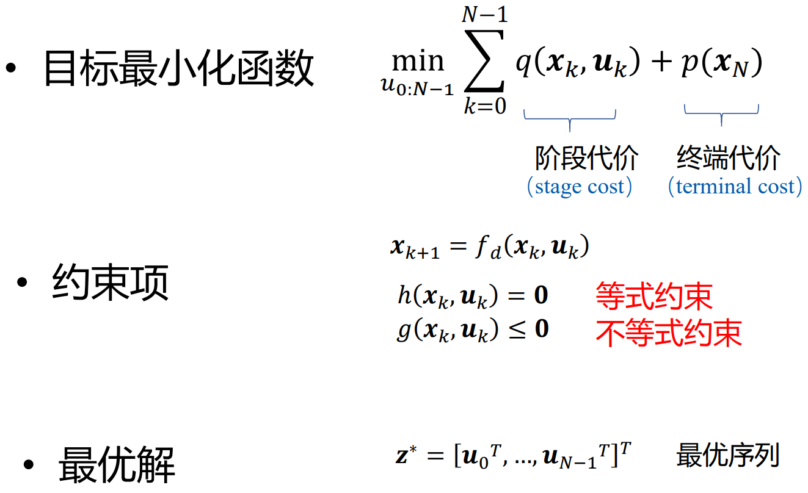

import { Steps } from '@astrojs/starlight/components';

本期视频将用最感性的方式、最通俗的语言概述从现代控制理论到智能控制、最优控制乃至强化学习的相关内容。总之，看完看懂你就可以在不懂的朋友面前装一名控制算法工程师了。

## 控制是什么？

控制的核心概念在于反馈。

为什么要反馈呢？假设有一个盲人，告诉他一直走就能走回家，他大概率走着走着就走歪了。但如果这条直路上有盲道，走歪了，盲人能感觉到，调整方向回到这条直路上。感觉到走歪并调整就是反馈。

引入**控制方框图**的概念：



对于绝大多数例子我们要想建模，可以优先确定被控量，比如在这个例子中可以定为：**行走方向**。

那么**被控对象**就是身体和腿，**执行器**就是腿部肌肉，**控制器**是大脑。特别注意控制量是执行器发出的。系统建模时切忌把控制量和被控量搞错。

**反馈环节**：感受脚底盲道，估计实际行走方向，到比较器中比较，调整方向。

## PID 是什么？

### 比例控制

那么是如何实现方向调整的呢？很容易想到，感觉到偏离方向多了就把身体多转回来一点；如果偏离的少就少转回来一点。放到方框图中，比较器将**设定的行走方向**与**反馈量**（实际行走方向）做差，这个差值就是刚刚说的偏离量。我们可以写出一个简单的控制方程：

$$\alpha = K(\theta_{set} - \theta_{real})$$

其中α是需要身体转动的角度，θ是行走的方向角度。到这你已经知道控制最基础的概念，**负反馈**，就是这个式子当中减号决定的。绝大多数稳定的控制都依靠负反馈。

这个式子代表的控制方式叫**比例控制**，因为左边的量与误差成比例，也就是PID控制中的**P**。

### 微分控制

现在我们把盲人换成无人机，盲道换成需要遵循的运动轨迹。被控量是与轨迹之间的偏差。

假设无人机在某一点开始偏离，偏离的角度越来越大，但实际上还未与设定轨迹有较大的误差。毫无疑问，比例控制的作用很小，但是你很担心如果接下来按照这个很大的偏离角度走会控制不住，所以你想把这个苗头扼杀在摇篮里。换句话说，你要遏制偏差迅速增加的可能。于是你设计了一个新的控制项，正比于偏离量的增加率。

于是式子变成：

$$\alpha = K_p(\theta_{set} - \theta_{real}) + K_d\frac{d\theta_{set}-d\theta_{real}}{dt}$$

这新的项叫**微分控制**，也就是PID控制中的**D**。其中包含对时间求导表明它关注于未来的变化趋势。

### 积分控制

无人机和设定轨迹的距离误差被我们控制得越来越小，但有可能，这个误差由于外界风等扰动因素迟迟不能被消除。因为此时误差小，比例控制的力小，和想要增大误差的扰动相抵消。这个迟迟不能被消除的、不变的误差叫**稳态误差**，稳态就是系统（无人机）在控制作用下平衡的状态。

我们需要让系统发现稳态误差**一直**存在并给出额外的控制来消除，那么控制的量就是与过去的误差相关。我们可以计算误差随时间的累计量。如果误差一直存在，那么累计的量就会越来越大。于是你设计了一个新的控制项，正比于偏离量的积分。

于是式子变成：

$$\alpha = K_p(\theta_{set} - \theta_{real}) + K_d\frac{d\theta_{set}-d\theta_{real}}{dt} + K_i\int_{0}^{t} (\theta_{set} - \theta_{real})dt$$

这新的项叫**积分控制**，也就是PID控制中的**I**。

## 仿真系统

在深入学习其他先进的控制方法之前不妨移步**前向通道**的其他模块。

执行器将控制信号和控制量对应起来，系统建模时常常和控制器放入一个模块当中，比如无人机我们可能直接用力而不是设置角度。

被控对象就像模拟系统的黑箱，通常基于物理学公式、常识。当输入控制量之后，它内部经过计算，最终改变被控量。

### 拉氏（拉普拉斯）变换

我们着眼于这个被控对象（仿真系统），本质上就是一个固定的输入和输出的“函数/方程”关系，像这样：

$$y(t)=a_1x_1(t)+a_2x_2(t)+a_3x_3(t)+……+b_1u_1(t)+b_2u_2(t)+b_3u_3(t)+……$$

其中x是**状态变量**（也就是系统中各种相关变量），u是控制量（也就是被控对象的输入）。我们常常把这个式子以及物理学公式决定的各个状态变量的关系式转换成如下**状态空间方程**描述（针对线性时不变）。



这个方程中的求导。学过复变函数就会知道，求解它不太容易。于是有人想出一个办法把导数变成乘法，比如x1的导数就变成`x1*s`（`s`是我们额外设置的符号）这就是[**拉氏变换**](https://baike.baidu.com/item/%E6%8B%89%E6%99%AE%E6%8B%89%E6%96%AF%E5%8F%98%E6%8D%A2/2)的初心。

### 传递函数

拉氏变换把时域转换到频域上分析，换句话说它将时域信号表示为不同频率指数函数的叠加，能**把所有带t的式子变成带s的**：



于是我们能获得这样一个矩阵形式的方程：
<center>
$$Y(s)=C(sI-A)^{-1}(BU(s)+x(0))+DU(s)$$
</center>
当是零初始条件时，整合可以得到：

<center>
$G(s)=C(sI-A)^{-1}BU(s)+DU(s)$

$$Y(s)=G(s)U(s)$$
</center>

其中G(s)叫**传递函数**（针对线性时不变），输出Y(s)和输入U(s)的关系就变得非常明了了。于是你就可以用传递函数来替代**被控对象**方框了。

当然我们也可也用拉氏变换把反馈的输入输出关系用一个“传递函数”表示出来，比如 H(s)。

:::note[]
以上内容没搞懂也没关系，你只需要知道，我们的核心目的是：
```
用便于计算和处理的方程/函数来模拟被控对象这个黑箱，输入控制量并输出符合规律的被控量。
```
针对线性时不变连续的系统，可以采用上面的拉普拉斯变换。当然数学建模也有其他的方法，比如离散系统用Z变换。

而拉氏变换和Z变换最常用，因为它把问题从**时域**转移到**频域**上了。
:::

它可能会像这样：



### 回到 PID

开环传递函数和有闭环反馈的整体传递函数，它们都能通过一些方式来获取关于这个系统的性能指标，比如稳定性、稳定裕度、幅频裕度等，也能绘制出一些可供具体分析的图表，比如波特图、奈奎斯特图等。你可以通过[这些图来对系统做补偿](https://zhuanlan.zhihu.com/p/721366793)，来满足稳定性好、裕度高等优良特性。换句话说就是依据系统的G(s)获取指标评估，找出其中的缺陷，用一个具有H(s)特性的补偿模块和这个不好G(s)相乘，以获得性能好的G'(s)，G'(s)就代表了一个加入了控制的系统。

结合之前所讲，针对线性时不变连续系统，求导等于乘个s，积分等于除以s。所以PID当中比例控制P充当系数，积分控制I充当分母上乘s，微分控制D充当分子上乘s，于是从感性上来看PID控制就能够组成任何用于补偿的线性的H(s)函数了。

## 控制理论

现在让我们宏观来看一下整个控制系统，它无非就是`控制模块+系统模型`。该部分我们将主要介绍现代控制理论的两个重要分支。

### 反应式控制

反应式控制指的是当误差发生后再去调节，PID控制就是最普遍的反应式控制。**特点是比较简单，适用范围比较广（简单的系统够用）**。通常会在PID控制前加上一个前馈控制，也就是通过监测系统的输入或扰动，提前做出响应，以减少或消除对系统输出的影响。

### 智能控制

很显然 PID 控制给系统的补偿比较死板，针对非线性、复杂动态系统效果就不好。而且有很多系统我们并不能给出数学模型，从而计算出理想的模型应该如何。于是专家大佬们想出了许多先进的控制方法，来对这类复杂、非线性、不确定的系统进行控制。智能控制就是这类控制方法的统称，是现代控制理论的重要分支。

#### 专家控制

名字听起来很高大上，但其实就是我们常说的分类讨论。依据专家的经验来划分输出量的输出范围，对不同划分范围的输出采用不同的方法控制。这显然具备非线性，能控制一些非线性系统。最常见的专家控制就是专家PID控制，在核心部分采用 PID 的基础上分类讨论。

#### 模糊控制

模糊控制像是专家控制的升级版，它让直接分类讨论产生的界限不那么生硬死板了。在实现上通常按照模糊化、模糊推理和去模糊化三个步骤进行：
1. 模糊化：将输入的精确值转换为模糊集合。
2. 模糊推理：根据模糊规则库对模糊输入进行推理，得到模糊输出集合。这个规则用“如果…则…”表示，也就是分类讨论。
3. 去模糊化：将模糊输出转换为精确的控制信号，以驱动被控对象。常用的去模糊化方法包括最大隶属度法和重心法。

假想一个空调，它要控制室温，以下是一种可能的模糊控制处理方法：
<Steps>
1. **模糊化**：划分室温为“冷”、“适中”、“热”。这帮研发空调的专家每个人体质不同，有争议了，最终给出有重叠的划分：0-18可以算冷，16-30算适中，28-38算热。那怎么办，很显然 18度 算是“冷”里面的最高温，也就没有那么冷，同时算“适中”里面比较低的。于是对每个区域设计一个**隶属度函数**，取值0-1，1代表绝对属于这个区域的，图中 23度 就是绝对属于“适中”。通过比较隶属度的值来判断某一具体温度属于哪个区域。当然可能存在隶属度相同，不妨当作同时归属两个区域。
2. **模糊推理**：如果“冷”就“大加热”，“适中”就“小加热”，“热”就“不加热”。根据模糊化得出的隶属区域来确定输出的模糊集合。
3. **去模糊化**：去模糊将模糊集合转变为唯一的具体输出值，方法有很多。比如根据隶属度函数，取函数值最大处的值作为该模糊集合的输出。刚刚提到可能存在输入同时归属两个区域，那么很可能输出也对应两个区域，那么可以将它们对应的具体值平均，作为最后的输出。
</Steps>

显然这种方法也是非线性的。

而上面是直接对输入进行模糊化。有时我们也会对输入与目标值之差的误差及其变化率进行模糊化，得到的输出作为PID控制的系数微调量，这种方法称为**模糊PID控制**。

#### 神经网络控制

前面我们说可以把被控对象看作黑箱，其实也可以把控制模块看为黑箱。输入为现在这个有缺陷系统的输出，输出为我们期望的理想控制量，用理想控制量输入到被控对象，使其输出我们期望的值。就用这些输入、输出的值来训练模型，这个模型就是我们的控制模块。输入很容易得到，而期望的输出则来源于仿真、数学计算等。

毫无疑问，神经网络也能实现非线性控制器。该控制方法常采用RBF神经网络，其能对任意非线性连续函数进行任意精度的拟合，因此在很多系统当中采用RBF神经网络自适应控制，让系统运行的同时神经网络去学习，最终让整个控制系统达到“完美”。

### 最优控制

最优控制也是现代控制理论的一个重要分支，旨在从所有可能的控制方案中寻求最佳解决方案，以达到特定的控制目标。对比智能控制，最优控制偏理论，应用于能够数学建模的系统当中。对比反应式控制，最优控制不止考虑要达到目标状态，还将系统性能考虑进去，进行全局最优控制。

#### 开环最优控制

我们先用一个无人机的例子来解释开环最优控制。



该例子中我们希望通过最小化这个**目标最小化函数**来获得控制律，也就是每时每刻无人机的升力 u 。

其中需要被最小化的函数包含阶段代价和终端代价。终端代价显然最小为0，此时无人机状态达到目标状态。而阶段代价就是我们设计的性能指标。比如我们希望控制无人机到目标状态的过程中，尽可能走我们在一开始就算出的参考轨迹（跟踪），并且控制的升力不要突变、越平滑越好。



但是我们想要无人机达到目标状态的过程中可能还会有各种艰难险阻，比如图中障碍物，那么就要再列出一些约束条件。



至此我们就有了开环最优控制的全部方程，就是在符合约束条件的情况下，求解出最小化目标函数的控制策略。当然预测轨迹也会一并解出。而解出的策略是一个序列，有每个时刻的控制量——升力 u 。无人机直接执行解出的策略即可。

我们很容易发现最优控制有一些关键问题：
1. 算法最小化目标函数而不知道何时控制完成，求解的序列可能无限长，计算量巨大，那就几乎算不出控制律
2. 系统模型必须准确。不然算出的控制策略与实际情况差距很大，甚至可能完全失效
3. 最优解`z∗`是算法算出来的，执行器可能精度不够，无法准确执行
4. 外界扰动影响较大

#### 模型预测控制（MPC）

针对第一点改良并引入闭环的特性解决二三四点，我们就得到 PID 之外最经典的控制方法——模型预测控制（又称MPC控制）。

该算法不再要求去求解完整的控制量序列，而是只关注于一段预测时间，比如 5s 。假设该离散控制时间间隔 1s，那么在第 0s 时执行刚刚解出的 0-5s 控制量序列中的第一个控制量。然后在第 1s 时由算法给出到第 1-6s 控制量。同样也执行第一步，以此类推。

用一句话说就是：从估计的当前状态开始，在**有限的预测时域**内找到最佳的控制输入序列，执行第一个最佳的控制输入，**更新状态重规划**。

- 有限的预测时间减小计算量，能快速响应。预测的时间窗口不断滚动，因此 MPC 又称滚动优化控制。
- 重规划再执行有时间上的反馈，实现了闭环。因此 MPC 也叫开环最优反馈。
- MPC 的本质是规划而非名字里所谓的控制。因此 MPC 别名反应式规划。

无疑，有限时域的局部最优并不能保证整体最优。当预测时域不够长时，可能导致系统不稳定。至今未能从理论层面证明 MPC 的稳定性。

但它毕竟基本上解决了开环最优控制的所有问题，非常好用，所以实际应用广泛，比如波士顿动力的机器人。

再来简单对比一下：
|  | 反应式 | 开环最优控制 | 模型预测控制 |
| --- | --- | --- | --- |
| 算力要求 | 小 | 大 | 中 |
| 路径最优 | 差 | 好 | 中 |

我们会发现如预测时间只有一步，MPC 几乎等同于反应式控制，若预测时间无限长并且不重复计算，则等同于开环最优控制。可以说 MPC 相当于反应式控制（即时的PID）和最优控制的中间态，重点在于预测时间长短。

#### 延申到强化学习

如果在每一个时间步上不再让它执行实时计算出来的策略，而是采用先前的“经验”来预测下一步的策略，不再是最小化目标函数，而是最大化奖励，那么这就是强化学习的基本概念。

经验是“实战”之前训练出来的。当智能体（无人机）到达某一状态时，让它去尝试做任何可能能做的动作，与环境交互得到奖励。可以把奖励理解为积分，撞树就扣除积分，绕开就增加积分。训练要求无人机跑一次获得最多的积分，也就是最大化奖励。那么它在实战中就有经验了，在某一状态下，撞树可能并不是好的策略。
